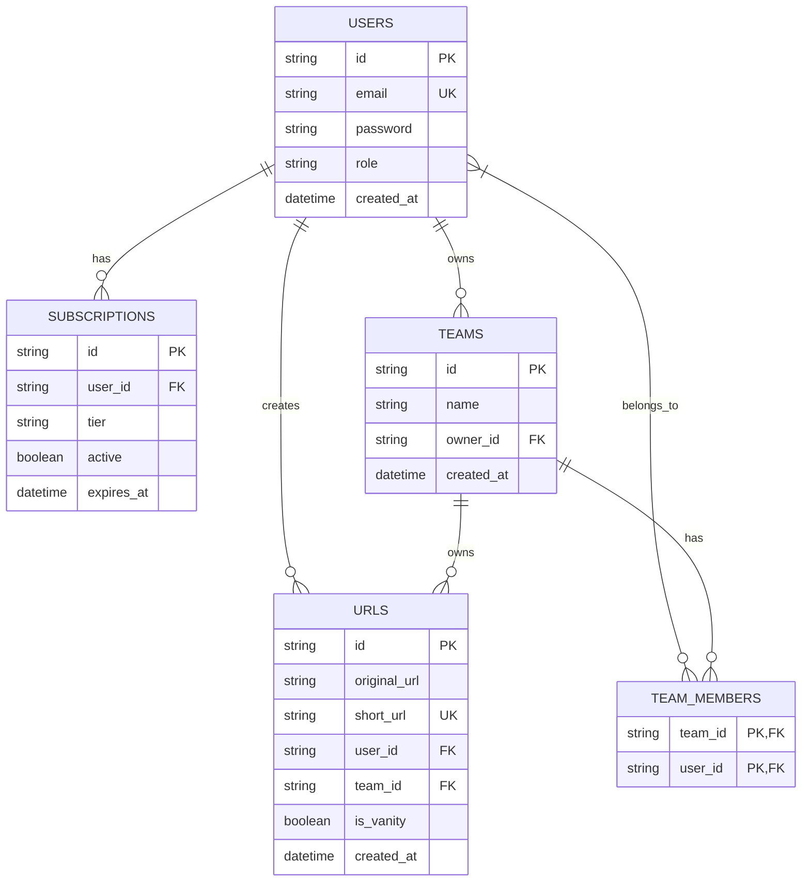

# URL Shortener Service

## Requirements:

The requirement are the following:

- user authentication
- subscriptions
- payment tiers
- vanity url for subscribers
- users can access only their own data
- admin role with no restriction
- team urls

the vanity url is only for paying user not for the users on the free tier. The number of vanity urls per users must be limited depending on the payed tier. A team could have their own urls shared between team members.

## Architecture

### SQL Schema

