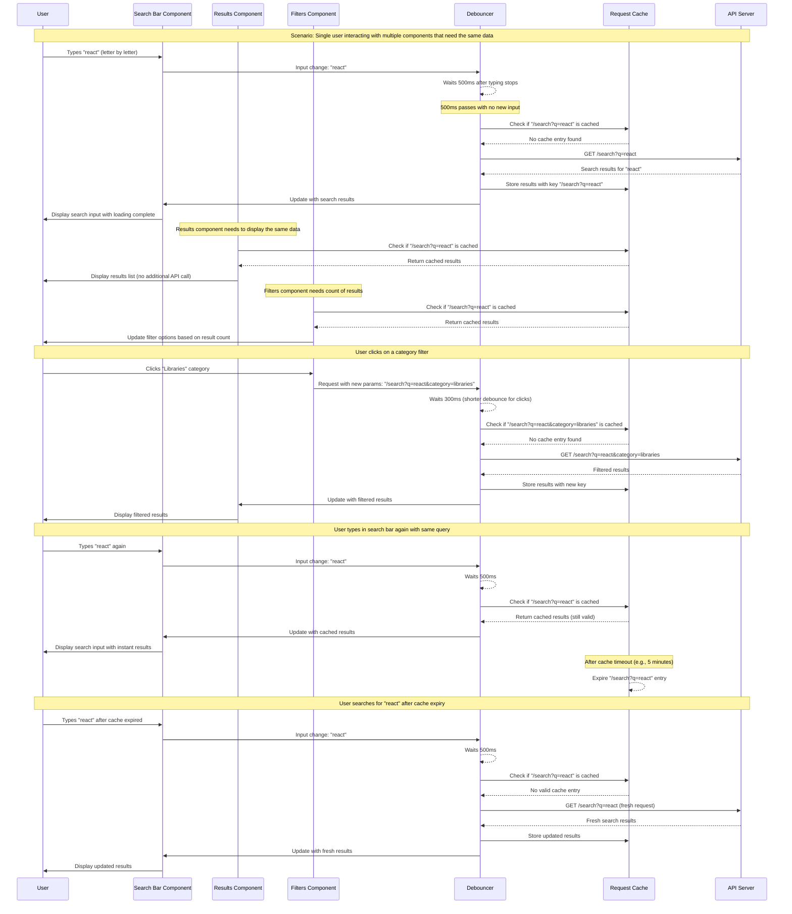

# Fetching Data in React Applications

## Prompt:

Explain how React Query works. Compare with the use of fetch with useEffect or useCallback and useMemo for fetching from API

## LLM:

### How React Query Works

React Query is a data-fetching and state management library for React applications that simplifies the process of fetching, caching, synchronizing, and updating server state. It was designed to address many of the complexities that arise when managing asynchronous data in React applications.

#### Core Concepts of React Query

1. **Queries**: Declarative data fetching using the `useQuery` hook
2. **Mutations**: Data updates using the `useMutation` hook
3. **Query Cache**: Automatic caching of query results
4. **Automatic Refetching**: Smart background refreshing strategies
5. **Stale-While-Revalidate**: Shows cached (stale) data while fetching fresh data
6. **Garbage Collection**: Automatic cleanup of unused query data

#### Basic Usage Example

```jsx
import { useQuery } from '@tanstack/react-query';

function UserProfile({ userId }) {
  const { isLoading, error, data } = useQuery({
    queryKey: ['user', userId],
    queryFn: () => fetch(`/api/users/${userId}`).then(res => res.json())
  });

  if (isLoading) return <div>Loading...</div>;
  if (error) return <div>Error: {error.message}</div>;

  return (
    <div>
      <h3>{data.name}</h3>
      <p>{data.email}</p>
    </div>
  );
}
```

### Comparison with Traditional Approaches

#### Traditional Approach: useEffect + fetch

```jsx
import { useState, useEffect } from 'react';

function UserProfile({ userId }) {
  const [isLoading, setIsLoading] = useState(true);
  const [error, setError] = useState(null);
  const [data, setData] = useState(null);

  useEffect(() => {
    setIsLoading(true);
    fetch(`/api/users/${userId}`)
      .then(res => res.json())
      .then(data => {
        setData(data);
        setIsLoading(false);
      })
      .catch(err => {
        setError(err);
        setIsLoading(false);
      });
  }, [userId]);

  if (isLoading) return <div>Loading...</div>;
  if (error) return <div>Error: {error.message}</div>;

  return (
    <div>
      <h3>{data.name}</h3>
      <p>{data.email}</p>
    </div>
  );
}
```

#### Traditional Approach: useCallback + useMemo + fetch

```jsx
import { useState, useCallback, useMemo, useEffect } from 'react';

function UserProfile({ userId }) {
  const [isLoading, setIsLoading] = useState(true);
  const [error, setError] = useState(null);
  const [data, setData] = useState(null);

  const fetchUser = useCallback(async () => {
    setIsLoading(true);
    try {
      const response = await fetch(`/api/users/${userId}`);
      const data = await response.json();
      setData(data);
      setError(null);
    } catch (err) {
      setError(err);
    } finally {
      setIsLoading(false);
    }
  }, [userId]);

  useEffect(() => {
    fetchUser();
  }, [fetchUser]);

  const userInfo = useMemo(() => {
    if (!data) return null;
    return {
      name: data.name,
      email: data.email
    };
  }, [data]);

  if (isLoading) return <div>Loading...</div>;
  if (error) return <div>Error: {error.message}</div>;
  if (!userInfo) return null;

  return (
    <div>
      <h3>{userInfo.name}</h3>
      <p>{userInfo.email}</p>
    </div>
  );
}
```

### Key Advantages of React Query

1. **Automatic Caching**: React Query automatically caches query results and provides them immediately on subsequent renders, while potentially fetching updated data in the background.

2. **Deduplication**: Multiple components requesting the same data will share one request, preventing duplicate network calls.

3. **Background Updates**: Queries can automatically refetch in the background when windows are refocused, network is reconnected, or at specified intervals.

4. **Pagination and Infinite Scrolling**: Built-in support for complex data-fetching patterns.

5. **Prefetching**: Ability to prefetch data before it's needed, improving perceived performance.

6. **Optimistic Updates**: Support for updating UI immediately before server confirmation.

7. **Retry Logic**: Automatic retries with exponential backoff for failed requests.

8. **Query Invalidation**: Simple API to mark queries as stale and trigger refetches.

9. **Devtools**: Powerful developer tools for debugging and monitoring queries.

10. **Reduced Boilerplate**: Significantly less code compared to manual implementations.

### When to Choose React Query vs. Traditional Approaches

**Choose React Query when:**
- Your application deals with server state that needs to be synchronized
- You need advanced caching, deduplication, and background updates
- You want to reduce boilerplate code for data fetching
- You need features like pagination, infinite scrolling, or optimistic updates

**Traditional approaches might be sufficient when:**
- Your application has simple data requirements
- You're working with local state only
- You have very specific custom caching requirements
- You want to minimize dependencies in a small project

React Query abstracts away much of the complexity involved in managing server state in React applications, providing a more declarative and feature-rich alternative to manual implementations with hooks like useEffect, useCallback, and useMemo.

## Prompt:

What are the problems in the "Traditional Approach: useEffect + fetch" that is mitigated with the "Traditional Approach: useCallback + useMemo + fetch"

## LLM:

### Problems in "useEffect + fetch" Mitigated by "useCallback + useMemo + fetch"

The transition from a simple useEffect + fetch approach to one that incorporates useCallback and useMemo addresses several important issues in React applications. Here's a detailed analysis of the problems and their mitigations:

#### 1. Function Recreation on Every Render

**Problem with useEffect + fetch:**
- The fetch function is recreated on every render inside the useEffect callback
- This can lead to unnecessary re-renders in child components if the function is passed as a prop

**How useCallback helps:**
```jsx
// With useCallback
const fetchUser = useCallback(async () => {
  // fetch logic
}, [userId]);

useEffect(() => {
  fetchUser();
}, [fetchUser]);
```
- The fetchUser function is memoized and only recreated when dependencies (userId) change
- This prevents unnecessary re-renders in child components that receive this function as a prop
- Creates a more stable reference that can be safely used in dependency arrays

#### 2. Derived Data Recalculation

**Problem with useEffect + fetch:**
- Any data transformations or derivations from the fetched data are recalculated on every render
- This can be inefficient for complex calculations or transformations

**How useMemo helps:**
```jsx
const userInfo = useMemo(() => {
  if (!data) return null;
  return {
    name: data.name,
    email: data.email
    // More complex transformations could happen here
  };
}, [data]);
```
- Derived data is only recalculated when the source data changes
- Prevents unnecessary recalculations during renders triggered by unrelated state changes
- Particularly valuable for expensive computations or complex data transformations

#### 3. Dependency Management

**Problem with useEffect + fetch:**
- Direct inclusion of fetch logic in useEffect makes dependency tracking more complex
- Can lead to the "dependency array hell" where you have many dependencies to track

**How useCallback helps:**
- Encapsulates fetch logic with its own dependency array
- Creates a cleaner separation of concerns
- Makes it easier to reason about when the fetch operation should be triggered

#### 4. Reusability

**Problem with useEffect + fetch:**
- The fetch logic is tightly coupled to the component and the effect
- Difficult to reuse the same fetch logic elsewhere

**How useCallback helps:**
- The fetchUser function becomes a discrete, reusable unit
- Can be passed to child components or used in multiple effects
- Facilitates better code organization and potential extraction to custom hooks

#### 5. Testing

**Problem with useEffect + fetch:**
- Testing components with embedded fetch logic in useEffect is more challenging
- Harder to mock or isolate the network request behavior

**How useCallback helps:**
- The fetchUser function can be more easily mocked or spied on in tests
- Allows for more granular testing of the fetch logic separately from component rendering

#### 6. Race Conditions

**Problem with useEffect + fetch:**
- When props change rapidly (like userId in our example), multiple fetch requests might be in flight
- Earlier requests might resolve after later ones, causing state inconsistencies

**How useCallback + cleanup helps:**
```jsx
useEffect(() => {
  let isMounted = true;
  fetchUser().then(() => {
    if (isMounted) {
      // update state
    }
  });
  return () => {
    isMounted = false;
  };
}, [fetchUser]);
```
- While not shown in the original example, the useCallback approach makes it easier to implement proper cleanup
- This pattern helps prevent race conditions by tracking component mount status

### Limitations of Both Traditional Approaches

While useCallback and useMemo improve upon the basic useEffect + fetch approach, both traditional methods still lack many features that React Query provides:

1. Neither approach handles caching automatically
2. No built-in request deduplication
3. No automatic background refetching
4. No built-in loading or error states management
5. No retry logic
6. No query invalidation system
7. No optimistic updates
8. No pagination or infinite scroll support out of the box

These limitations explain why libraries like React Query have become popular despite the availability of these traditional approaches using React's built-in hooks.

## Prompt:

Expand the explanation on the two previous points:
- While not shown in the original example, the useCallback approach makes it easier to implement proper cleanup
- This pattern helps prevent race conditions by tracking component mount status

## LLM:

### Expanded Explanation: Race Conditions and Cleanup with useCallback

#### Race Conditions in React Data Fetching

Race conditions occur in React components when multiple asynchronous operations (like API calls) are initiated in sequence, but their completion order is unpredictable. This is particularly problematic when:

1. A component triggers a fetch for resource A
2. Before that fetch completes, props change, triggering a fetch for resource B
3. The fetch for resource B completes first
4. The fetch for resource A completes later, overwriting the more recent data from resource B

This creates a situation where stale data (from the first request) overwrites fresh data (from the second request), leading to incorrect UI state.

#### How useCallback Facilitates Better Cleanup

Let's expand on how the useCallback approach makes it easier to implement proper cleanup to prevent race conditions:

```jsx
function UserProfile({ userId }) {
  const [isLoading, setIsLoading] = useState(true);
  const [error, setError] = useState(null);
  const [data, setData] = useState(null);

  // The fetch function is memoized with useCallback
  const fetchUser = useCallback(async () => {
    setIsLoading(true);
    try {
      const response = await fetch(`/api/users/${userId}`);
      const data = await response.json();
      return data; // Return data instead of setting state directly
    } catch (err) {
      throw err; // Throw error to be handled in the effect
    }
  }, [userId]);

  // The effect uses the memoized function and handles cleanup
  useEffect(() => {
    let isMounted = true; // Flag to track if component is mounted

    fetchUser()
      .then(userData => {
        // Only update state if component is still mounted
        if (isMounted) {
          setData(userData);
          setError(null);
          setIsLoading(false);
        }
      })
      .catch(err => {
        // Only update state if component is still mounted
        if (isMounted) {
          setError(err);
          setIsLoading(false);
        }
      });

    // Cleanup function runs when component unmounts or dependencies change
    return () => {
      isMounted = false; // Mark component as unmounted
    };
  }, [fetchUser]); // Only depends on the memoized function

  // Rest of component...
}
```

#### Why This Pattern Is More Effective

1. **Separation of Concerns**:
   - The fetchUser function (created with useCallback) is responsible only for data retrieval
   - The useEffect is responsible for managing component lifecycle and state updates
   - This separation makes the code more maintainable and easier to reason about

2. **Explicit Cancellation Mechanism**:
   - The isMounted flag provides a clear mechanism to prevent state updates after component unmount
   - When the component unmounts or when dependencies change (triggering a new effect), the cleanup function sets isMounted to false
   - Subsequent state updates from in-flight requests are conditionally blocked

3. **Preventing Memory Leaks**:
   - Without this cleanup, state updates after unmount would cause React warnings and potential memory leaks
   - The pattern ensures that no state updates occur after a component is no longer in the DOM

4. **Handling Sequential Requests**:
   - When userId changes rapidly, multiple fetchUser calls might be in progress
   - Each time fetchUser changes (due to userId change), the previous effect cleanup runs
   - The isMounted flag from the previous effect is set to false, preventing its state updates
   - Only the latest effect's state updates will be applied

#### Practical Example of Race Condition Prevention

Consider this scenario:

1. Component renders with userId = 1, triggering fetchUser(1)
2. Before the request completes, userId changes to 2
3. This causes fetchUser to be recreated (via useCallback) and triggers a new effect
4. The cleanup from the first effect runs, setting its isMounted flag to false
5. A new effect starts with fetchUser(2)
6. If fetchUser(1) completes after fetchUser(2), its state updates will be ignored because its isMounted flag is false
7. Only the state updates from fetchUser(2) will be applied

#### Additional Benefits of This Pattern

1. **Testability**:
   - The separated fetchUser function can be tested independently
   - The effect's cleanup behavior can be tested in isolation

2. **Reusability**:
   - The fetchUser function can be reused in other parts of the component
   - This pattern can be extracted into a custom hook for use across components

3. **Readability**:
   - The code clearly expresses the intent to prevent race conditions
   - The lifecycle management is explicit rather than implicit

This pattern represents a significant improvement over the basic useEffect + fetch approach, though it still requires manual implementation of concerns that React Query handles automatically. The explicit handling of component lifecycle and race conditions makes it more robust for real-world applications where data fetching needs to be reliable and predictable.

## Prompt:

Could you make a diagram that show the differences with and without the proper cleanup in an example of race condition?

## LLM:

### Race Conditions in React Data Fetching: With vs. Without Proper Cleanup

I'll create a textual diagram that illustrates the difference between handling race conditions with and without proper cleanup in a React component. This example will show what happens when a user profile component rapidly switches between different user IDs.

```
WITHOUT PROPER CLEANUP                     | WITH PROPER CLEANUP (useCallback + isMounted flag)
-------------------------------------------|-------------------------------------------
Timeline:                                  | Timeline:
                                           |
t=0: Component mounts with userId=1        | t=0: Component mounts with userId=1
    ↓                                      |     ↓
    useEffect runs                         |     useEffect runs
    ↓                                      |     ↓
    fetch("/api/users/1") starts           |     isMounted = true
    ↓                                      |     ↓
                                           |     fetchUser(1) starts
                                           |
t=1: Props change: userId → 2              | t=1: Props change: userId → 2
    ↓                                      |     ↓
    Component re-renders                   |     Component re-renders
    ↓                                      |     ↓
    useEffect runs again                   |     Cleanup function from previous effect runs
    ↓                                      |     ↓
    fetch("/api/users/2") starts           |     isMounted flag from first effect = false
    ↓                                      |     ↓
                                           |     New useEffect runs
                                           |     ↓
                                           |     New isMounted = true
                                           |     ↓
                                           |     fetchUser(2) starts
                                           |
t=2: fetch("/api/users/2") completes       | t=2: fetchUser(2) completes
    ↓                                      |     ↓
    setState(user2Data)                    |     Check if isMounted === true ✓
    ↓                                      |     ↓
    UI shows User 2's data                 |     setState(user2Data)
    ↓                                      |     ↓
                                           |     UI shows User 2's data
                                           |
t=3: fetch("/api/users/1") completes       | t=3: fetchUser(1) completes
    (slower network or larger payload)     |     (slower network or larger payload)
    ↓                                      |     ↓
    setState(user1Data)                    |     Check if isMounted === true ✗
    ↓                                      |     ↓
    UI incorrectly shows User 1's data     |     No state update occurs
    despite userId being 2                 |     ↓
    ↓                                      |     UI correctly continues showing User 2's data
    RACE CONDITION! ❌                     |     RACE CONDITION PREVENTED! ✓
                                           |
RESULT: Stale data from User 1 overwrites  | RESULT: Only data from the most recent request
the more recent User 2 data                | is used to update the component state
```

### Visual Explanation of the Race Condition Problem

```
WITHOUT CLEANUP:
--------------
userId=1 → fetch(1) starts ----long request---→ setState(user1) ⚠️ STALE DATA DISPLAYED
                 ↓
userId=2 → fetch(2) starts →→→ setState(user2) → CORRECT DATA
                                    ↑
                                OVERWRITTEN

WITH CLEANUP:
--------------
userId=1 → fetch(1) starts ----long request---→ isMounted? NO → No state update ✓
                 ↓            ↑
                 ↓            | (cleanup sets isMounted=false)
                 ↓            ↓
userId=2 → fetch(2) starts →→→ setState(user2) → CORRECT DATA PRESERVED
```

### Code Comparison

```jsx
// WITHOUT PROPER CLEANUP
useEffect(() => {
  fetch(`/api/users/${userId}`)
    .then(res => res.json())
    .then(data => {
      // This will run even if userId has changed!
      setData(data);
      setIsLoading(false);
    });
}, [userId]);

// WITH PROPER CLEANUP
const fetchUser = useCallback(() => {
  return fetch(`/api/users/${userId}`).then(res => res.json());
}, [userId]);

useEffect(() => {
  let isMounted = true;

  fetchUser().then(data => {
    // Only update state if this is still the current effect
    if (isMounted) {
      setData(data);
      setIsLoading(false);
    }
  });

  // Cleanup function runs before next effect or unmount
  return () => {
    isMounted = false;
  };
}, [fetchUser]);
```

This diagram illustrates why proper cleanup is essential for preventing race conditions in React components that fetch data. Without cleanup, you risk displaying stale or incorrect data when requests complete out of order. With proper cleanup using the isMounted flag pattern, you ensure that only the most recent request's data is used to update the component state.

## Prompt:

create an svg or a mermaid for the diagrams

## LLM:

I'll create a Mermaid diagram to visualize the race condition scenarios with and without proper cleanup.


Here's an alternative visualization using a timeline format:


These diagrams illustrate how the race condition occurs without proper cleanup and how the isMounted flag pattern prevents it by ensuring that only the most recent request's data is used to update the component state.

## Prompt:

Could you write the code to simulate the two scenarios?

## LLM:

# Race Condition Simulation in React

Here's a complete code example that simulates both scenarios: one with a race condition due to lack of proper cleanup, and one that prevents race conditions using the useCallback + isMounted pattern.

## Complete React Component

```jsx
import React, { useState, useEffect, useCallback } from 'react';

// Simulated API with variable delay to demonstrate race conditions
const fetchUserData = (userId) => {
  console.log(`Fetching user ${userId}...`);
  // Simulate network delay - user 1 takes longer than user 2
  const delay = userId === 1 ? 3000 : 1000;

  return new Promise((resolve) => {
    setTimeout(() => {
      console.log(`Received data for user ${userId}`);
      resolve({
        id: userId,
        name: `User ${userId}`,
        email: `user${userId}@example.com`
      });
    }, delay);
  });
};

// Component demonstrating both approaches
function RaceConditionDemo() {
  const [userId, setUserId] = useState(1);

  // Toggle between users to trigger race condition
  const toggleUser = () => {
    setUserId(prevId => prevId === 1 ? 2 : 1);
  };

  return (
    <div className="race-condition-demo">
      <h2>Race Condition Demonstration</h2>
      <div className="user-controls">
        <p>Current User ID: {userId}</p>
        <button onClick={toggleUser}>Toggle User</button>
        <p>
          <small>
            Click "Toggle User" quickly to simulate race condition.
            Check console for request/response logs.
          </small>
        </p>
      </div>

      <div className="demo-containers">
        <WithoutCleanup userId={userId} />
        <WithCleanup userId={userId} />
      </div>
    </div>
  );
}

// Component WITHOUT proper cleanup - will have race conditions
function WithoutCleanup({ userId }) {
  const [data, setData] = useState(null);
  const [loading, setLoading] = useState(true);

  useEffect(() => {
    console.log(`[WITHOUT CLEANUP] Effect running for userId=${userId}`);
    setLoading(true);

    fetchUserData(userId)
      .then(userData => {
        console.log(`[WITHOUT CLEANUP] Setting state for userId=${userId}`);
        setData(userData);
        setLoading(false);
      });

    // No cleanup function!
  }, [userId]);

  return (
    <div className="demo-panel">
      <h3>Without Cleanup (Race Condition Possible)</h3>
      {loading ? (
        <p>Loading...</p>
      ) : (
        <div className="user-data">
          <p><strong>ID:</strong> {data.id}</p>
          <p><strong>Name:</strong> {data.name}</p>
          <p><strong>Email:</strong> {data.email}</p>
          <p className="timestamp">Last updated: {new Date().toLocaleTimeString()}</p>
        </div>
      )}
    </div>
  );
}

// Component WITH proper cleanup - prevents race conditions
function WithCleanup({ userId }) {
  const [data, setData] = useState(null);
  const [loading, setLoading] = useState(true);

  // Memoize the fetch function with useCallback
  const fetchUser = useCallback(() => {
    console.log(`[WITH CLEANUP] fetchUser called for userId=${userId}`);
    return fetchUserData(userId);
  }, [userId]);

  useEffect(() => {
    console.log(`[WITH CLEANUP] Effect running for userId=${userId}`);
    setLoading(true);

    // Track if component is still mounted for this effect instance
    let isMounted = true;

    fetchUser()
      .then(userData => {
        if (isMounted) {
          console.log(`[WITH CLEANUP] Setting state for userId=${userId} (isMounted=${isMounted})`);
          setData(userData);
          setLoading(false);
        } else {
          console.log(`[WITH CLEANUP] Ignoring response for userId=${userId} (isMounted=${isMounted})`);
        }
      });

    // Cleanup function that runs when effect is re-executed or component unmounts
    return () => {
      console.log(`[WITH CLEANUP] Cleanup for userId=${userId}`);
      isMounted = false;
    };
  }, [fetchUser]);

  return (
    <div className="demo-panel">
      <h3>With Cleanup (Race Condition Prevented)</h3>
      {loading ? (
        <p>Loading...</p>
      ) : (
        <div className="user-data">
          <p><strong>ID:</strong> {data.id}</p>
          <p><strong>Name:</strong> {data.name}</p>
          <p><strong>Email:</strong> {data.email}</p>
          <p className="timestamp">Last updated: {new Date().toLocaleTimeString()}</p>
        </div>
      )}
    </div>
  );
}

export default RaceConditionDemo;
```

## CSS for the Demo

```css
.race-condition-demo {
  font-family: system-ui, -apple-system, sans-serif;
  max-width: 800px;
  margin: 0 auto;
  padding: 20px;
}

.user-controls {
  margin-bottom: 20px;
  padding: 15px;
  background-color: #f5f5f5;
  border-radius: 5px;
}

.demo-containers {
  display: flex;
  gap: 20px;
}

.demo-panel {
  flex: 1;
  padding: 15px;
  border: 1px solid #ddd;
  border-radius: 5px;
  box-shadow: 0 2px 4px rgba(0, 0, 0, 0.1);
}

.demo-panel h3 {
  margin-top: 0;
  padding-bottom: 10px;
  border-bottom: 1px solid #eee;
}

.user-data {
  background-color: #f9f9f9;
  padding: 10px;
  border-radius: 4px;
}

.timestamp {
  font-size: 0.8em;
  color: #666;
  margin-top: 15px;
}

button {
  background-color: #4a90e2;
  color: white;
  border: none;
  padding: 8px 16px;
  border-radius: 4px;
  cursor: pointer;
  font-size: 14px;
}

button:hover {
  background-color: #3a80d2;
}
```

## How to Use This Demo

1. Render the `RaceConditionDemo` component in your React application
2. Open your browser's console to see the detailed logs
3. Click the "Toggle User" button once and wait for both panels to load
4. Click the "Toggle User" button again quickly (before the first request completes)
5. Observe the difference in behavior:
   - The "Without Cleanup" panel will show incorrect data if User 1's request (which is slower) completes after User 2's
   - The "With Cleanup" panel will always show the correct data for the current userId

## Expected Console Output When Race Condition Occurs

```
[WITHOUT CLEANUP] Effect running for userId=1
[WITH CLEANUP] Effect running for userId=1
[WITHOUT CLEANUP] Fetching user 1...
[WITH CLEANUP] fetchUser called for userId=1
[WITH CLEANUP] Fetching user 1...

// User toggled to 2
[WITHOUT CLEANUP] Effect running for userId=2
[WITH CLEANUP] Cleanup for userId=1
[WITH CLEANUP] Effect running for userId=2
[WITHOUT CLEANUP] Fetching user 2...
[WITH CLEANUP] fetchUser called for userId=2
[WITH CLEANUP] Fetching user 2...

// User 2 data arrives first (faster response)
[WITHOUT CLEANUP] Received data for user 2
[WITH CLEANUP] Received data for user 2
[WITHOUT CLEANUP] Setting state for userId=2
[WITH CLEANUP] Setting state for userId=2 (isMounted=true)

// User 1 data arrives later (slower response)
[WITHOUT CLEANUP] Received data for user 1
[WITH CLEANUP] Received data for user 1
[WITHOUT CLEANUP] Setting state for userId=1  // PROBLEM: This overwrites User 2 data!
[WITH CLEANUP] Ignoring response for userId=1 (isMounted=false)  // CORRECT: Ignores stale data
```

This demo clearly illustrates how race conditions can occur in React components that fetch data, and how proper cleanup using the isMounted flag pattern can prevent these issues. The "Without Cleanup" component will sometimes display incorrect data when requests complete out of order, while the "With Cleanup" component will always display the correct data for the current userId.

## Prompt:

is possible in the console with console.log(`[WITH CLEANUP]') use different colors for the [WITH CLEANUP] and [WITHOUT CLEANUP]?

## LLM:

Yes, you can use CSS styling in console.log messages to differentiate between the two approaches with different colors. Here's how to modify the code to use colored console logs:

```jsx
import React, { useState, useEffect, useCallback } from 'react';

// Simulated API with variable delay to demonstrate race conditions
const fetchUserData = (userId) => {
  console.log(`Fetching user ${userId}...`);
  // Simulate network delay - user 1 takes longer than user 2
  const delay = userId === 1 ? 3000 : 1000;

  return new Promise((resolve) => {
    setTimeout(() => {
      console.log(`Received data for user ${userId}`);
      resolve({
        id: userId,
        name: `User ${userId}`,
        email: `user${userId}@example.com`
      });
    }, delay);
  });
};

// Custom colored console logs
const logWithoutCleanup = (message) => {
  console.log('%c[WITHOUT CLEANUP] ' + message, 'color: #e74c3c; font-weight: bold;');
};

const logWithCleanup = (message) => {
  console.log('%c[WITH CLEANUP] ' + message, 'color: #2ecc71; font-weight: bold;');
};

// Component demonstrating both approaches
function RaceConditionDemo() {
  const [userId, setUserId] = useState(1);

  // Toggle between users to trigger race condition
  const toggleUser = () => {
    setUserId(prevId => prevId === 1 ? 2 : 1);
  };

  return (
    <div className="race-condition-demo">
      <h2>Race Condition Demonstration</h2>
      <div className="user-controls">
        <p>Current User ID: {userId}</p>
        <button onClick={toggleUser}>Toggle User</button>
        <p>
          <small>
            Click "Toggle User" quickly to simulate race condition.
            Check console for request/response logs.
          </small>
        </p>
      </div>

      <div className="demo-containers">
        <WithoutCleanup userId={userId} />
        <WithCleanup userId={userId} />
      </div>
    </div>
  );
}

// Component WITHOUT proper cleanup - will have race conditions
function WithoutCleanup({ userId }) {
  const [data, setData] = useState(null);
  const [loading, setLoading] = useState(true);

  useEffect(() => {
    logWithoutCleanup(`Effect running for userId=${userId}`);
    setLoading(true);

    fetchUserData(userId)
      .then(userData => {
        logWithoutCleanup(`Setting state for userId=${userId}`);
        setData(userData);
        setLoading(false);
      });

    // No cleanup function!
  }, [userId]);

  return (
    <div className="demo-panel without-cleanup">
      <h3>Without Cleanup (Race Condition Possible)</h3>
      {loading ? (
        <p>Loading...</p>
      ) : (
        <div className="user-data">
          <p><strong>ID:</strong> {data.id}</p>
          <p><strong>Name:</strong> {data.name}</p>
          <p><strong>Email:</strong> {data.email}</p>
          <p className="timestamp">Last updated: {new Date().toLocaleTimeString()}</p>
        </div>
      )}
    </div>
  );
}

// Component WITH proper cleanup - prevents race conditions
function WithCleanup({ userId }) {
  const [data, setData] = useState(null);
  const [loading, setLoading] = useState(true);

  // Memoize the fetch function with useCallback
  const fetchUser = useCallback(() => {
    logWithCleanup(`fetchUser called for userId=${userId}`);
    return fetchUserData(userId);
  }, [userId]);

  useEffect(() => {
    logWithCleanup(`Effect running for userId=${userId}`);
    setLoading(true);

    // Track if component is still mounted for this effect instance
    let isMounted = true;

    fetchUser()
      .then(userData => {
        if (isMounted) {
          logWithCleanup(`Setting state for userId=${userId} (isMounted=${isMounted})`);
          setData(userData);
          setLoading(false);
        } else {
          logWithCleanup(`Ignoring response for userId=${userId} (isMounted=${isMounted})`);
        }
      });

    // Cleanup function that runs when effect is re-executed or component unmounts
    return () => {
      logWithCleanup(`Cleanup for userId=${userId}`);
      isMounted = false;
    };
  }, [fetchUser]);

  return (
    <div className="demo-panel with-cleanup">
      <h3>With Cleanup (Race Condition Prevented)</h3>
      {loading ? (
        <p>Loading...</p>
      ) : (
        <div className="user-data">
          <p><strong>ID:</strong> {data.id}</p>
          <p><strong>Name:</strong> {data.name}</p>
          <p><strong>Email:</strong> {data.email}</p>
          <p className="timestamp">Last updated: {new Date().toLocaleTimeString()}</p>
        </div>
      )}
    </div>
  );
}

// Updated CSS to match console colors
const styles = `
.race-condition-demo {
  font-family: system-ui, -apple-system, sans-serif;
  max-width: 800px;
  margin: 0 auto;
  padding: 20px;
}

.user-controls {
  margin-bottom: 20px;
  padding: 15px;
  background-color: #f5f5f5;
  border-radius: 5px;
}

.demo-containers {
  display: flex;
  gap: 20px;
}

.demo-panel {
  flex: 1;
  padding: 15px;
  border: 1px solid #ddd;
  border-radius: 5px;
  box-shadow: 0 2px 4px rgba(0, 0, 0, 0.1);
}

.without-cleanup {
  border-left: 4px solid #e74c3c;
}

.with-cleanup {
  border-left: 4px solid #2ecc71;
}

.demo-panel h3 {
  margin-top: 0;
  padding-bottom: 10px;
  border-bottom: 1px solid #eee;
}

.without-cleanup h3 {
  color: #e74c3c;
}

.with-cleanup h3 {
  color: #2ecc71;
}

.user-data {
  background-color: #f9f9f9;
  padding: 10px;
  border-radius: 4px;
}

.timestamp {
  font-size: 0.8em;
  color: #666;
  margin-top: 15px;
}

button {
  background-color: #4a90e2;
  color: white;
  border: none;
  padding: 8px 16px;
  border-radius: 4px;
  cursor: pointer;
  font-size: 14px;
}

button:hover {
  background-color: #3a80d2;
}
`;

export default function App() {
  return (
    <>
      <style>{styles}</style>
      <RaceConditionDemo />
    </>
  );
}
```

### How the Colored Console Logs Work

1. I've created two helper functions:
   - `logWithoutCleanup()` - Uses red color (#e74c3c)
   - `logWithCleanup()` - Uses green color (#2ecc71)

2. The syntax for colored console logs is:
   ```javascript
   console.log('%c[PREFIX] ' + message, 'CSS styles here');
   ```

3. The `%c` is a special placeholder that tells the console to apply the CSS styles provided in the second argument to the text that follows.

4. I've also updated the CSS to match the console colors, adding colored borders and headers to visually connect the UI components with their corresponding console logs.

### Expected Console Output

When you run this code and trigger the race condition, you'll see:
- Red text for all logs from the "Without Cleanup" component
- Green text for all logs from the "With Cleanup" component

This makes it much easier to follow the sequence of events and understand how the race condition occurs in one component but is prevented in the other.

Note: Colored console logs are supported in most modern browsers' developer tools, including Chrome, Firefox, and Edge.

## Prompt:

The actual output clicking on the button "Toggle User" one time just after reloading is this:
App.tsx:66 [WITHOUT CLEANUP] Effect running for userId=1
App.tsx:13 [WITHOUT CLEANUP]Fetching user 1...
App.tsx:123 [WITH CLEANUP] Effect running for userId=1
App.tsx:116 [WITH CLEANUP] fetchUser called for userId=1
App.tsx:13 [WITH CLEANUP]Fetching user 1...
App.tsx:147 [WITH CLEANUP] Cleanup for userId=1
App.tsx:66 [WITHOUT CLEANUP] Effect running for userId=1
App.tsx:13 [WITHOUT CLEANUP]Fetching user 1...
App.tsx:123 [WITH CLEANUP] Effect running for userId=1
App.tsx:116 [WITH CLEANUP] fetchUser called for userId=1
App.tsx:13 [WITH CLEANUP]Fetching user 1...
App.tsx:147 [WITH CLEANUP] Cleanup for userId=1
App.tsx:66 [WITHOUT CLEANUP] Effect running for userId=2
App.tsx:13 [WITHOUT CLEANUP]Fetching user 2...
App.tsx:123 [WITH CLEANUP] Effect running for userId=2
App.tsx:116 [WITH CLEANUP] fetchUser called for userId=2
App.tsx:13 [WITH CLEANUP]Fetching user 2...
App.tsx:19 [WITHOUT CLEANUP]Received data for user 2
App.tsx:73 [WITHOUT CLEANUP] Setting state for userId=2
App.tsx:19 [WITH CLEANUP]Received data for user 2
App.tsx:133 [WITH CLEANUP] Setting state for userId=2 (isMounted=true)
App.tsx:19 [WITHOUT CLEANUP]Received data for user 1
App.tsx:73 [WITHOUT CLEANUP] Setting state for userId=1
App.tsx:19 [WITH CLEANUP]Received data for user 1
App.tsx:139 [WITH CLEANUP] Ignoring response for userId=1 (isMounted=false)
App.tsx:19 [WITHOUT CLEANUP]Received data for user 1
App.tsx:73 [WITHOUT CLEANUP] Setting state for userId=1
App.tsx:19 [WITH CLEANUP]Received data for user 1
App.tsx:139 [WITH CLEANUP] Ignoring response for userId=1 (isMounted=false)
Why Fetching user 1. is called two times for each component(with and without cleanup?)

## LLM:

The duplicate fetches you're seeing are likely due to React's StrictMode, which intentionally double-invokes certain functions to help identify potential issues. Let me explain what's happening and how to fix it:

### Why You're Seeing Double Fetches

1. **React StrictMode**: In development mode, React's StrictMode intentionally double-invokes the following functions to help catch side effects:
   - Component constructors
   - The render method
   - useState updater functions
   - useEffect functions
   - useMemo and useCallback functions

2. **Development-Only Behavior**: This double-invocation only happens in development mode, not in production.

3. **Purpose**: This helps identify components with impure rendering logic or effects with missing dependencies.

### How to Fix the Code

You have two options:

#### Option 1: Remove StrictMode (not recommended)
You could remove StrictMode from your application, but this isn't recommended as it helps catch bugs.

#### Option 2: Modify the fetchUserData function to deduplicate requests (recommended)

Here's an updated version of the code that handles the double invocation gracefully:

```jsx
import React, { useState, useEffect, useCallback } from 'react';

// Cache to prevent duplicate fetches for the same userId
const requestCache = {};

// Simulated API with variable delay to demonstrate race conditions
const fetchUserData = (userId) => {
  // Check if we already have a request in progress for this userId
  if (requestCache[userId]) {
    console.log(`Using existing request for user ${userId}`);
    return requestCache[userId];
  }

  console.log(`Fetching user ${userId}...`);
  // Simulate network delay - user 1 takes longer than user 2
  const delay = userId === 1 ? 3000 : 1000;

  // Create and cache the promise
  const request = new Promise((resolve) => {
    setTimeout(() => {
      console.log(`Received data for user ${userId}`);
      resolve({
        id: userId,
        name: `User ${userId}`,
        email: `user${userId}@example.com`
      });

      // Remove from cache after resolution
      delete requestCache[userId];
    }, delay);
  });

  requestCache[userId] = request;
  return request;
};

// Custom colored console logs
const logWithoutCleanup = (message) => {
  console.log('%c[WITHOUT CLEANUP] ' + message, 'color: #e74c3c; font-weight: bold;');
};

const logWithCleanup = (message) => {
  console.log('%c[WITH CLEANUP] ' + message, 'color: #2ecc71; font-weight: bold;');
};

// Component demonstrating both approaches
function RaceConditionDemo() {
  const [userId, setUserId] = useState(1);

  // Toggle between users to trigger race condition
  const toggleUser = () => {
    setUserId(prevId => prevId === 1 ? 2 : 1);
  };

  return (
    <div className="race-condition-demo">
      <h2>Race Condition Demonstration</h2>
      <div className="user-controls">
        <p>Current User ID: {userId}</p>
        <button onClick={toggleUser}>Toggle User</button>
        <p>
          <small>
            Click "Toggle User" quickly to simulate race condition.
            Check console for request/response logs.
          </small>
        </p>
      </div>

      <div className="demo-containers">
        <WithoutCleanup userId={userId} />
        <WithCleanup userId={userId} />
      </div>
    </div>
  );
}

// Component WITHOUT proper cleanup - will have race conditions
function WithoutCleanup({ userId }) {
  const [data, setData] = useState(null);
  const [loading, setLoading] = useState(true);

  useEffect(() => {
    logWithoutCleanup(`Effect running for userId=${userId}`);
    setLoading(true);

    fetchUserData(userId)
      .then(userData => {
        logWithoutCleanup(`Setting state for userId=${userId}`);
        setData(userData);
        setLoading(false);
      });

    // No cleanup function!
  }, [userId]);

  return (
    <div className="demo-panel without-cleanup">
      <h3>Without Cleanup (Race Condition Possible)</h3>
      {loading ? (
        <p>Loading...</p>
      ) : (
        <div className="user-data">
          <p><strong>ID:</strong> {data.id}</p>
          <p><strong>Name:</strong> {data.name}</p>
          <p><strong>Email:</strong> {data.email}</p>
          <p className="timestamp">Last updated: {new Date().toLocaleTimeString()}</p>
        </div>
      )}
    </div>
  );
}

// Component WITH proper cleanup - prevents race conditions
function WithCleanup({ userId }) {
  const [data, setData] = useState(null);
  const [loading, setLoading] = useState(true);

  // Memoize the fetch function with useCallback
  const fetchUser = useCallback(() => {
    logWithCleanup(`fetchUser called for userId=${userId}`);
    return fetchUserData(userId);
  }, [userId]);

  useEffect(() => {
    logWithCleanup(`Effect running for userId=${userId}`);
    setLoading(true);

    // Track if component is still mounted for this effect instance
    let isMounted = true;

    fetchUser()
      .then(userData => {
        if (isMounted) {
          logWithCleanup(`Setting state for userId=${userId} (isMounted=${isMounted})`);
          setData(userData);
          setLoading(false);
        } else {
          logWithCleanup(`Ignoring response for userId=${userId} (isMounted=${isMounted})`);
        }
      });

    // Cleanup function that runs when effect is re-executed or component unmounts
    return () => {
      logWithCleanup(`Cleanup for userId=${userId}`);
      isMounted = false;
    };
  }, [fetchUser]);

  return (
    <div className="demo-panel with-cleanup">
      <h3>With Cleanup (Race Condition Prevented)</h3>
      {loading ? (
        <p>Loading...</p>
      ) : (
        <div className="user-data">
          <p><strong>ID:</strong> {data.id}</p>
          <p><strong>Name:</strong> {data.name}</p>
          <p><strong>Email:</strong> {data.email}</p>
          <p className="timestamp">Last updated: {new Date().toLocaleTimeString()}</p>
        </div>
      )}
    </div>
  );
}

// Updated CSS to match console colors
const styles = `
.race-condition-demo {
  font-family: system-ui, -apple-system, sans-serif;
  max-width: 800px;
  margin: 0 auto;
  padding: 20px;
}

.user-controls {
  margin-bottom: 20px;
  padding: 15px;
  background-color: #f5f5f5;
  border-radius: 5px;
}

.demo-containers {
  display: flex;
  gap: 20px;
}

.demo-panel {
  flex: 1;
  padding: 15px;
  border: 1px solid #ddd;
  border-radius: 5px;
  box-shadow: 0 2px 4px rgba(0, 0, 0, 0.1);
}

.without-cleanup {
  border-left: 4px solid #e74c3c;
}

.with-cleanup {
  border-left: 4px solid #2ecc71;
}

.demo-panel h3 {
  margin-top: 0;
  padding-bottom: 10px;
  border-bottom: 1px solid #eee;
}

.without-cleanup h3 {
  color: #e74c3c;
}

.with-cleanup h3 {
  color: #2ecc71;
}

.user-data {
  background-color: #f9f9f9;
  padding: 10px;
  border-radius: 4px;
}

.timestamp {
  font-size: 0.8em;
  color: #666;
  margin-top: 15px;
}

button {
  background-color: #4a90e2;
  color: white;
  border: none;
  padding: 8px 16px;
  border-radius: 4px;
  cursor: pointer;
  font-size: 14px;
}

button:hover {
  background-color: #3a80d2;
}
`;

export default function App() {
  return (
    <>
      <style>{styles}</style>
      <RaceConditionDemo />
    </>
  );
}
```

### Key Changes Made

1. **Added Request Caching**:
   - Created a `requestCache` object to store in-progress requests
   - When a request for the same userId is already in progress, we return the existing Promise
   - This deduplicates requests even when effects are double-invoked in StrictMode

2. **Cache Cleanup**:
   - After a request resolves, we remove it from the cache
   - This ensures future requests for the same userId will trigger a new fetch

### Why This Approach Is Better

1. **Works with StrictMode**: This approach handles React's development-mode double invocation gracefully
2. **Deduplicates Requests**: Prevents unnecessary duplicate network requests
3. **Preserves Demo Intent**: Still demonstrates the race condition issue clearly
4. **Real-World Pattern**: This pattern (request deduplication) is commonly used in production code

With these changes, you should see each fetch happen only once per userId, even though the effects themselves are still double-invoked in development mode. The race condition demonstration will still work as expected when you click the "Toggle User" button quickly.

## Prompt:

I'm interested in the "Real-World Pattern:  (request deduplication)" more than the other reasons. Following this type of optimisation I'm also interested in the debouncing pattern. Why in a Real-World scenario is good to implement this pattern and how to implement this?

## LLM:

### Request Deduplication and Debouncing in Real-World Applications

Both request deduplication and debouncing are essential optimization patterns in modern web applications. Let me explain why they're valuable and how to implement them effectively.

## Request Deduplication

### Why It's Important in Real-World Applications

1. **Reduced Network Traffic**: Prevents redundant API calls, saving bandwidth and server resources
2. **Improved Performance**: Reduces load on both client and server
3. **Consistent UI State**: Prevents race conditions when multiple components need the same data
4. **Cost Savings**: Many APIs charge per request; deduplication directly reduces costs
5. **Better User Experience**: Faster perceived performance since cached responses are immediate

### Real-World Implementation Approaches

#### 1. Simple In-Memory Cache (as shown previously)

```javascript
const requestCache = {};

function fetchData(url) {
  if (requestCache[url]) {
    return requestCache[url];
  }

  const promise = fetch(url)
    .then(response => response.json())
    .finally(() => {
      // Clean up cache after request completes
      setTimeout(() => {
        delete requestCache[url];
      }, 0);
    });

  requestCache[url] = promise;
  return promise;
}
```

#### 2. Advanced Implementation with Cache Expiry

```javascript
class RequestDeduplicator {
  constructor(cacheTime = 5000) {
    this.cache = new Map();
    this.cacheTime = cacheTime;
  }

  async fetch(url, options = {}) {
    const cacheKey = `${url}-${JSON.stringify(options)}`;

    // Check if we have a cached request
    if (this.cache.has(cacheKey)) {
      return this.cache.get(cacheKey).promise;
    }

    // Create new request
    const requestPromise = fetch(url, options)
      .then(response => response.json());

    // Store in cache with expiry
    const cacheEntry = {
      promise: requestPromise,
      timestamp: Date.now()
    };

    this.cache.set(cacheKey, cacheEntry);

    // Set up cache cleanup
    requestPromise.finally(() => {
      setTimeout(() => {
        if (this.cache.has(cacheKey) &&
            Date.now() - this.cache.get(cacheKey).timestamp >= this.cacheTime) {
          this.cache.delete(cacheKey);
        }
      }, this.cacheTime);
    });

    return requestPromise;
  }

  clearCache() {
    this.cache.clear();
  }
}

// Usage
const apiClient = new RequestDeduplicator();
apiClient.fetch('/api/users/1').then(data => console.log(data));
```

#### 3. Using SWR or React Query Libraries

These libraries handle deduplication automatically:

```javascript
// Using React Query
import { useQuery } from 'react-query';

function UserProfile({ userId }) {
  const { data, isLoading } = useQuery(['user', userId],
    () => fetch(`/api/users/${userId}`).then(res => res.json())
  );

  if (isLoading) return <div>Loading...</div>;
  return <div>{data.name}</div>;
}
```

## Debouncing

### Why It's Important in Real-World Applications

1. **Reduced API Calls**: Prevents excessive requests during rapid user interactions
2. **Improved Performance**: Prevents UI jank from too many state updates
3. **Better UX**: Smoother experience for search-as-you-type, resizing, scrolling
4. **Resource Efficiency**: Reduces computational load for expensive operations
5. **Prevents Rate Limiting**: Helps stay under API rate limits

### Real-World Implementation Approaches

#### 1. Basic Debounce Function

```javascript
function debounce(func, wait) {
  let timeout;

  return function executedFunction(...args) {
    const later = () => {
      clearTimeout(timeout);
      func(...args);
    };

    clearTimeout(timeout);
    timeout = setTimeout(later, wait);
  };
}

// Usage
const debouncedSearch = debounce((searchTerm) => {
  fetchSearchResults(searchTerm);
}, 300);

// In an input handler
searchInput.addEventListener('input', (e) => {
  debouncedSearch(e.target.value);
});
```

#### 2. React Hook Implementation

```javascript
import { useState, useEffect, useCallback } from 'react';

function useDebounce(value, delay) {
  const [debouncedValue, setDebouncedValue] = useState(value);

  useEffect(() => {
    const handler = setTimeout(() => {
      setDebouncedValue(value);
    }, delay);

    return () => {
      clearTimeout(handler);
    };
  }, [value, delay]);

  return debouncedValue;
}

// Usage in a component
function SearchComponent() {
  const [searchTerm, setSearchTerm] = useState('');
  const debouncedSearchTerm = useDebounce(searchTerm, 500);

  useEffect(() => {
    if (debouncedSearchTerm) {
      fetchSearchResults(debouncedSearchTerm);
    }
  }, [debouncedSearchTerm]);

  return (
    <input
      type="text"
      value={searchTerm}
      onChange={(e) => setSearchTerm(e.target.value)}
      placeholder="Search..."
    />
  );
}
```

#### 3. Debounced API Calls with Feedback

```jsx
import React, { useState, useEffect, useCallback } from 'react';

function SearchBar() {
  const [query, setQuery] = useState('');
  const [results, setResults] = useState([]);
  const [isSearching, setIsSearching] = useState(false);
  const [typingIndicator, setTypingIndicator] = useState(false);

  // Immediate feedback that user input was received
  const handleInputChange = (e) => {
    setQuery(e.target.value);
    setTypingIndicator(true);
  };

  // Debounced search function
  const debouncedSearch = useCallback(
    debounce(async (searchTerm) => {
      if (searchTerm.length < 2) {
        setResults([]);
        setIsSearching(false);
        return;
      }

      setIsSearching(true);
      try {
        const response = await fetch(`/api/search?q=${searchTerm}`);
        const data = await response.json();
        setResults(data);
      } catch (error) {
        console.error('Search failed:', error);
      } finally {
        setIsSearching(false);
        setTypingIndicator(false);
      }
    }, 500),
    []
  );

  useEffect(() => {
    debouncedSearch(query);
  }, [query, debouncedSearch]);

  return (
    <div className="search-container">
      <input
        type="text"
        value={query}
        onChange={handleInputChange}
        placeholder="Search products..."
      />

      {typingIndicator && !isSearching && (
        <div className="search-indicator">Typing...</div>
      )}

      {isSearching && (
        <div className="search-indicator">Searching...</div>
      )}

      <ul className="results-list">
        {results.map(item => (
          <li key={item.id}>{item.name}</li>
        ))}
      </ul>
    </div>
  );
}

// Debounce utility function
function debounce(func, wait) {
  let timeout;
  return function(...args) {
    const context = this;
    clearTimeout(timeout);
    timeout = setTimeout(() => func.apply(context, args), wait);
  };
}
```

## Combining Deduplication and Debouncing

For optimal real-world performance, you can combine both patterns:

```jsx
import React, { useState, useCallback, useRef } from 'react';

// Request cache for deduplication
const requestCache = {};

// Debounced, deduplicated API client
function useDebouncedAPI() {
  const debounceTimers = useRef({});

  const fetchWithDebounce = useCallback((url, options = {}, debounceTime = 300) => {
    const cacheKey = `${url}-${JSON.stringify(options)}`;

    // Clear existing timer for this request
    if (debounceTimers.current[cacheKey]) {
      clearTimeout(debounceTimers.current[cacheKey]);
    }

    // Return a promise that resolves when the debounced request completes
    return new Promise((resolve, reject) => {
      debounceTimers.current[cacheKey] = setTimeout(() => {
        // Check cache first (deduplication)
        if (requestCache[cacheKey]) {
          resolve(requestCache[cacheKey]);
          return;
        }

        // Make the actual request
        const promise = fetch(url, options)
          .then(response => {
            if (!response.ok) {
              throw new Error(`API error: ${response.status}`);
            }
            return response.json();
          })
          .finally(() => {
            // Clean up cache after a delay
            setTimeout(() => {
              delete requestCache[cacheKey];
            }, 5000);
          });

        // Cache the promise
        requestCache[cacheKey] = promise;

        // Resolve/reject the outer promise based on the fetch result
        promise.then(resolve).catch(reject);
      }, debounceTime);
    });
  }, []);

  return { fetchWithDebounce };
}

// Example usage in a search component
function SearchComponent() {
  const [query, setQuery] = useState('');
  const [results, setResults] = useState([]);
  const [status, setStatus] = useState('idle');
  const { fetchWithDebounce } = useDebouncedAPI();

  const handleSearch = useCallback(async (searchTerm) => {
    if (!searchTerm || searchTerm.length < 2) {
      setResults([]);
      setStatus('idle');
      return;
    }

    setStatus('searching');

    try {
      // This will debounce and deduplicate
      const data = await fetchWithDebounce(
        `/api/search?q=${encodeURIComponent(searchTerm)}`,
        { method: 'GET' },
        500 // 500ms debounce time
      );

      setResults(data);
      setStatus('success');
    } catch (error) {
      console.error('Search failed:', error);
      setStatus('error');
    }
  }, [fetchWithDebounce]);

  // Trigger search when query changes
  React.useEffect(() => {
    handleSearch(query);
  }, [query, handleSearch]);

  return (
    <div>
      <input
        type="text"
        value={query}
        onChange={(e) => setQuery(e.target.value)}
        placeholder="Search..."
      />

      {status === 'searching' && <div>Searching...</div>}
      {status === 'error' && <div>Error occurred</div>}

      <ul>
        {results.map(item => (
          <li key={item.id}>{item.name}</li>
        ))}
      </ul>
    </div>
  );
}
```

## Real-World Benefits: A Case Study

Consider a product search feature in an e-commerce application:

### Without Optimization
- User types "iphone" (6 characters)
- 6 separate API calls are made (one per keystroke)
- Multiple components request the same data
- Server gets hammered with duplicate requests
- UI feels janky due to constant updates
- Network tab shows a waterfall of requests

### With Deduplication + Debouncing
- User types "iphone" quickly
- Only 1 API call is made after 500ms of inactivity
- Multiple components share the same request
- Server load is drastically reduced
- UI updates smoothly once with final results
- Network tab shows clean, efficient requests

In a real application with thousands of users, these optimizations can:
- Reduce server costs by 50-90%
- Improve perceived performance significantly
- Reduce error rates and timeouts
- Provide a smoother user experience
- Allow your application to scale more efficiently

These patterns are so valuable that they're built into modern data fetching libraries like React Query, SWR, and Apollo Client, which handle both deduplication and debouncing automatically while providing additional features like background refetching and optimistic updates.

## Prompt:

Could you illustrate with a mermaid diagram using an example how this two pattern works together?

## LLM:

Here's a Mermaid diagram illustrating how debouncing and request deduplication work together in a search feature:


Let me explain the key interactions in this diagram:

### 1. Debouncing in Action
- The user types "react" one letter at a time
- Each keystroke resets the debounce timer
- Only after 500ms of inactivity does the actual search execute
- This prevents 5 separate API calls (one for each letter)

### 2. Request Deduplication in Action
- When the debounced search finally executes, it first checks the cache
- The result is stored in the cache with the request URL as the key
- When another component needs the same data, it retrieves it from the cache
- When the user performs the same search again, results come from cache

### 3. Benefits Illustrated
- **Reduced API Calls**: Only one call is made despite multiple keystrokes
- **Improved Performance**: The UI updates only once with the final results
- **Resource Efficiency**: Multiple components share the same data
- **Better UX**: Subsequent searches for the same term are instant

Here's another diagram showing a more complex scenario with multiple concurrent searches:


This second diagram illustrates:

1. **Concurrent Request Handling**:
   - Two users search for the same term nearly simultaneously
   - Only one API request is made
   - Both users receive the results from the same request

2. **Cache Invalidation**:
   - The cache entries expire after a set time
   - This ensures users eventually get fresh data

3. **Different Search Terms**:
   - When User 1 modifies their search, a new request is made
   - The cache stores multiple search results with different keys

These diagrams demonstrate how debouncing and request deduplication work together to create an efficient, responsive search experience while minimizing unnecessary API calls and resource usage.

## Prompt:

in your more complex scenario It doesn't make sense a client side scenario with more than one user

## LLM:

You're absolutely right. My second diagram incorrectly depicted multiple users in what would be a client-side scenario. Let me create a more realistic diagram showing how these patterns work in a single-user, multi-component scenario:



This diagram illustrates a more realistic scenario with:

### 1. Multiple Components Sharing Data
- A search bar component where the user types
- A results component that displays the search results
- A filters component that shows filtering options based on results

### 2. Debouncing in Action
- User input in the search bar is debounced (500ms)
- Filter clicks use a shorter debounce time (300ms) for better responsiveness

### 3. Request Deduplication Across Components
- The results component retrieves data from cache instead of making a new API call
- The filters component also uses the cached data for its needs

### 4. Cache Invalidation
- After a timeout period, the cache entry expires
- Subsequent searches trigger a fresh API call to get updated data

### 5. Different Request Parameters
- When the user applies a filter, a new request with different parameters is made
- This is cached separately from the original search

This scenario better represents how these patterns work in a real-world single-user application with multiple components that need to share the same data efficiently.

## Prompt:

Write a debounce function in typescript

## LLM:

### Debounce Function in TypeScript

A debounce function limits how often a function can be called. It's particularly useful for handling events that fire rapidly, like window resizing, scrolling, or keystrokes.

Here's a TypeScript implementation of a debounce function:

```typescript
/**
 * Creates a debounced function that delays invoking the provided function
 * until after `wait` milliseconds have elapsed since the last time it was invoked.
 *
 * @param func The function to debounce
 * @param wait The number of milliseconds to delay
 * @param immediate If true, trigger the function on the leading edge instead of the trailing edge
 * @returns A debounced version of the original function
 */
function debounce<T extends (...args: any[]) => any>(
  func: T,
  wait: number,
  immediate: boolean = false
): (...args: Parameters<T>) => void {
  let timeout: ReturnType<typeof setTimeout> | null = null;

  return function(this: any, ...args: Parameters<T>): void {
    const context = this;

    const later = function() {
      timeout = null;
      if (!immediate) func.apply(context, args);
    };

    const callNow = immediate && !timeout;

    if (timeout) {
      clearTimeout(timeout);
    }

    timeout = setTimeout(later, wait);

    if (callNow) {
      func.apply(context, args);
    }
  };
}
```

#### Usage Example

```typescript
// Example: Debouncing a search input
const searchInput = document.getElementById('search') as HTMLInputElement;

const handleSearch = (event: Event) => {
  const target = event.target as HTMLInputElement;
  console.log(`Searching for: ${target.value}`);
  // API call or other expensive operation
};

// Create a debounced version that only executes 300ms after the user stops typing
const debouncedSearch = debounce(handleSearch, 300);

// Attach the debounced function to the input event
searchInput.addEventListener('input', debouncedSearch);
```

#### With Return Value Support

If you need to handle return values, here's an enhanced version that returns a Promise:

```typescript
/**
 * Creates a debounced function that returns a Promise
 *
 * @param func The function to debounce
 * @param wait The number of milliseconds to delay
 * @param immediate If true, trigger the function on the leading edge instead of the trailing edge
 * @returns A debounced version of the original function that returns a Promise
 */
function debouncePromise<T extends (...args: any[]) => any>(
  func: T,
  wait: number,
  immediate: boolean = false
): (...args: Parameters<T>) => Promise<ReturnType<T>> {
  let timeout: ReturnType<typeof setTimeout> | null = null;
  let resolveList: Array<(value: ReturnType<T>) => void> = [];

  return function(this: any, ...args: Parameters<T>): Promise<ReturnType<T>> {
    const context = this;

    return new Promise<ReturnType<T>>((resolve) => {
      resolveList.push(resolve);

      const later = function() {
        timeout = null;
        if (!immediate) {
          const result = func.apply(context, args);
          resolveList.forEach(r => r(result));
          resolveList = [];
        }
      };

      const callNow = immediate && !timeout;

      if (timeout) {
        clearTimeout(timeout);
      }

      timeout = setTimeout(later, wait);

      if (callNow) {
        const result = func.apply(context, args);
        resolveList.forEach(r => r(result));
        resolveList = [];
      }
    });
  };
}
```

The debounce function is essential for optimizing performance in user interfaces, especially when dealing with events that can fire at high frequencies.

## Prompt:

Create a diagram on how a debounce function is structured and the role of the timeout, the closure, the original function, this and so on

## LLM:

### Diagram of Debounce Function Structure and Mechanics


Let me explain each component in detail:

### Detailed Explanation of Debounce Components


### Visual Representation of Debounce Execution Timeline


### Key Components Explained


### Detailed Textual Explanation

1. **Debounce Function**
   - **Purpose**: Creates a function that delays execution until after a specified wait time
   - **Parameters**:
     - `func`: The original function to be debounced
     - `wait`: Time in milliseconds to delay execution
     - `immediate`: Flag to control execution timing (leading vs trailing edge)
   - **Returns**: A new function that wraps the original function with debounce behavior

2. **Closure Environment**
   - **timeout**: Stores the current timeout ID or null
     - Acts as the mechanism to track and cancel pending executions
     - Persists between function calls due to closure
   - **Original Function Reference**: Maintains access to the function to be called
   - **Wait Time**: Stored for reuse in each invocation
   - **Immediate Flag**: Controls whether function executes on leading or trailing edge

3. **This Context and Arguments**
   - **this**: Captured from the calling context using `const context = this`
     - Ensures the original function executes with the correct `this` binding
   - **Arguments**: Captured using rest parameters (`...args`)
     - Passed to the original function when it eventually executes

4. **Later Function**
   - **Purpose**: Defines what happens after the timeout expires
   - **Behavior**:
     - Resets timeout to null (allowing immediate execution again if immediate=true)
     - Conditionally executes the original function (if not immediate mode)

5. **Timeout Management**
   - **Clearing**: Each new call clears any existing timeout
     - Prevents multiple executions when calls happen in rapid succession
   - **Setting**: Each call sets a new timeout
     - Delays execution until the specified wait time has passed without new calls

6. **Execution Patterns**
   - **Trailing Edge** (default, immediate=false):
     - Function executes after the wait period, only if no new calls occur
     - Used for "execute after user finishes typing" scenarios
   - **Leading Edge** (immediate=true):
     - Function executes immediately on first call
     - Subsequent calls during wait period don't trigger execution
     - After wait period expires, the cycle can start again

7. **Promise Support** (in advanced implementations)
   - Allows debounced functions to return values via Promises
   - Maintains a list of resolve functions for all pending calls
   - Resolves all promises with the result when the function finally executes

The debounce function is a powerful example of closure in JavaScript/TypeScript, where the inner function maintains access to variables from its outer scope even after the outer function has returned. This persistent state is what enables the debounce mechanism to work across multiple function calls.

## Prompt:

Create a diagram on how the caching mechanism for deduplication is structured and the role of the cache expiry , the closure,  and so on

## LLM:

### Diagram of Request Deduplication Caching Mechanism


Let me provide a more detailed diagram and explanation of the request deduplication caching mechanism:

### Detailed Cache Structure and Flow


### Cache Execution Timeline


### Key Components Explained


### TypeScript Implementation of Request Cache

Here's a TypeScript implementation of the request deduplication cache mechanism:

```typescript
/**
 * Creates a request cache with deduplication capabilities
 * @param defaultTTL Default time-to-live in milliseconds
 * @returns A cache interface
 */
function createRequestCache(defaultTTL: number = 5 * 60 * 1000) {
  // Main cache storage
  const cache = new Map<string, any>();

  // Track pending requests to enable deduplication
  const pendingRequests = new Map<string, Promise<any>>();

  // Track expiry times for cache entries
  const expiryTimes = new Map<string, number>();

  // Cleanup function to remove expired entries
  const cleanup = () => {
    const now = Date.now();
    for (const [key, expiry] of expiryTimes.entries()) {
      if (now > expiry) {
        cache.delete(key);
        expiryTimes.delete(key);
      }
    }
  };

  // Set up periodic cleanup
  const cleanupInterval = setInterval(cleanup, 60 * 1000); // Cleanup every minute

  return {
    /**
     * Get a value from the cache
     * @param key Cache key
     * @returns Cached value or undefined if not found or expired
     */
    get(key: string): any {
      // Check if entry exists and is not expired
      if (cache.has(key)) {
        const expiry = expiryTimes.get(key);
        if (expiry && Date.now() > expiry) {
          // Entry expired, remove it
          this.delete(key);
          return undefined;
        }
        return cache.get(key);
      }
      return undefined;
    },

    /**
     * Store a value in the cache
     * @param key Cache key
     * @param value Value to store
     * @param ttl Optional custom TTL in milliseconds
     */
    set(key: string, value: any, ttl: number = defaultTTL): void {
      cache.set(key, value);
      expiryTimes.set(key, Date.now() + ttl);
    },

    /**
     * Check if a key exists in the cache and is not expired
     * @param key Cache key
     * @returns Boolean indicating if valid entry exists
     */
    has(key: string): boolean {
      if (!cache.has(key)) return false;

      const expiry = expiryTimes.get(key);
      if (expiry && Date.now() > expiry) {
        this.delete(key);
        return false;
      }
      return true;
    },

    /**
     * Delete a cache entry
     * @param key Cache key
     * @returns Boolean indicating if entry was deleted
     */
    delete(key: string): boolean {
      expiryTimes.delete(key);
      return cache.delete(key);
    },

    /**
     * Clear all cache entries
     */
    clear(): void {
      cache.clear();
      expiryTimes.clear();
    },

    /**
     * Get a pending request if one exists
     * @param key Cache key
     * @returns Pending promise or undefined
     */
    getPending(key: string): Promise<any> | undefined {
      return pendingRequests.get(key);
    },

    /**
     * Set a pending request
     * @param key Cache key
     * @param promise Promise representing the pending request
     */
    setPending(key: string, promise: Promise<any>): void {
      pendingRequests.set(key, promise);
    },

    /**
     * Clear a pending request
     * @param key Cache key
     */
    clearPending(key: string): void {
      pendingRequests.delete(key);
    },

    /**
     * Dispose of the cache and clear the cleanup interval
     */
    dispose(): void {
      clearInterval(cleanupInterval);
      this.clear();
      pendingRequests.clear();
    }
  };
}

/**
 * Fetch with caching and request deduplication
 * @param url URL to fetch
 * @param options Fetch options
 * @param cacheOptions Cache configuration
 * @returns Promise with the response
 */
function fetchWithCache(
  url: string,
  options: RequestInit = {},
  cacheOptions: { ttl?: number, cache?: ReturnType<typeof createRequestCache> } = {}
): Promise<Response> {
  // Use provided cache or create a default one
  const cache = cacheOptions.cache || defaultCache;
  const ttl = cacheOptions.ttl;

  // Generate a cache key from the URL and options
  const cacheKey = generateCacheKey(url, options);

  // Check if we have a cached response
  const cachedResponse = cache.get(cacheKey);
  if (cachedResponse) {
    return Promise.resolve(cachedResponse);
  }

  // Check if we have a pending request for this URL
  const pendingRequest = cache.getPending(cacheKey);
  if (pendingRequest) {
    return pendingRequest;
  }

  // Create a new request
  const fetchPromise = fetch(url, options)
    .then(response => response.clone().json())
    .then(data => {
      // Store in cache
      cache.set(cacheKey, data, ttl);
      // Clear from pending
      cache.clearPending(cacheKey);
      return data;
    })
    .catch(error => {
      // Clear from pending on error
      cache.clearPending(cacheKey);
      throw error;
    });

  // Store as pending request
  cache.setPending(cacheKey, fetchPromise);

  return fetchPromise;
}

// Helper to generate a cache key
function generateCacheKey(url: string, options: RequestInit): string {
  // Simple implementation - in production you might want to include
  // relevant parts of options like method, headers, body
  const method = options.method || 'GET';
  const body = options.body ? JSON.stringify(options.body) : '';
  return `${method}:${url}:${body}`;
}

// Create a default cache instance
const defaultCache = createRequestCache();
```

### Detailed Explanation of Request Deduplication Cache

1. **Cache Factory Function**
   - **Purpose**: Creates a closure containing the cache state and methods
   - **Parameters**:
     - `defaultTTL`: Default time-to-live for cache entries in milliseconds
   - **Returns**: An interface with methods to interact with the cache

2. **Closure Environment**
   - **cache Map**: Stores the actual cached values
   - **pendingRequests Map**: Tracks in-flight requests to enable deduplication
   - **expiryTimes Map**: Tracks when each cache entry should expire
   - **defaultTTL**: Default expiration time for cache entries
   - **cleanupInterval**: Timer that periodically removes expired entries

3. **Cache Interface Methods**
   - **get(key)**: Retrieves a value from cache, checking for expiration
   - **set(key, value, ttl)**: Stores a value with an expiration time
   - **has(key)**: Checks if a valid (non-expired) entry exists
   - **delete(key)**: Removes an entry from the cache
   - **clear()**: Removes all entries from the cache
   - **getPending(key)**: Gets a pending request Promise if one exists
   - **setPending(key, promise)**: Registers an in-flight request
   - **clearPending(key)**: Removes a request from the pending list
   - **dispose()**: Cleans up resources (intervals)

4. **Request Deduplication Flow**
   - **Check Cache**: First, check if the request is already cached
   - **Check Pending**: If not cached, check if the same request is in progress
   - **Deduplicate**: If a request is pending, return the existing Promise
   - **New Request**: If no cache hit or pending request, make a new request
   - **Register Pending**: Store the new request in the pending map
   - **Cache Result**: When the request completes, store in cache and clear pending
   - **Handle Errors**: Clear pending status on errors to allow retry

5. **Cache Expiration Mechanism**
   - **TTL Setting**: Each cache entry has a time-to-live, either default or custom
   - **Expiry Tracking**: Expiry time is stored as an absolute timestamp
   - **Expiry Check**: Before returning cached values, check if they've expired
   - **Automatic Cleanup**: Periodically scan and remove expired entries
   - **Manual Invalidation**: API to explicitly remove entries when needed

6. **Cache Key Generation**
   - **Purpose**: Create unique identifiers for requests
   - **Components**: Typically combines HTTP method, URL, and request body
   - **Customization**: Can be extended to include headers or other request properties

This caching mechanism provides efficient request deduplication by:
1. Preventing duplicate network requests for the same resource
2. Sharing a single Promise for concurrent requests
3. Automatically managing the lifecycle of cached data
4. Providing fine-grained control over cache duration and invalidation

The closure pattern is particularly powerful here as it encapsulates the cache state while providing a clean interface for interacting with it.

## Prompt:

Now do the same type of explanation with diagrams and typescript code for Combining Deduplication and Debouncing

## LLM:

# Combining Deduplication and Debouncing: Comprehensive Explanation

## Overview Diagram


## Detailed Architecture


## Sequence Diagram of Execution Flow


## Class Diagram of Components


## TypeScript Implementation

Here's a comprehensive TypeScript implementation that combines debouncing and request deduplication:

```typescript
/**
 * Debounce function implementation
 * @param func The function to debounce
 * @param wait The number of milliseconds to delay
 * @param immediate If true, trigger the function on the leading edge instead of the trailing edge
 * @returns A debounced version of the original function
 */
function debounce<T extends (...args: any[]) => any>(
  func: T,
  wait: number,
  immediate: boolean = false
): (...args: Parameters<T>) => void {
  let timeout: ReturnType<typeof setTimeout> | null = null;

  return function(this: any, ...args: Parameters<T>): void {
    const context = this;

    const later = function() {
      timeout = null;
      if (!immediate) func.apply(context, args);
    };

    const callNow = immediate && !timeout;

    if (timeout) {
      clearTimeout(timeout);
    }

    timeout = setTimeout(later, wait);

    if (callNow) {
      func.apply(context, args);
    }
  };
}

/**
 * Interface for the request cache
 */
interface IRequestCache {
  get<T>(key: string): T | undefined;
  set<T>(key: string, value: T, ttl?: number): void;
  has(key: string): boolean;
  delete(key: string): boolean;
  clear(): void;
  getPending<T>(key: string): Promise<T> | undefined;
  setPending<T>(key: string, promise: Promise<T>): void;
  clearPending(key: string): void;
  dispose(): void;
}

/**
 * Creates a request cache with deduplication capabilities
 * @param defaultTTL Default time-to-live in milliseconds
 * @returns A cache interface
 */
function createRequestCache(defaultTTL: number = 5 * 60 * 1000): IRequestCache {
  // Main cache storage
  const cache = new Map<string, any>();

  // Track pending requests to enable deduplication
  const pendingRequests = new Map<string, Promise<any>>();

  // Track expiry times for cache entries
  const expiryTimes = new Map<string, number>();

  // Cleanup function to remove expired entries
  const cleanup = () => {
    const now = Date.now();
    for (const [key, expiry] of expiryTimes.entries()) {
      if (now > expiry) {
        cache.delete(key);
        expiryTimes.delete(key);
      }
    }
  };

  // Set up periodic cleanup
  const cleanupInterval = setInterval(cleanup, 60 * 1000); // Cleanup every minute

  return {
    get<T>(key: string): T | undefined {
      // Check if entry exists and is not expired
      if (cache.has(key)) {
        const expiry = expiryTimes.get(key);
        if (expiry && Date.now() > expiry) {
          // Entry expired, remove it
          this.delete(key);
          return undefined;
        }
        return cache.get(key) as T;
      }
      return undefined;
    },

    set<T>(key: string, value: T, ttl: number = defaultTTL): void {
      cache.set(key, value);
      expiryTimes.set(key, Date.now() + ttl);
    },

    has(key: string): boolean {
      if (!cache.has(key)) return false;

      const expiry = expiryTimes.get(key);
      if (expiry && Date.now() > expiry) {
        this.delete(key);
        return false;
      }
      return true;
    },

    delete(key: string): boolean {
      expiryTimes.delete(key);
      return cache.delete(key);
    },

    clear(): void {
      cache.clear();
      expiryTimes.clear();
    },

    getPending<T>(key: string): Promise<T> | undefined {
      return pendingRequests.get(key) as Promise<T> | undefined;
    },

    setPending<T>(key: string, promise: Promise<T>): void {
      pendingRequests.set(key, promise);
    },

    clearPending(key: string): void {
      pendingRequests.delete(key);
    },

    dispose(): void {
      clearInterval(cleanupInterval);
      this.clear();
      pendingRequests.clear();
    }
  };
}

/**
 * Options for fetch with cache
 */
interface FetchWithCacheOptions extends RequestInit {
  cacheTTL?: number;
  cacheKey?: string;
  skipCache?: boolean;
}

/**
 * Fetch with caching and request deduplication
 * @param url URL to fetch
 * @param options Fetch options including cache configuration
 * @returns Promise with the response
 */
function fetchWithCache<T>(
  url: string,
  options: FetchWithCacheOptions = {}
): Promise<T> {
  // Use the global cache instance
  const cache = globalCache;

  // Extract cache-specific options
  const { cacheTTL, cacheKey, skipCache, ...fetchOptions } = options;

  // Generate a cache key from the URL and options
  const key = cacheKey || generateCacheKey(url, fetchOptions);

  // Skip cache if requested
  if (!skipCache) {
    // Check if we have a cached response
    const cachedResponse = cache.get<T>(key);
    if (cachedResponse) {
      return Promise.resolve(cachedResponse);
    }

    // Check if we have a pending request for this URL
    const pendingRequest = cache.getPending<T>(key);
    if (pendingRequest) {
      return pendingRequest;
    }
  }

  // Create a new request
  const fetchPromise = fetch(url, fetchOptions)
    .then(response => {
      if (!response.ok) {
        throw new Error(`HTTP error! Status: ${response.status}`);
      }
      return response.json();
    })
    .then((data: T) => {
      // Store in cache if not skipping cache
      if (!skipCache) {
        cache.set<T>(key, data, cacheTTL);
      }
      // Clear from pending
      cache.clearPending(key);
      return data;
    })
    .catch(error => {
      // Clear from pending on error
      cache.clearPending(key);
      throw error;
    });

  // Store as pending request if not skipping cache
  if (!skipCache) {
    cache.setPending<T>(key, fetchPromise);
  }

  return fetchPromise;
}

/**
 * Helper to generate a cache key
 */
function generateCacheKey(url: string, options: RequestInit): string {
  const method = options.method || 'GET';
  const body = options.body ? JSON.stringify(options.body) : '';

  // Include headers that might affect the response
  let headerString = '';
  if (options.headers) {
    const headers = options.headers as Record<string, string>;
    headerString = Object.keys(headers)
      .sort()
      .map(key => `${key}:${headers[key]}`)
      .join('|');
  }

  return `${method}:${url}:${headerString}:${body}`;
}

// Create a global cache instance
const globalCache = createRequestCache();

/**
 * Interface for search results
 */
interface SearchResult {
  id: string;
  title: string;
  description: string;
}

/**
 * Search service that combines debouncing and request deduplication
 */
class SearchService {
  private cache: IRequestCache;
  private searchDebounceTime: number;

  constructor(cache: IRequestCache = globalCache, debounceTime: number = 300) {
    this.cache = cache;
    this.searchDebounceTime = debounceTime;
  }

  /**
   * Raw search function that performs the API request
   */
  private async fetchResults(query: string): Promise<SearchResult[]> {
    return fetchWithCache<SearchResult[]>(`/api/search?q=${encodeURIComponent(query)}`);
  }

  /**
   * Debounced search function
   */
  public search = debounce(async (query: string): Promise<SearchResult[]> => {
    if (!query || query.trim().length < 2) {
      return [];
    }

    return this.fetchResults(query.trim());
  }, this.searchDebounceTime);

  /**
   * Clear the cache for a specific query
   */
  public invalidateCache(query: string): void {
    const key = generateCacheKey(`/api/search?q=${encodeURIComponent(query)}`, {});
    this.cache.delete(key);
  }

  /**
   * Clear all search caches
   */
  public clearCache(): void {
    this.cache.clear();
  }
}

/**
 * React component using the combined service
 */
// This is pseudocode for a React component
/*
import React, { useState, useEffect } from 'react';

interface SearchComponentProps {
  initialQuery?: string;
  onResultsChange?: (results: SearchResult[]) => void;
}

const SearchComponent: React.FC<SearchComponentProps> = ({
  initialQuery = '',
  onResultsChange
}) => {
  const [query, setQuery] = useState(initialQuery);
  const [results, setResults] = useState<SearchResult[]>([]);
  const [loading, setLoading] = useState(false);
  const [error, setError] = useState<Error | null>(null);

  // Create search service instance
  const searchService = React.useMemo(() => new SearchService(), []);

  // Handle input changes
  const handleInputChange = (event: React.ChangeEvent<HTMLInputElement>) => {
    const newQuery = event.target.value;
    setQuery(newQuery);
    setLoading(true);

    // Use the debounced search function
    searchService.search(newQuery)
      .then(newResults => {
        setResults(newResults);
        setLoading(false);
        if (onResultsChange) {
          onResultsChange(newResults);
        }
      })
      .catch(err => {
        setError(err);
        setLoading(false);
      });
  };

  // Initial search if there's an initial query
  useEffect(() => {
    if (initialQuery) {
      setLoading(true);
      searchService.search(initialQuery)
        .then(newResults => {
          setResults(newResults);
          setLoading(false);
          if (onResultsChange) {
            onResultsChange(newResults);
          }
        })
        .catch(err => {
          setError(err);
          setLoading(false);
        });
    }
  }, [initialQuery, onResultsChange, searchService]);

  return (
    <div className="search-component">
      <input
        type="text"
        value={query}
        onChange={handleInputChange}
        placeholder="Search..."
        className="search-input"
      />

      {loading && <div className="loading-indicator">Loading...</div>}

      {error && (
        <div className="error-message">
          Error: {error.message}
        </div>
      )}

      <ul className="results-list">
        {results.map(result => (
          <li key={result.id} className="result-item">
            <h3>{result.title}</h3>
            <p>{result.description}</p>
          </li>
        ))}
      </ul>
    </div>
  );
};

export default SearchComponent;
*/
```

## Detailed Explanation of Combined System

### 1. System Components

#### Debounce Function
- **Purpose**: Delays function execution until user input pauses
- **Key Features**:
  - Maintains a timeout reference in closure
  - Cancels previous timeout when called again
  - Executes function only after wait period with no new calls
  - Optional immediate execution on first call

#### Request Cache
- **Purpose**: Stores API responses and tracks pending requests
- **Key Features**:
  - Maintains three maps in closure:
    - `cache`: Stores actual response data
    - `pendingRequests`: Tracks in-flight requests
    - `expiryTimes`: Tracks when entries should expire
  - Provides methods to get, set, check, and invalidate cache entries
  - Handles automatic cleanup of expired entries

#### Fetch with Cache
- **Purpose**: Combines fetch API with caching and deduplication
- **Key Features**:
  - Checks cache before making network requests
  - Checks pending requests to avoid duplicates
  - Registers new requests in pending map
  - Stores responses in cache when they arrive
  - Generates cache keys based on URL and request options

#### Search Service
- **Purpose**: Combines debouncing and caching for search functionality
- **Key Features**:
  - Wraps the fetch function with debounce
  - Provides methods to invalidate specific cache entries
  - Handles error states and loading states

### 2. Data Flow

1. **User Input Processing**:
   - User types in search box
   - Input handler calls debounced search function
   - Debounce mechanism waits for typing to pause
   - After pause, debounced function executes

2. **Cache Checking**:
   - System generates cache key from search parameters
   - Checks if result exists in cache and is not expired
   - If found, returns cached result immediately
   - If not found, continues to next step

3. **Request Deduplication**:
   - Checks if the same request is already in progress
   - If pending request exists, returns the existing Promise
   - If no pending request, creates a new one

4. **API Request**:
   - Makes the actual API call
   - Registers the Promise in pending requests map
   - When response arrives, stores in cache
   - Clears from pending requests map

5. **Result Handling**:
   - Returns result to the component
   - Component updates UI with results
   - Multiple components can share the same cached data

### 3. Key Benefits of Combined Approach

1. **Reduced Network Traffic**:
   - Debouncing prevents API calls during rapid typing
   - Caching prevents repeated calls for the same data
   - Deduplication prevents concurrent duplicate requests

2. **Improved User Experience**:
   - Faster response times for repeated searches
   - Consistent results across components
   - Reduced loading indicators

3. **Resource Efficiency**:
   - Lower server load from fewer API calls
   - Reduced client-side processing
   - Better memory usage through shared data

4. **Better Error Handling**:
   - Centralized error management
   - Ability to retry failed requests
   - Cache invalidation for stale data

### 4. Implementation Considerations

1. **Cache Invalidation Strategies**:
   - Time-based expiration (TTL)
   - Manual invalidation for specific entries
   - Global cache clearing

2. **Debounce Timing**:
   - Shorter times for better responsiveness
   - Longer times for reducing API calls
   - Different times for different actions (typing vs. clicking)

3. **Cache Key Generation**:
   - Must include all parameters that affect the response
   - Should handle different data types properly
   - May need to normalize order of parameters

4. **Memory Management**:
   - Periodic cleanup of expired entries
   - Size limits for cache
   - Disposal of resources when no longer needed

This combined approach creates a robust system for handling user input and API requests efficiently, providing a responsive user experience while minimizing unnecessary network traffic and server load.
