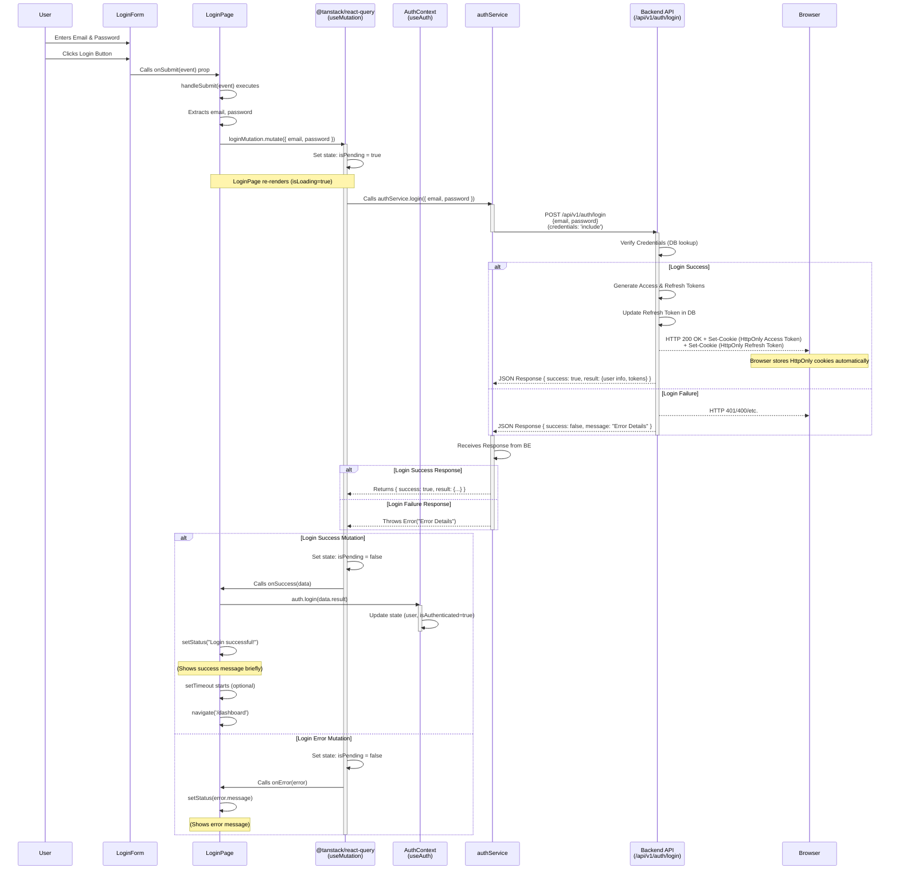

# Login flow

**Explanation of the Diagram:**

1. **User Interaction:** The flow starts with the user interacting with the `LoginForm`.
2. **Component Interaction:** `LoginForm` calls the `onSubmit` handler provided by `LoginPage`.
3. **Mutation Trigger:** `LoginPage` triggers the `useMutation` hook (`loginMutation.mutate`).
4. **Loading State:** `useMutation` immediately sets its internal state to pending, causing `LoginPage` to re-render with `isLoading = true`.
5. **Service Call:** `useMutation` executes the `authService.login` function.
6. **API Request:** `authService` sends the actual POST request to the backend API endpoint, ensuring `credentials: 'include'` is set so cookies can be received and sent later.
7. **Backend Processing:** The backend verifies credentials, interacts with the database (on success), and generates tokens.
8. **Backend Response:**
    - **Success:** Sends a 2xx status, the user data/tokens in the JSON body, _and_ `Set-Cookie` headers for the HttpOnly tokens.
    - **Failure:** Sends a 4xx/5xx status and an error message in the JSON body.
9. **Browser Cookie Handling:** The browser automatically intercepts the `Set-Cookie` headers and stores the `HttpOnly` tokens securely. The frontend JavaScript _cannot_ access these.
10. **Service Response Handling:** `authService` receives the HTTP response, parses the JSON, and either returns the success data or throws an error based on the response status and the `success` flag in the JSON.
11. **Mutation Outcome:** `useMutation` receives the result (or error) from `authService`.
12. **Callbacks & State Updates:**
    - **Success:** `useMutation` calls the `onSuccess` callback in `LoginPage`. `LoginPage` updates the global `AuthContext` using `auth.login()` and sets its local status message.
    - **Error:** `useMutation` calls the `onError` callback in `LoginPage`. `LoginPage` sets its local error status message.
13. **Navigation:** On successful login, `LoginPage` navigates the user to the dashboard route.
