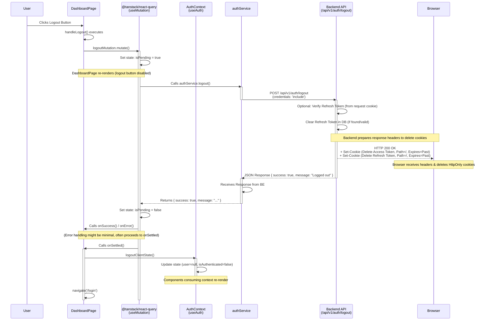

# Logout Flow

**Explanation of the Logout Diagram:**

1.  **User Action:** The user clicks the logout button on the `DashboardPage`.
2.  **Trigger Mutation:** The `handleLogout` function in `DashboardPage` calls `logoutMutation.mutate()`.
3.  **Loading State:** `useMutation` sets its state to pending (`isPending = true`), causing the UI to update (e.g., disable the logout button, show a spinner).
4.  **Service Call:** `useMutation` executes `authService.logout`.
5.  **API Request:** `authService` sends a POST request to the backend `/api/v1/auth/logout` endpoint. Crucially, `credentials: 'include'` ensures the browser sends existing cookies (like the refresh token) with the request.
6.  **Backend Processing:**
    - The backend receives the request.
    - It _optionally_ reads and verifies the refresh token cookie to identify the user and ensure the token matches the one in the database.
    - It updates the user's record in the database, setting `refresh_token` to `NULL`.
    - It prepares an HTTP response (typically 200 OK).
7.  **Cookie Deletion Headers:** The backend adds `Set-Cookie` headers to the response for _both_ the access token and refresh token cookies. These headers specify the same `Path`, `Domain` (if used), `HttpOnly`, `Secure`, and `SameSite` attributes as when the cookies were set, but crucially set the `Expires` attribute to a date in the past (or `Max-Age=0`).
8.  **Browser Action:** The browser receives the response and the `Set-Cookie` headers. It identifies the matching cookies and removes them because they are now expired.
9.  **Backend Response to Frontend:** The backend sends the JSON response (e.g., `{ success: true, message: "Logged out" }`) back to the `authService`.
10. **Service Response Handling:** `authService` returns the backend's response data to the `useMutation` hook.
11. **Mutation Outcome:**
    - `useMutation` sets `isPending = false`.
    - It calls `onSuccess` or `onError` based on the API call result (though often, logout proceeds client-side regardless of minor backend errors).
    - It calls `onSettled`, which is guaranteed to run after success _or_ error.
12. **Client-Side State Update:** Inside `onSettled`, the `DashboardPage` calls `logoutClientState()` from the `AuthContext`.
13. **Context Update:** `AuthContext` updates its internal state, setting `user` to `null` and `isAuthenticated` to `false`. This triggers re-renders in any component consuming the context.
14. **Navigation:** `DashboardPage` uses `navigate` to redirect the user back to the `/login` page.
