# Understanding React Internals

## Prompt: *What are the core concepts on how React works under the hood?*
Explain using also mermaid diagrams and typescript examples.*

### LLM:

#### How React Works Under the Hood

React is a popular JavaScript library for building user interfaces. Understanding how it works internally can help you write more efficient code and debug issues more effectively. Let's explore the core concepts:

##### 1. Virtual DOM

React's most distinctive feature is the Virtual DOM (VDOM). Instead of directly manipulating the browser's DOM, React creates a lightweight copy of it in memory.

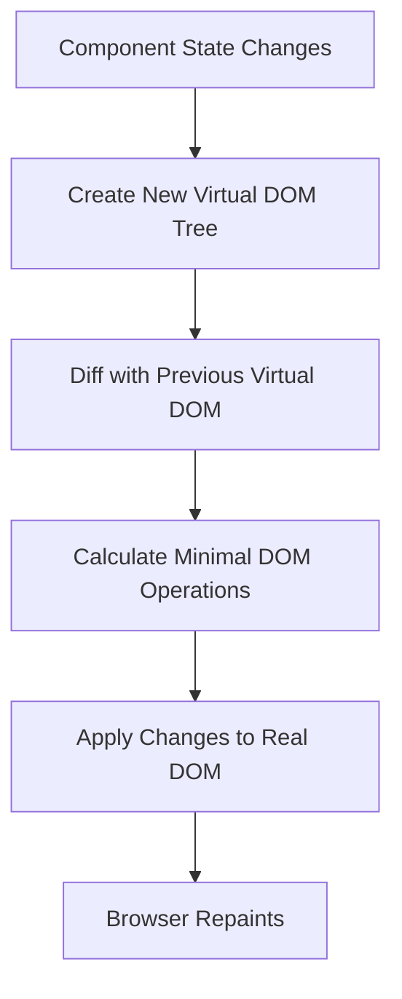

**TypeScript Example:**

```typescript
// Simplified representation of Virtual DOM nodes
interface VNode {
  type: string | Function;
  props: Record<string, any>;
  children: VNode[];
}

// Very simplified version of how React might represent a component
const vnode: VNode = {
  type: 'div',
  props: { className: 'container' },
  children: [
    {
      type: 'h1',
      props: {},
      children: [{ type: 'text', props: { content: 'Hello World' }, children: [] }]
    }
  ]
};
```

##### 2. Reconciliation Algorithm (Diffing)

React's reconciliation algorithm (often called "diffing") efficiently determines what has changed in the Virtual DOM.

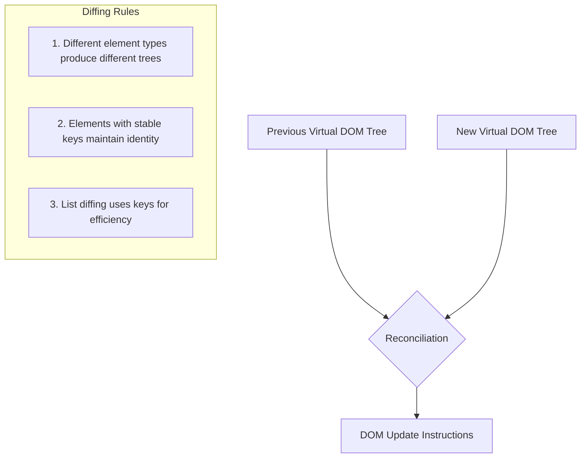

**TypeScript Example:**

```typescript
// Simplified diff function
function diff(oldVNode: VNode | null, newVNode: VNode | null): DOMPatch[] {
  // If old node doesn't exist, create new DOM node
  if (oldVNode === null) {
    return [{ type: 'CREATE', node: newVNode }];
  }

  // If new node doesn't exist, remove old DOM node
  if (newVNode === null) {
    return [{ type: 'REMOVE' }];
  }

  // If node types differ, replace the entire node
  if (oldVNode.type !== newVNode.type) {
    return [{ type: 'REPLACE', node: newVNode }];
  }

  // If it's a text node and content changed
  if (oldVNode.type === 'text' && newVNode.type === 'text' &&
      oldVNode.props.content !== newVNode.props.content) {
    return [{ type: 'UPDATE_TEXT', content: newVNode.props.content }];
  }

  // If we get here, we need to update the node's properties and diff its children
  const patches: DOMPatch[] = [];

  // Diff props
  if (JSON.stringify(oldVNode.props) !== JSON.stringify(newVNode.props)) {
    patches.push({ type: 'UPDATE_PROPS', props: newVNode.props });
  }

  // Diff children (simplified)
  // In reality, React uses a more complex algorithm with keys
  for (let i = 0; i < Math.max(oldVNode.children.length, newVNode.children.length); i++) {
    const childPatches = diff(
      oldVNode.children[i] || null,
      newVNode.children[i] || null
    );
    patches.push(...childPatches.map(patch => ({ ...patch, childIndex: i })));
  }

  return patches;
}

type DOMPatch =
  | { type: 'CREATE', node: VNode }
  | { type: 'REMOVE' }
  | { type: 'REPLACE', node: VNode }
  | { type: 'UPDATE_TEXT', content: string }
  | { type: 'UPDATE_PROPS', props: Record<string, any> }
  | { type: 'CREATE', node: VNode, childIndex: number }
  | { type: 'REMOVE', childIndex: number }
  | { type: 'REPLACE', node: VNode, childIndex: number }
  | { type: 'UPDATE_TEXT', content: string, childIndex: number }
  | { type: 'UPDATE_PROPS', props: Record<string, any>, childIndex: number };
```

##### 3. Component Rendering Lifecycle

React components go through a lifecycle from initialization to unmounting.

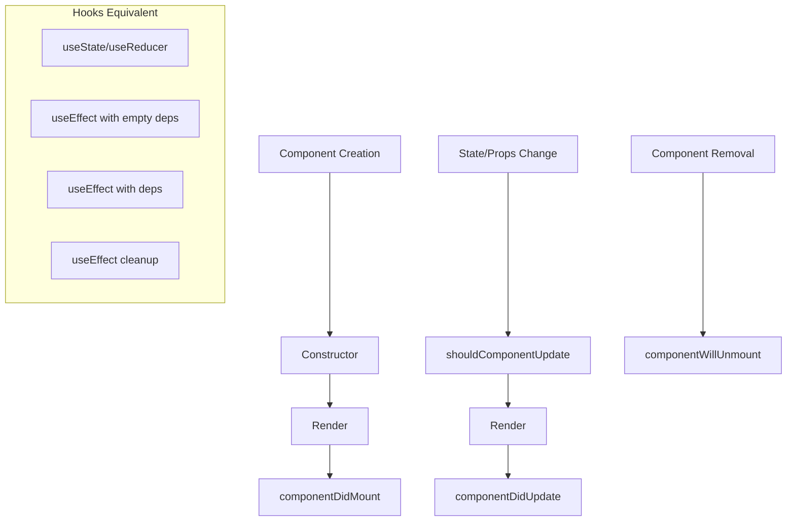

**TypeScript Example (Class Component):**

```typescript
class Counter extends React.Component<{}, { count: number }> {
  constructor(props: {}) {
    super(props);
    this.state = { count: 0 };
  }

  componentDidMount() {
    console.log('Component mounted');
  }

  componentDidUpdate(prevProps: {}, prevState: { count: number }) {
    if (prevState.count !== this.state.count) {
      console.log(`Count updated from ${prevState.count} to ${this.state.count}`);
    }
  }

  componentWillUnmount() {
    console.log('Component will unmount');
  }

  render() {
    return (
      <div>
        <p>Count: {this.state.count}</p>
        <button onClick={() => this.setState({ count: this.state.count + 1 })}>
          Increment
        </button>
      </div>
    );
  }
}
```

**TypeScript Example (Functional Component with Hooks):**

```typescript
const Counter: React.FC = () => {
  const [count, setCount] = React.useState(0);

  // Similar to componentDidMount
  React.useEffect(() => {
    console.log('Component mounted');

    // Similar to componentWillUnmount
    return () => {
      console.log('Component will unmount');
    };
  }, []);

  // Similar to componentDidUpdate for count
  React.useEffect(() => {
    if (count > 0) { // Skip first render
      console.log(`Count updated to ${count}`);
    }
  }, [count]);

  return (
    <div>
      <p>Count: {count}</p>
      <button onClick={() => setCount(count + 1)}>
        Increment
      </button>
    </div>
  );
};
```

##### 4. Fiber Architecture

In React 16, the Fiber architecture was introduced to enable incremental rendering.

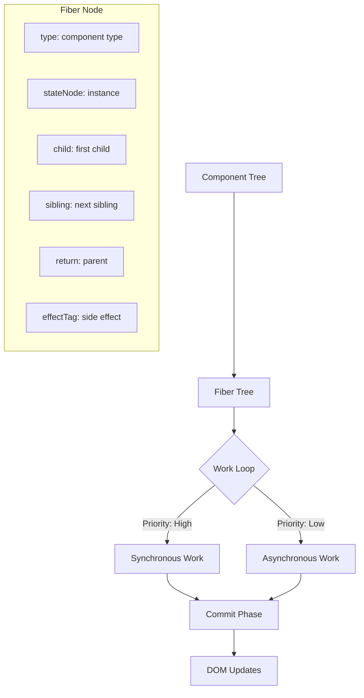

**TypeScript Example (Simplified Fiber Node):**

```typescript
interface FiberNode {
  // Instance
  type: string | Function | null;
  stateNode: any;

  // Fiber structure
  child: FiberNode | null;
  sibling: FiberNode | null;
  return: FiberNode | null;

  // Effects
  effectTag: number;
  nextEffect: FiberNode | null;

  // Work information
  pendingProps: any;
  memoizedProps: any;
  memoizedState: any;
  updateQueue: UpdateQueue | null;

  // Scheduling
  expirationTime: number;
}

// How React might traverse the fiber tree
function workLoop(deadline: IdleDeadline) {
  let shouldYield = false;
  while (nextUnitOfWork && !shouldYield) {
    nextUnitOfWork = performUnitOfWork(nextUnitOfWork);
    shouldYield = deadline.timeRemaining() < 1;
  }

  if (!nextUnitOfWork && pendingCommit) {
    commitWork(pendingCommit);
  }

  requestIdleCallback(workLoop);
}
```

##### 5. State Management and Re-rendering

React's state management triggers re-renders when state changes.

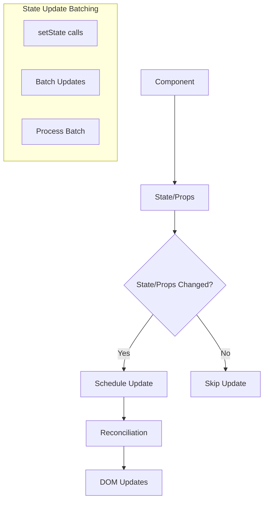

**TypeScript Example:**

```typescript
// How React might handle state updates internally
interface UpdateQueue<State> {
  pending: Update<State> | null;
}

interface Update<State> {
  action: State | ((prevState: State) => State);
  next: Update<State> | null;
}

// Simplified version of how useState might work
function useState<T>(initialState: T): [T, (newState: T | ((prev: T) => T)) => void] {
  const fiber = getCurrentFiber();
  const hook = getOrCreateHook(fiber);

  // Initialize state on first render
  if (hook.memoizedState === undefined) {
    hook.memoizedState = initialState;
  }

  const setState = (newState: T | ((prev: T) => T)) => {
    // Create an update
    const update: Update<T> = {
      action: newState,
      next: null
    };

    // Add to update queue
    if (hook.queue.pending === null) {
      // Create a circular list
      update.next = update;
    } else {
      update.next = hook.queue.pending.next;
      hook.queue.pending.next = update;
    }
    hook.queue.pending = update;

    // Schedule work
    scheduleWork(fiber);
  };

  return [hook.memoizedState, setState];
}
```

##### 6. Event Handling System

React implements a synthetic event system for cross-browser compatibility.

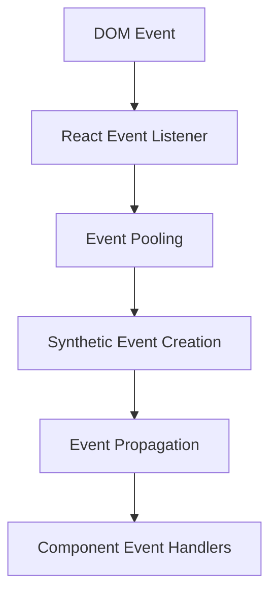

**TypeScript Example:**

```typescript
// Simplified synthetic event
interface SyntheticEvent<T = Element> {
  bubbles: boolean;
  currentTarget: EventTarget & T;
  cancelable: boolean;
  defaultPrevented: boolean;
  eventPhase: number;
  isTrusted: boolean;
  nativeEvent: Event;
  target: EventTarget & T;
  timeStamp: number;
  type: string;
  preventDefault(): void;
  stopPropagation(): void;
}

// How React might set up event delegation
function setupEventSystem(rootContainer: HTMLElement) {
  // Instead of attaching handlers to each element,
  // React attaches a single handler at the root
  const eventTypes = ['click', 'change', 'keydown', /* etc */];

  eventTypes.forEach(eventType => {
    rootContainer.addEventListener(eventType, handleEvent, false);
  });
}

function handleEvent(nativeEvent: Event) {
  // Create synthetic event
  const syntheticEvent = createSyntheticEvent(nativeEvent);

  // Find the fiber/component for the target
  let target = nativeEvent.target as HTMLElement;
  let fiber = getClosestFiber(target);

  // Simulate capturing phase
  const captured = [];
  while (fiber) {
    captured.unshift(fiber);
    fiber = fiber.return;
  }

  // Dispatch capture phase
  for (const fiber of captured) {
    const handler = fiber.stateNode[`on${syntheticEvent.type}Capture`];
    if (handler) {
      handler(syntheticEvent);
      if (syntheticEvent.defaultPrevented) {
        return;
      }
    }
  }

  // Simulate bubbling phase
  fiber = getClosestFiber(target);
  while (fiber && !syntheticEvent.isPropagationStopped()) {
    const handler = fiber.stateNode[`on${syntheticEvent.type}`];
    if (handler) {
      handler(syntheticEvent);
    }
    fiber = fiber.return;
  }

  // Return event to pool
  releaseEvent(syntheticEvent);
}
```

#### Putting It All Together

Here's a high-level overview of how these concepts work together:

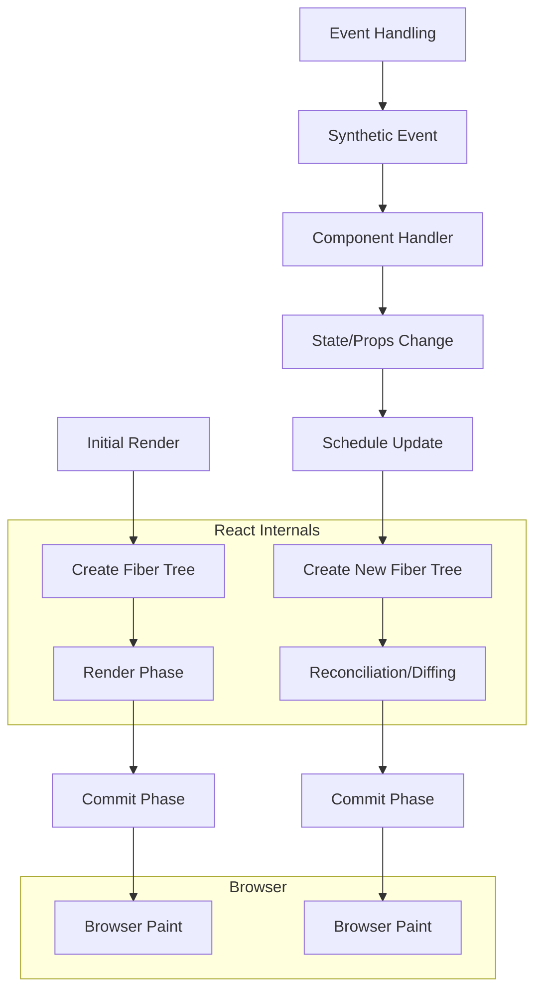

Understanding these core concepts gives you a solid foundation for how React works under the hood. This knowledge can help you optimize your applications and debug complex issues more effectively.

## Prompt: *Explain in more depth the Component Rendering Lifecycle for functional components*

### LLM:

#### React Functional Component Rendering Lifecycle In Depth

Functional components have revolutionized React development by simplifying the component model while providing powerful capabilities through hooks. Let's explore their lifecycle in detail.

##### The Mental Model: From Classes to Hooks

Unlike class components with their predefined lifecycle methods, functional components use hooks to tap into React's lifecycle. This creates a more flexible but sometimes less obvious lifecycle flow.

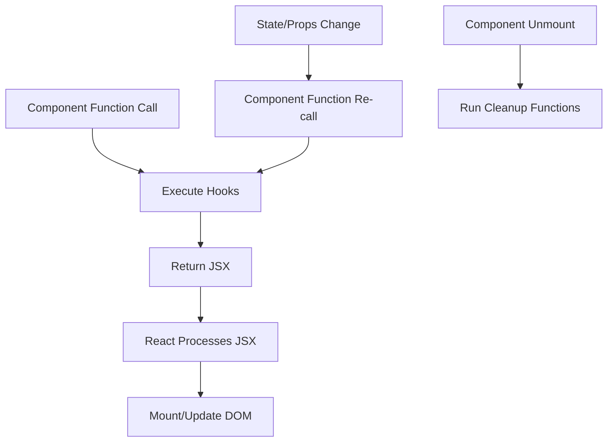

##### Initial Render Phase

When a functional component first renders, React executes the entire function body from top to bottom.

```typescript
function ProfileCard({ userId }: { userId: string }) {
  console.log('1. Component function body executing'); // Runs on every render

  // State initialization
  const [user, setUser] = useState<User | null>(null);
  const [isLoading, setIsLoading] = useState(true);

  // Effect setup (doesn't run yet)
  useEffect(() => {
    console.log('4. Effect function executing after DOM update');

    async function fetchUser() {
      setIsLoading(true);
      try {
        const userData = await api.getUser(userId);
        setUser(userData);
      } catch (error) {
        console.error('Failed to fetch user', error);
      } finally {
        setIsLoading(false);
      }
    }

    fetchUser();

    // Cleanup function defined (doesn't run on initial render)
    return () => {
      console.log('Cleanup from previous effect (not run on initial render)');
    };
  }, [userId]); // Dependency array

  console.log('2. Preparing to return JSX');

  // Render output
  return (
    <div className="profile-card">
      {isLoading ? (
        <Spinner />
      ) : user ? (
        <>
          <h2>{user.name}</h2>
          <p>{user.bio}</p>
        </>
      ) : (
        <p>User not found</p>
      )}
    </div>
  );

  // After this point, React takes the JSX, processes it, and updates the DOM
  console.log('3. This never runs - after return statement');
}
```

The sequence for initial render:
1. Component function executes from top to bottom
2. All hooks are called in order (useState, useEffect, etc.)
3. JSX is returned
4. React processes the JSX and updates the DOM
5. Browser paints the screen
6. Effect functions (useEffect) run

##### Re-render Phase

When props change or state updates, React re-executes the entire function body:

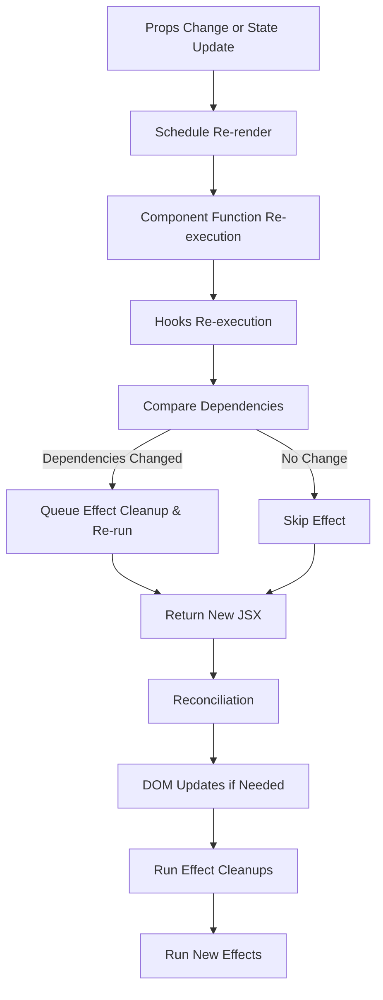

Let's see how this works with our example:

```typescript
// Re-render due to parent re-rendering or state change
function ProfileCard({ userId }: { userId: string }) {
  console.log('1. Component re-executing'); // Runs again

  // State retrieval (not initialization)
  const [user, setUser] = useState<User | null>(null);
  const [isLoading, setIsLoading] = useState(true);

  // Effect evaluation
  useEffect(() => {
    console.log('5. Effect re-executing (only if userId changed)');

    async function fetchUser() {
      setIsLoading(true);
      try {
        const userData = await api.getUser(userId);
        setUser(userData);
      } catch (error) {
        console.error('Failed to fetch user', error);
      } finally {
        setIsLoading(false);
      }
    }

    fetchUser();

    return () => {
      console.log('4. Cleanup from previous effect (runs before new effect)');
    };
  }, [userId]); // React checks if userId changed

  console.log('2. Preparing to return JSX again');

  // Return potentially new JSX
  return (
    <div className="profile-card">
      {isLoading ? (
        <Spinner />
      ) : user ? (
        <>
          <h2>{user.name}</h2>
          <p>{user.bio}</p>
        </>
      ) : (
        <p>User not found</p>
      )}
    </div>
  );

  // 3. React processes new JSX, performs reconciliation
}
```

The sequence for re-renders:
1. Component function re-executes
2. Hooks are called again, but React associates them with previous state
3. New JSX is returned
4. React reconciles the new JSX with previous render
5. If needed, DOM is updated
6. Browser paints changes
7. Cleanup functions from previous effects run (if dependencies changed)
8. New effect functions run (if dependencies changed)

##### Unmounting Phase

When a component is removed from the UI:

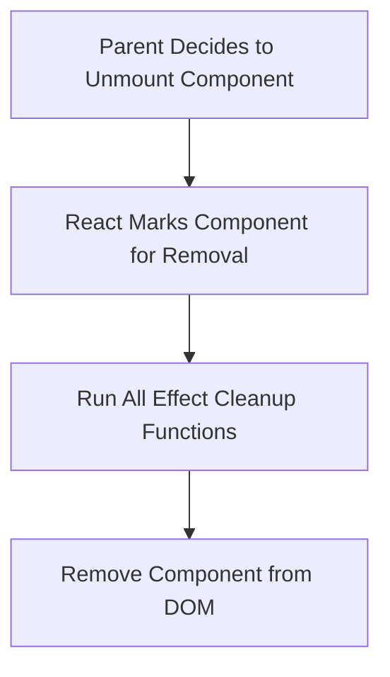

```typescript
// When component is about to be unmounted
// The component function doesn't run again
// Instead, React runs all cleanup functions

// For our example, React would call:
() => {
  console.log('Cleanup from effect (runs during unmount)');
}
```

##### Hook Dependencies and Lifecycle Control

The dependency array in hooks is crucial for controlling when effects run:

```typescript
// Runs after every render
useEffect(() => {
  console.log('This runs after every render');
});

// Runs only on mount (empty dependency array)
useEffect(() => {
  console.log('This runs only on mount');
  return () => console.log('This runs only on unmount');
}, []);

// Runs on mount and when dependencies change
useEffect(() => {
  console.log(`This runs when count (${count}) changes`);
  return () => console.log('This runs before next effect or on unmount');
}, [count]);
```

##### Advanced Hooks and Their Lifecycle Behavior

Let's explore how other hooks integrate into the lifecycle:

###### useLayoutEffect

Similar to useEffect but runs synchronously after DOM mutations but before the browser paints:

```typescript
function MeasureComponent() {
  const [width, setWidth] = useState(0);
  const ref = useRef<HTMLDivElement>(null);

  // Runs synchronously after DOM mutations but before browser paint
  useLayoutEffect(() => {
    if (ref.current) {
      // This measurement and update happens before the user sees anything
      const measuredWidth = ref.current.getBoundingClientRect().width;
      setWidth(measuredWidth);
    }
  }, []);

  return (
    <div>
      <div ref={ref}>Measure me</div>
      <p>The width is: {width}px</p>
    </div>
  );
}
```

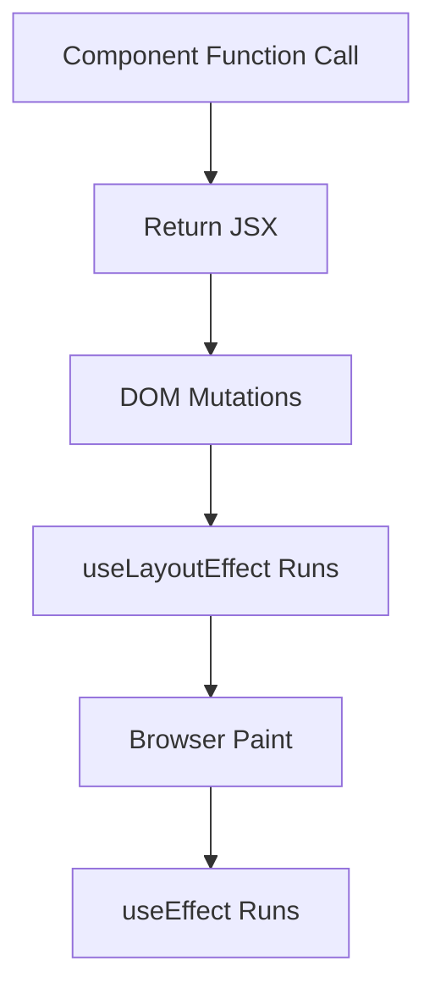

###### useCallback and useMemo

These hooks memoize values across renders based on dependencies:

```typescript
function SearchComponent({ onSearch }: { onSearch: (term: string) => void }) {
  const [searchTerm, setSearchTerm] = useState('');

  // Memoized callback - only changes if dependencies change
  const debouncedSearch = useCallback(
    debounce((term: string) => {
      console.log('Searching for:', term);
      onSearch(term);
    }, 500),
    [onSearch] // Only recreate if onSearch changes
  );

  // Memoized value - only recalculates if dependencies change
  const isValidSearch = useMemo(() => {
    console.log('Calculating validity for:', searchTerm);
    return searchTerm.length >= 3;
  }, [searchTerm]);

  return (
    <div>
      <input
        value={searchTerm}
        onChange={e => {
          setSearchTerm(e.target.value);
          debouncedSearch(e.target.value);
        }}
      />
      {!isValidSearch && <p>Search term must be at least 3 characters</p>}
    </div>
  );
}
```

###### useRef

Persists values across renders without causing re-renders:

```typescript
function IntervalCounter() {
  const [count, setCount] = useState(0);
  const intervalRef = useRef<number | null>(null);

  // Setup on mount
  useEffect(() => {
    console.log('Setting up interval');
    intervalRef.current = window.setInterval(() => {
      setCount(c => c + 1);
    }, 1000);

    // Cleanup on unmount
    return () => {
      console.log('Clearing interval');
      if (intervalRef.current !== null) {
        clearInterval(intervalRef.current);
      }
    };
  }, []);

  // The ref value persists across renders but changing it doesn't trigger re-renders
  const handleReset = () => {
    setCount(0);
    // We can access the current interval even though it was set in an effect
    if (intervalRef.current !== null) {
      clearInterval(intervalRef.current);
      intervalRef.current = window.setInterval(() => {
        setCount(c => c + 1);
      }, 1000);
    }
  };

  return (
    <div>
      <p>Count: {count}</p>
      <button onClick={handleReset}>Reset</button>
    </div>
  );
}
```

##### Custom Hooks and Lifecycle Composition

Custom hooks allow you to compose lifecycle behaviors:

```typescript
// Custom hook that manages resource fetching lifecycle
function useResource<T>(fetchFn: () => Promise<T>, dependencies: any[] = []) {
  const [data, setData] = useState<T | null>(null);
  const [isLoading, setIsLoading] = useState(true);
  const [error, setError] = useState<Error | null>(null);

  useEffect(() => {
    let isMounted = true;
    setIsLoading(true);

    fetchFn()
      .then(result => {
        if (isMounted) {
          setData(result);
          setError(null);
        }
      })
      .catch(err => {
        if (isMounted) {
          setError(err);
          setData(null);
        }
      })
      .finally(() => {
        if (isMounted) {
          setIsLoading(false);
        }
      });

    // Cleanup function handles component unmounting during fetch
    return () => {
      isMounted = false;
    };
  }, dependencies);

  return { data, isLoading, error };
}

// Using the custom hook
function UserProfile({ userId }: { userId: string }) {
  const {
    data: user,
    isLoading,
    error
  } = useResource(() => api.getUser(userId), [userId]);

  if (isLoading) return <Spinner />;
  if (error) return <ErrorMessage error={error} />;
  if (!user) return <p>User not found</p>;

  return (
    <div>
      <h2>{user.name}</h2>
      <p>{user.bio}</p>
    </div>
  );
}
```

##### Functional Component Lifecycle Debugging

To debug lifecycle issues in functional components:

```typescript
function DebuggableComponent({ prop1, prop2 }: Props) {
  // Log renders
  console.log('Component rendering with props:', { prop1, prop2 });

  // Track previous props
  const prevPropsRef = useRef<Props | null>(null);

  // Log what caused re-render
  useEffect(() => {
    if (prevPropsRef.current) {
      const prevProps = prevPropsRef.current;
      const changedProps: Record<string, { from: any, to: any }> = {};

      if (prevProps.prop1 !== prop1) {
        changedProps.prop1 = { from: prevProps.prop1, to: prop1 };
      }

      if (prevProps.prop2 !== prop2) {
        changedProps.prop2 = { from: prevProps.prop2, to: prop2 };
      }

      if (Object.keys(changedProps).length > 0) {
        console.log('Component re-rendered due to prop changes:', changedProps);
      } else {
        console.log('Component re-rendered but props unchanged (likely state or context change)');
      }
    } else {
      console.log('Component mounted for the first time');
    }

    prevPropsRef.current = { prop1, prop2 };
  });

  // State with debugging
  const [count, setCount] = useState(0);

  // Log state changes
  useEffect(() => {
    console.log('Count state changed to:', count);
  }, [count]);

  return <div>{/* JSX */}</div>;
}
```

##### The Complete Lifecycle Flow

Here's a comprehensive view of a functional component's lifecycle:

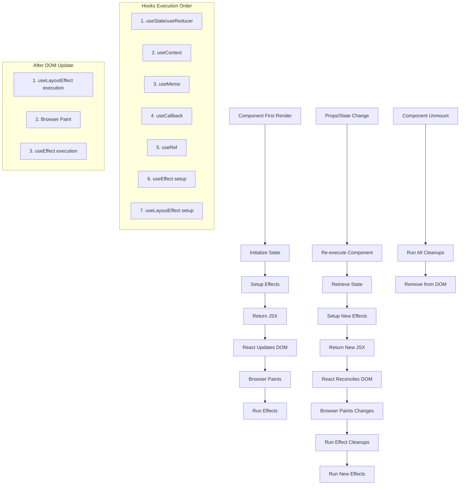

##### Key Takeaways for Functional Component Lifecycle

1. **Mental Shift**: Think of components as functions that run on every render, not objects with discrete lifecycle events.

2. **Execution Order**: The entire function body executes on every render before any effects run.

3. **Effect Timing**:
   - `useLayoutEffect` runs synchronously after DOM mutations but before painting
   - `useEffect` runs asynchronously after painting

4. **Dependency Arrays**: These control when effects and memoized values are recalculated.

5. **Cleanup Functions**: Run before the next effect execution or on unmount.

6. **State Updates**: Trigger re-renders but the new state is only available in the next render.

7. **Refs**: Persist across renders without causing re-renders.

Understanding this lifecycle model helps you write more predictable and efficient React components while avoiding common pitfalls like infinite re-render loops or stale closures.

## Prompt: *Explain in more details how  useRef for Persisting values across renders without causing re-renders works*

### LLM:

#### Understanding useRef: Persisting Values Across Renders

The `useRef` hook is one of React's most powerful yet sometimes misunderstood features. Let's dive deep into how it works, why it doesn't trigger re-renders, and how to leverage it effectively.

##### Core Mechanics of useRef

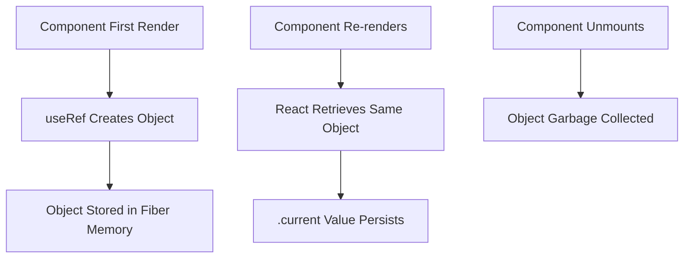

At its core, `useRef` returns a mutable object with a `.current` property that persists across renders. Unlike state:

1. Modifying `.current` doesn't trigger a re-render
2. The same object reference is maintained across renders
3. Each component instance gets its own ref object

##### How useRef Works Under the Hood

When you call `useRef`, React creates an object and stores it in the component's Fiber node (React's internal representation of a component):

```typescript
// Simplified internal implementation
function useRef<T>(initialValue: T): { current: T } {
  const dispatcher = resolveDispatcher();
  return dispatcher.useRef(initialValue);
}

// Inside React's reconciler
function mountRef<T>(initialValue: T): { current: T } {
  const hook = mountWorkInProgressHook();
  const ref = { current: initialValue };
  hook.memoizedState = ref;
  return ref;
}

function updateRef<T>(_initialValue: T): { current: T } {
  const hook = updateWorkInProgressHook();
  return hook.memoizedState;
}
```

Let's see this in action with a detailed example:

```typescript
function Timer() {
  // On first render, React creates { current: null } and stores it
  const intervalRef = useRef<number | null>(null);
  const [seconds, setSeconds] = useState(0);

  console.log("Component rendering, intervalRef:", intervalRef);
  // Even after re-renders, this is the same object reference

  useEffect(() => {
    console.log("Effect running, setting up interval");
    // We can modify .current without triggering re-renders
    intervalRef.current = window.setInterval(() => {
      setSeconds(s => s + 1);
    }, 1000);

    // This cleanup function runs when component unmounts
    return () => {
      console.log("Cleaning up interval:", intervalRef.current);
      if (intervalRef.current !== null) {
        clearInterval(intervalRef.current);
        intervalRef.current = null;
      }
    };
  }, []);

  const handleReset = () => {
    setSeconds(0);
    // We can access and modify .current from event handlers
    if (intervalRef.current !== null) {
      clearInterval(intervalRef.current);
      intervalRef.current = window.setInterval(() => {
        setSeconds(s => s + 1);
      }, 1000);
    }
  };

  return (
    <div>
      <p>Seconds: {seconds}</p>
      <button onClick={handleReset}>Reset</button>
    </div>
  );
}
```

##### Why Mutations Don't Cause Re-renders

React's rendering model is based on two key principles:

1. Components re-render when their state or props change
2. React detects these changes through the useState/useReducer APIs

When you modify a ref's `.current` property, you're bypassing React's state system entirely:

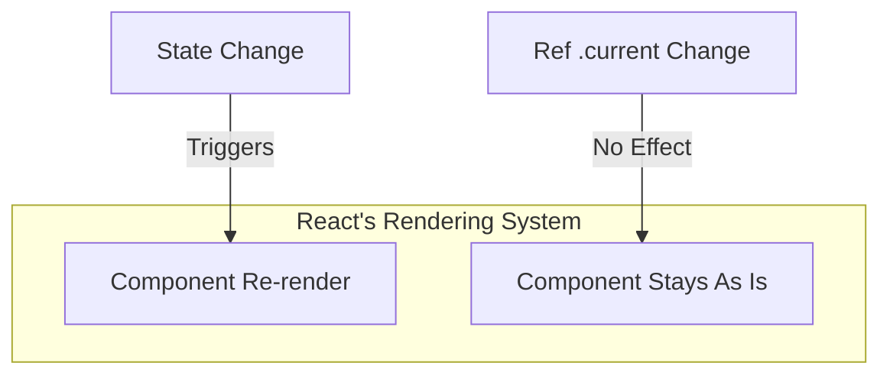

Let's demonstrate this with a comparative example:

```typescript
function StateVsRefExample() {
  const [stateCount, setStateCount] = useState(0);
  const refCount = useRef(0);

  console.log("Rendering component");
  console.log("State count:", stateCount);
  console.log("Ref count:", refCount.current);

  const incrementState = () => {
    console.log("Incrementing state");
    setStateCount(stateCount + 1);
    // This triggers a re-render
  };

  const incrementRef = () => {
    console.log("Incrementing ref");
    refCount.current += 1;
    console.log("New ref value:", refCount.current);
    // This doesn't trigger a re-render
  };

  return (
    <div>
      <p>State count: {stateCount}</p>
      <p>Ref count: {refCount.current}</p>
      <button onClick={incrementState}>Increment State</button>
      <button onClick={incrementRef}>Increment Ref</button>
    </div>
  );
}
```

If you click "Increment Ref" multiple times and then click "Increment State", you'll see that the ref count has been updated all along, but the UI only reflects it after the state-triggered re-render.

##### The Memory Model: How Values Persist

To understand how refs persist values, let's look at React's memory model:

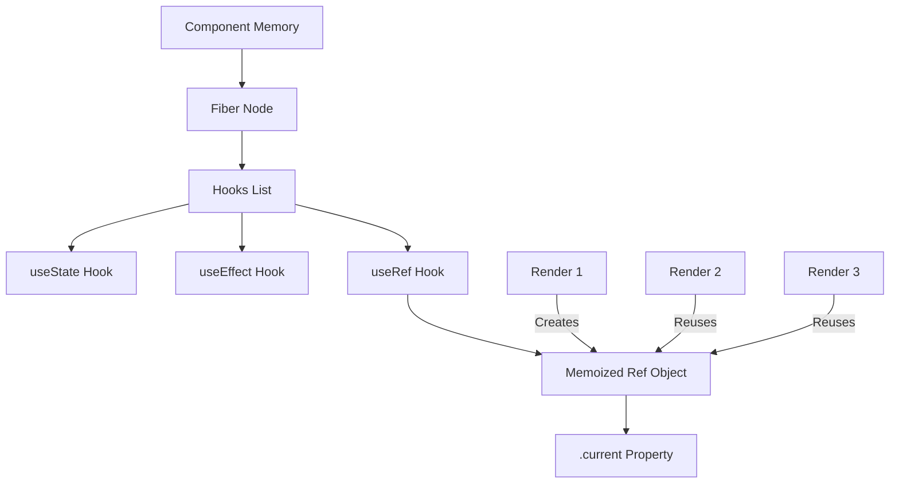

When React renders your component:

1. It allocates memory for the component's Fiber node
2. It maintains a list of hooks used by the component
3. For useRef, it either creates a new ref object (first render) or retrieves the existing one (subsequent renders)
4. The ref object lives in React's internal memory, not in the function's scope

This is why the ref persists even though the component function re-executes:

```typescript
function PersistenceExample() {
  // This function executes from top to bottom on every render

  // Local variables don't persist
  let localCounter = 0;

  // Refs persist
  const persistentCounter = useRef(0);

  // State persists and triggers re-renders
  const [renderCount, setRenderCount] = useState(0);

  console.log("Render #", renderCount);
  console.log("Local counter:", localCounter);
  console.log("Persistent counter:", persistentCounter.current);

  const incrementLocal = () => {
    localCounter += 1;
    console.log("Incremented local to:", localCounter);
    // This value will be reset on next render
  };

  const incrementPersistent = () => {
    persistentCounter.current += 1;
    console.log("Incremented persistent to:", persistentCounter.current);
    // This value will persist
  };

  const triggerRerender = () => {
    setRenderCount(renderCount + 1);
  };

  return (
    <div>
      <p>Render count: {renderCount}</p>
      <p>Local counter: {localCounter}</p>
      <p>Persistent counter: {persistentCounter.current}</p>
      <button onClick={incrementLocal}>Increment Local</button>
      <button onClick={incrementPersistent}>Increment Persistent</button>
      <button onClick={triggerRerender}>Force Re-render</button>
    </div>
  );
}
```

##### Advanced useRef Patterns

###### 1. Tracking Previous Values

One common pattern is using refs to track previous props or state:

```typescript
function usePrevious<T>(value: T): T | undefined {
  const ref = useRef<T>();

  useEffect(() => {
    // Update after render with current value
    ref.current = value;
  }, [value]);

  // Return previous value (undefined on first render)
  return ref.current;
}

function Counter() {
  const [count, setCount] = useState(0);
  const prevCount = usePrevious(count);

  return (
    <div>
      <p>Current: {count}, Previous: {prevCount ?? 'None'}</p>
      <button onClick={() => setCount(count + 1)}>Increment</button>
    </div>
  );
}
```

How this works:
1. On first render, ref.current is undefined
2. After render, the effect sets ref.current to the initial value
3. On subsequent renders, we get the previous value because the effect hasn't run yet
4. After each render, the effect updates ref.current to the new current value

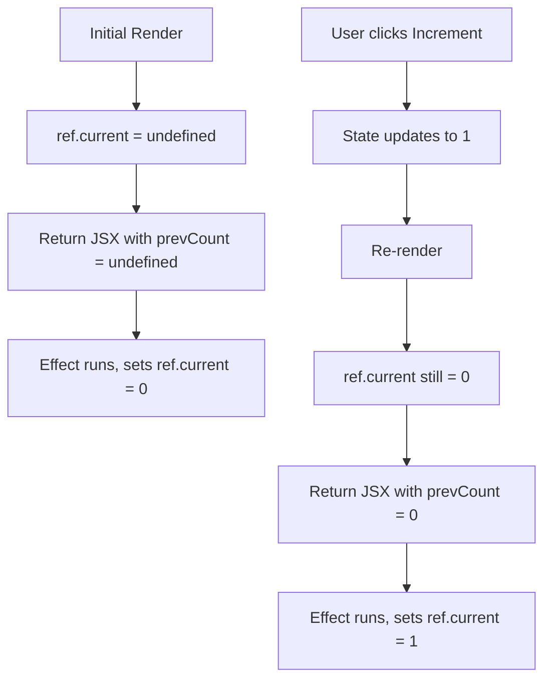

###### 2. Instance Variables (Class Component Equivalent)

Refs can replace instance variables from class components:

```typescript
// Class component with instance variables
class ClassCounter extends React.Component {
  private timerId: number | null = null;

  componentDidMount() {
    this.timerId = window.setInterval(() => {
      this.forceUpdate();
    }, 1000);
  }

  componentWillUnmount() {
    if (this.timerId) {
      clearInterval(this.timerId);
    }
  }

  render() {
    return <div>{new Date().toLocaleTimeString()}</div>;
  }
}

// Functional component equivalent using useRef
function FunctionalCounter() {
  const timerIdRef = useRef<number | null>(null);
  const [, forceUpdate] = useReducer(x => x + 1, 0);

  useEffect(() => {
    timerIdRef.current = window.setInterval(() => {
      forceUpdate();
    }, 1000);

    return () => {
      if (timerIdRef.current) {
        clearInterval(timerIdRef.current);
      }
    };
  }, []);

  return <div>{new Date().toLocaleTimeString()}</div>;
}
```

###### 3. Mutable Values in Event Handlers

Refs are particularly useful for accessing current values in event handlers without stale closures:

```typescript
function SearchComponent() {
  const [searchTerm, setSearchTerm] = useState('');
  const searchTermRef = useRef('');

  // Update both state and ref
  const handleChange = (e: React.ChangeEvent<HTMLInputElement>) => {
    const value = e.target.value;
    setSearchTerm(value);
    searchTermRef.current = value;
  };

  useEffect(() => {
    const handleKeyPress = (e: KeyboardEvent) => {
      if (e.key === 'Enter') {
        // This always accesses the current value, even if the effect hasn't re-run
        console.log('Searching for:', searchTermRef.current);
        // If we used searchTerm here, we might get a stale value due to closure
      }
    };

    window.addEventListener('keydown', handleKeyPress);
    return () => window.removeEventListener('keydown', handleKeyPress);
  }, []); // Empty dependency array means this effect runs once

  return (
    <input
      type="text"
      value={searchTerm}
      onChange={handleChange}
      placeholder="Search..."
    />
  );
}
```

###### 4. Imperative Measurements and DOM Manipulation

Refs excel at imperative DOM operations:

```typescript
function MeasureExample() {
  const [height, setHeight] = useState(0);
  const [width, setWidth] = useState(0);
  const elementRef = useRef<HTMLDivElement>(null);

  useEffect(() => {
    const measureElement = () => {
      if (elementRef.current) {
        const { height, width } = elementRef.current.getBoundingClientRect();
        setHeight(height);
        setWidth(width);
      }
    };

    measureElement();
    window.addEventListener('resize', measureElement);

    return () => window.removeEventListener('resize', measureElement);
  }, []);

  return (
    <>
      <div
        ref={elementRef}
        style={{
          padding: '20px',
          backgroundColor: 'lightblue',
          resize: 'both',
          overflow: 'auto',
          maxWidth: '400px'
        }}
      >
        Resize me!
      </div>
      <p>Height: {height}px, Width: {width}px</p>
    </>
  );
}
```

##### Common Pitfalls and Best Practices

###### Pitfall 1: Expecting Re-renders

```typescript
// ❌ This won't work as expected
function BrokenCounter() {
  const countRef = useRef(0);

  const increment = () => {
    countRef.current += 1;
    // UI won't update!
  };

  return (
    <div>
      <p>Count: {countRef.current}</p>
      <button onClick={increment}>Increment</button>
    </div>
  );
}

// ✅ Correct approach: Use state for values that affect rendering
function WorkingCounter() {
  const [count, setCount] = useState(0);
  const countRef = useRef(0);

  const increment = () => {
    countRef.current += 1;
    setCount(countRef.current);
  };

  return (
    <div>
      <p>Count: {count}</p>
      <button onClick={increment}>Increment</button>
    </div>
  );
}
```

###### Pitfall 2: Forgetting That Refs Are Mutable

```typescript
// ❌ Problematic: Ref values can change unexpectedly
function SharedRefComponent() {
  const sharedData = useRef({ count: 0 });

  const incrementInChild = () => {
    sharedData.current.count += 1;
  };

  return (
    <div>
      <ChildComponent data={sharedData} onIncrement={incrementInChild} />
      <p>Parent sees: {sharedData.current.count}</p>
    </div>
  );
}

// ✅ Better: Be explicit about shared mutable state
function ImprovedSharedState() {
  const [count, setCount] = useState(0);
  const countRef = useRef(0);

  const increment = () => {
    countRef.current += 1;
    setCount(countRef.current);
  };

  return (
    <div>
      <ChildComponent count={count} onIncrement={increment} />
      <p>Parent sees: {count}</p>
    </div>
  );
}
```

###### Pitfall 3: Overusing Refs

```typescript
// ❌ Overusing refs
function OverusingRefs() {
  const nameRef = useRef('');
  const ageRef = useRef(0);
  const emailRef = useRef('');

  const handleSubmit = (e: React.FormEvent) => {
    e.preventDefault();
    console.log({
      name: nameRef.current,
      age: ageRef.current,
      email: emailRef.current
    });
  };

  return (
    <form onSubmit={handleSubmit}>
      <input
        type="text"
        onChange={e => nameRef.current = e.target.value}
        placeholder="Name"
      />
      <input
        type="number"
        onChange={e => ageRef.current = parseInt(e.target.value)}
        placeholder="Age"
      />
      <input
        type="email"
        onChange={e => emailRef.current = e.target.value}
        placeholder="Email"
      />
      <button type="submit">Submit</button>
    </form>
  );
}

// ✅ Better: Use state for form values
function FormWithState() {
  const [formData, setFormData] = useState({
    name: '',
    age: 0,
    email: ''
  });

  const handleChange = (e: React.ChangeEvent<HTMLInputElement>) => {
    const { name, value } = e.target;
    setFormData(prev => ({
      ...prev,
      [name]: name === 'age' ? parseInt(value) : value
    }));
  };

  const handleSubmit = (e: React.FormEvent) => {
    e.preventDefault();
    console.log(formData);
  };

  return (
    <form onSubmit={handleSubmit}>
      <input
        name="name"
        type="text"
        value={formData.name}
        onChange={handleChange}
        placeholder="Name"
      />
      <input
        name="age"
        type="number"
        value={formData.age || ''}
        onChange={handleChange}
        placeholder="Age"
      />
      <input
        name="email"
        type="email"
        value={formData.email}
        onChange={handleChange}
        placeholder="Email"
      />
      <button type="submit">Submit</button>
    </form>
  );
}
```

##### Best Practices for useRef

1. **Use refs for values that don't affect rendering**
   - Timers, intervals, and external API instances
   - DOM elements for imperative manipulation
   - Previous values for comparison

2. **Combine with useState when UI updates are needed**
   - Use refs to store the raw data
   - Use state to trigger re-renders when needed

3. **Use TypeScript to ensure type safety**
   - Specify the type of the ref value
   - Handle the null case for DOM refs

4. **Initialize with meaningful defaults**
   - `useRef<number | null>(null)` instead of just `useRef()`
   - This makes your code more self-documenting

5. **Be careful with object refs**
   - Remember that mutating nested properties won't create a new ref object
   - Consider immutable patterns for complex data

##### Conclusion: The Mental Model for useRef

Think of `useRef` as a box that holds a mutable value. This box:

1. Stays the same across renders (same reference)
2. Can have its contents changed at any time
3. Doesn't notify React when you change its contents
4. Is perfect for "remembering" things without triggering renders

This makes refs ideal for:
- Storing values that need to persist between renders but don't affect the UI directly
- Accessing and manipulating DOM elements imperatively
- Storing mutable values that would otherwise be captured in closures
- Creating "instance-like" variables in functional components

By understanding these principles, you can leverage `useRef` effectively while avoiding common pitfalls in your React applications.

## Prompt: *I don't understand the concept about "Each component instance gets its own ref object" you mentioned previously*

### LLM:

#### Understanding Component Instances and Ref Objects

Let me clarify the concept of "each component instance gets its own ref object" with more detail and examples. This is a fundamental aspect of how React manages component state and references.

##### What Are Component Instances?

When you define a React component, you're creating a blueprint or template. When React renders your component in the UI, it creates an instance of that component:

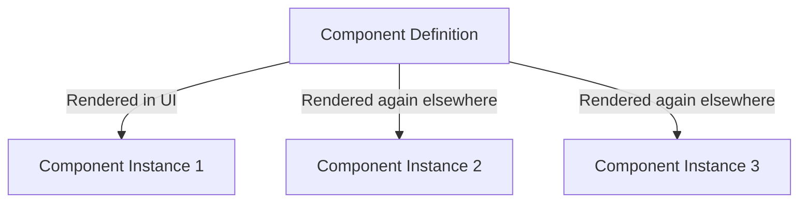

For example, if you define a `Button` component and use it three times in your app, React creates three separate instances of that component, each with its own state and refs.

##### Isolated Ref Objects Per Instance

When you use `useRef` in a component, React creates a unique ref object for each instance of that component. These ref objects are completely independent of each other.

Let's demonstrate this with a clear example:

```typescript
function Counter() {
  // Each Counter instance gets its own countRef
  const countRef = useRef(0);
  const [, forceUpdate] = useReducer(x => x + 1, 0);

  const increment = () => {
    countRef.current += 1;
    forceUpdate(); // Force re-render to see the updated value
  };

  return (
    <div style={{ border: '1px solid black', margin: '10px', padding: '10px' }}>
      <p>Count: {countRef.current}</p>
      <button onClick={increment}>Increment</button>
    </div>
  );
}

function App() {
  return (
    <div>
      <h2>Counter Instances</h2>
      <Counter /> {/* Instance 1 */}
      <Counter /> {/* Instance 2 */}
      <Counter /> {/* Instance 3 */}
    </div>
  );
}
```

In this example:
1. We render three instances of the `Counter` component
2. Each instance has its own `countRef` object
3. When you click "Increment" on one counter, only that counter's value increases
4. The other counters remain unchanged because they have their own independent ref objects

##### Visual Representation of Instance Isolation

Here's how React manages these separate instances in memory:

```mermaid
graph TD
    A[App Component] --> B[Counter Instance 1]
    A --> C[Counter Instance 2]
    A --> D[Counter Instance 3]

    B --> E[Fiber Node 1]
    C --> F[Fiber Node 2]
    D --> G[Fiber Node 3]

    E --> H[Hooks List 1]
    F --> I[Hooks List 2]
    G --> J[Hooks List 3]

    H --> K[countRef 1 {current: 0}]
    I --> L[countRef 2 {current: 0}]
    J --> M[countRef 3 {current: 0}]
```

##### Practical Example: Togglable Panels

Let's look at a more practical example to illustrate this concept:

```typescript
function ExpandablePanel({ title, children }: { title: string; children: React.ReactNode }) {
  // Each panel instance gets its own isExpanded ref
  const isExpandedRef = useRef(false);
  const [, forceUpdate] = useReducer(x => x + 1, 0);

  const togglePanel = () => {
    isExpandedRef.current = !isExpandedRef.current;
    forceUpdate();
  };

  return (
    <div className="panel">
      <div className="panel-header" onClick={togglePanel}>
        <h3>{title}</h3>
        <span>{isExpandedRef.current ? '▼' : '►'}</span>
      </div>
      {isExpandedRef.current && (
        <div className="panel-content">
          {children}
        </div>
      )}
    </div>
  );
}

function App() {
  return (
    <div>
      <ExpandablePanel title="Panel 1">
        <p>Content for panel 1</p>
      </ExpandablePanel>

      <ExpandablePanel title="Panel 2">
        <p>Content for panel 2</p>
      </ExpandablePanel>

      <ExpandablePanel title="Panel 3">
        <p>Content for panel 3</p>
      </ExpandablePanel>
    </div>
  );
}
```

In this example:
1. We render three instances of `ExpandablePanel`
2. Each panel has its own `isExpandedRef`
3. Clicking on one panel toggles only that panel's expanded state
4. The other panels remain in their current state

##### Proving Instance Isolation

We can prove that each component instance gets its own ref by adding some debugging:

```typescript
// Add a unique ID to each instance to demonstrate isolation
function DebugCounter() {
  // Generate a unique ID for this component instance
  const instanceId = useRef(`counter-${Math.random().toString(36).substr(2, 9)}`);
  const countRef = useRef(0);
  const [, forceUpdate] = useReducer(x => x + 1, 0);

  console.log(`Rendering counter ${instanceId.current}, count: ${countRef.current}`);

  const increment = () => {
    countRef.current += 1;
    console.log(`Incremented ${instanceId.current} to ${countRef.current}`);
    forceUpdate();
  };

  return (
    <div style={{ border: '1px solid black', margin: '10px', padding: '10px' }}>
      <p>Instance ID: {instanceId.current}</p>
      <p>Count: {countRef.current}</p>
      <button onClick={increment}>Increment</button>
    </div>
  );
}
```

If you run this code and check the console, you'll see that:
1. Each counter has a different instance ID
2. When you increment one counter, only that specific instance's count changes
3. The instance ID persists across re-renders, proving it's the same component instance

##### Contrast with Shared References

To further illustrate the concept, let's contrast with a situation where a ref is shared across component instances:

```typescript
// A ref created outside component is shared across all instances
const sharedCountRef = React.createRef<number>();
sharedCountRef.current = 0;

function SharedCounter() {
  const [, forceUpdate] = useReducer(x => x + 1, 0);

  const increment = () => {
    if (sharedCountRef.current !== null) {
      sharedCountRef.current += 1;
    }
    forceUpdate();
  };

  return (
    <div style={{ border: '1px solid black', margin: '10px', padding: '10px' }}>
      <p>Shared Count: {sharedCountRef.current}</p>
      <button onClick={increment}>Increment</button>
    </div>
  );
}

function App() {
  return (
    <div>
      <h2>Shared Counter Instances (all share the same ref)</h2>
      <SharedCounter />
      <SharedCounter />
      <SharedCounter />
    </div>
  );
}
```

In this example:
1. We create a single ref outside the component
2. All instances of `SharedCounter` use the same ref
3. When you click "Increment" on any counter, all counters update
4. This is because they're all referencing the same object in memory

##### How React Manages This Under the Hood

React's Fiber architecture maintains a separate memory space for each component instance:

1. When a component is rendered, React creates a Fiber node for it
2. The Fiber node contains a "memoizedState" linked list that stores all hook data
3. For useRef, the memoizedState contains the ref object
4. Each time the component function is called (re-rendered), React retrieves the existing hooks data from the Fiber node
5. This ensures each component instance maintains its own isolated state and refs

```typescript
// Simplified representation of how React might store this internally
type Fiber = {
  // Type of the component
  type: Function | string;

  // The actual instance for class components
  stateNode: any;

  // Linked list of hooks for this component instance
  memoizedState: Hook | null;

  // Other Fiber properties...
};

type Hook = {
  // For useState: the current state value
  // For useRef: the ref object
  memoizedState: any;

  // Next hook in the list
  next: Hook | null;

  // Other hook properties...
};
```

##### Practical Applications of Instance Isolation

This isolation of refs per component instance enables several powerful patterns:

1. **Independent Component State**
   - Each instance of a component can maintain its own internal state
   - Components can be reused multiple times without state interference

2. **Instance-Specific DOM References**
   - Each component instance can reference its own DOM elements
   - Useful for focus management, measurements, animations, etc.

```typescript
function FocusableInput({ label }: { label: string }) {
  // Each instance gets its own inputRef
  const inputRef = useRef<HTMLInputElement>(null);

  const focusInput = () => {
    inputRef.current?.focus();
  };

  return (
    <div>
      <label>{label}</label>
      <input ref={inputRef} type="text" />
      <button onClick={focusInput}>Focus</button>
    </div>
  );
}

function Form() {
  return (
    <div>
      <FocusableInput label="First Name" />
      <FocusableInput label="Last Name" />
      <FocusableInput label="Email" />
    </div>
  );
}
```

In this example, clicking "Focus" on any input only focuses that specific input, because each `FocusableInput` instance has its own `inputRef`.

3. **Instance-Specific Timers and Subscriptions**
   - Each component instance can manage its own timers, intervals, or subscriptions
   - Cleanup happens correctly when individual instances unmount

```typescript
function AutoSavingInput({ onSave }: { onSave: (value: string) => void }) {
  const [value, setValue] = useState('');
  const timerRef = useRef<number | null>(null);

  // Each instance manages its own auto-save timer
  const handleChange = (e: React.ChangeEvent<HTMLInputElement>) => {
    const newValue = e.target.value;
    setValue(newValue);

    // Clear previous timer
    if (timerRef.current !== null) {
      clearTimeout(timerRef.current);
    }

    // Set new timer
    timerRef.current = window.setTimeout(() => {
      console.log('Auto-saving:', newValue);
      onSave(newValue);
    }, 1000);
  };

  // Clean up timer when component unmounts
  useEffect(() => {
    return () => {
      if (timerRef.current !== null) {
        clearTimeout(timerRef.current);
      }
    };
  }, []);

  return (
    <input
      type="text"
      value={value}
      onChange={handleChange}
      placeholder="Type to auto-save..."
    />
  );
}

function NoteEditor() {
  return (
    <div>
      <h3>Title</h3>
      <AutoSavingInput onSave={(title) => console.log('Saved title:', title)} />

      <h3>Content</h3>
      <AutoSavingInput onSave={(content) => console.log('Saved content:', content)} />
    </div>
  );
}
```

In this example, each `AutoSavingInput` instance has its own timer reference, allowing them to auto-save independently.

##### Summary

The concept "each component instance gets its own ref object" means:

1. When you use `useRef` in a component, React creates a separate ref object for each time that component is rendered in your application.

2. These ref objects are completely independent - changing one doesn't affect the others.

3. This isolation happens automatically because React's Fiber architecture maintains separate memory for each component instance.

4. This enables components to be truly reusable, as each instance can maintain its own internal state and references without interfering with other instances.

5. This is different from creating a ref outside a component, which would be shared across all instances.

This instance isolation is a fundamental aspect of React's component model and applies not just to refs but to all hooks, ensuring that components can be composed and reused safely throughout your application.

## Prompt: *Why Functional components have been preferred over Class components in React development?*
Are the possibility to use closure is also a reason? Or there is more fundamental reasons?*

### LLM:

#### Why Functional Components Have Become Preferred in React

The shift from class components to functional components represents one of the most significant evolutions in React's history. This preference isn't just about syntax or style—it reflects fundamental changes in how we think about and build React applications.

##### Core Reasons for the Preference

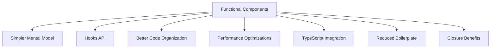

##### 1. Simpler Mental Model

Class components require understanding JavaScript classes, `this` binding, and React's lifecycle methods—concepts that can be challenging, especially for developers new to React or JavaScript.

```typescript
// Class component with lifecycle methods
class UserProfile extends React.Component<UserProfileProps, UserProfileState> {
  constructor(props: UserProfileProps) {
    super(props);
    this.state = { userData: null, loading: true, error: null };
    this.handleRefresh = this.handleRefresh.bind(this); // Binding required
  }

  componentDidMount() {
    this.fetchUserData();
  }

  componentDidUpdate(prevProps: UserProfileProps) {
    if (prevProps.userId !== this.props.userId) {
      this.fetchUserData();
    }
  }

  fetchUserData() {
    this.setState({ loading: true });
    fetchUser(this.props.userId)
      .then(data => this.setState({ userData: data, loading: false }))
      .catch(error => this.setState({ error, loading: false }));
  }

  handleRefresh() {
    this.fetchUserData();
  }

  render() {
    const { userData, loading, error } = this.state;
    // Render logic...
  }
}

// Functional component equivalent
function UserProfile({ userId }: UserProfileProps) {
  const [userData, setUserData] = useState<UserData | null>(null);
  const [loading, setLoading] = useState(true);
  const [error, setError] = useState<Error | null>(null);

  const fetchUserData = useCallback(async () => {
    setLoading(true);
    try {
      const data = await fetchUser(userId);
      setUserData(data);
    } catch (err) {
      setError(err as Error);
    } finally {
      setLoading(false);
    }
  }, [userId]);

  useEffect(() => {
    fetchUserData();
  }, [fetchUserData]);

  // Render logic...
}
```

Functional components provide a more direct, procedural way of expressing component logic that many developers find more intuitive.

##### 2. The Hooks API: A Paradigm Shift

The introduction of Hooks in React 16.8 was the catalyst for the widespread adoption of functional components. Hooks provide a way to use state and other React features without writing a class.

```typescript
// Multiple concerns mixed in a class component
class UserDashboard extends React.Component {
  componentDidMount() {
    // Authentication logic
    // Analytics tracking
    // Data fetching
    // Subscription setup
    // DOM measurements
  }

  componentWillUnmount() {
    // Cleanup for all the above
  }

  // Methods mixing different concerns
}

// Functional component with hooks separating concerns
function UserDashboard() {
  // Authentication
  useAuth();

  // Analytics
  useAnalytics('dashboard_view');

  // Data fetching
  const userData = useUserData();

  // Subscriptions
  useSubscription(CHANNELS.USER_UPDATES);

  // DOM measurements
  const { width, ref } = useMeasure();

  // Each concern is isolated and reusable
}
```

Hooks enable:
- Reusing stateful logic between components
- Splitting components into smaller functions based on related pieces
- Using React features without classes
- Composing behavior in a more flexible way

##### 3. Closures: A Powerful Programming Model

Functional components leverage JavaScript closures, which provide a more intuitive way to capture and use values from the component's scope.

```typescript
// Class component with potential stale props/state issue
class SearchComponent extends React.Component {
  state = { query: '' };

  componentDidMount() {
    this.timerId = setTimeout(() => {
      // This might use a stale value if props.defaultQuery changed
      console.log(`Searching for: ${this.props.defaultQuery || this.state.query}`);
    }, 5000);
  }

  // Need to clean up properly
  componentWillUnmount() {
    clearTimeout(this.timerId);
  }
}

// Functional component with closure capturing the current values
function SearchComponent({ defaultQuery = '' }) {
  const [query, setQuery] = useState(defaultQuery);

  useEffect(() => {
    const timerId = setTimeout(() => {
      // Closure captures the current values of defaultQuery and query
      console.log(`Searching for: ${defaultQuery || query}`);
    }, 5000);

    return () => clearTimeout(timerId);
  }, [defaultQuery, query]); // Dependencies make the closure behavior explicit
}
```

Benefits of closures in functional components:
- Values are captured at render time, making behavior more predictable
- Dependencies are explicitly declared in hooks
- The relationship between code and the values it uses is clearer
- Avoids the complexity of `this` binding and potential bugs

##### 4. Code Organization and Composition

Functional components encourage better code organization through custom hooks and function composition.

```typescript
// Class component with mixed concerns
class UserList extends React.Component {
  state = {
    users: [],
    loading: true,
    page: 1,
    sortBy: 'name',
    filterText: ''
  };

  componentDidMount() {
    this.fetchUsers();
  }

  componentDidUpdate(prevProps, prevState) {
    if (
      prevState.page !== this.state.page ||
      prevState.sortBy !== this.state.sortBy ||
      prevState.filterText !== this.state.filterText
    ) {
      this.fetchUsers();
    }
  }

  fetchUsers() {/* ... */}
  handlePageChange() {/* ... */}
  handleSortChange() {/* ... */}
  handleFilterChange() {/* ... */}

  render() {/* ... */}
}

// Functional component with separated concerns
function UserList() {
  // Data fetching logic extracted to a custom hook
  const {
    users,
    loading,
    page,
    setPage,
    sortBy,
    setSortBy,
    filterText,
    setFilterText
  } = useUserData();

  // Pagination logic in a reusable hook
  const pagination = usePagination({
    totalItems: users.length,
    itemsPerPage: 10,
    currentPage: page,
    onPageChange: setPage
  });

  // Sorting logic in a reusable hook
  const sorting = useSorting({
    items: users,
    initialSortBy: 'name',
    onSortChange: setSortBy
  });

  // Filtering logic in a reusable hook
  const filtering = useFiltering({
    items: users,
    onFilterChange: setFilterText
  });

  // Each concern is isolated, testable, and reusable
  return (/* ... */);
}
```

This approach enables:
- Better separation of concerns
- More reusable logic through custom hooks
- Easier testing of individual pieces
- More maintainable code as applications grow

##### 5. Performance Optimizations

React's rendering model works particularly well with functional components, enabling more efficient updates.

```typescript
// Class component optimization
class ExpensiveComponent extends React.PureComponent {
  // PureComponent does shallow comparison of props and state
}

// Functional component optimization
const ExpensiveComponent = React.memo(function ExpensiveComponent(props) {
  // Component logic
});

// More granular optimization with useMemo and useCallback
function ParentComponent() {
  // Memoize expensive calculations
  const processedData = useMemo(() => {
    return expensiveCalculation(data);
  }, [data]);

  // Memoize callbacks to prevent unnecessary re-renders of children
  const handleClick = useCallback(() => {
    console.log('Clicked!');
  }, []);

  return <ChildComponent data={processedData} onClick={handleClick} />;
}
```

Functional components offer:
- More granular optimization with `useMemo` and `useCallback`
- Easier memoization of specific parts of the component
- Better tree-shaking and potential for compiler optimizations

##### 6. TypeScript Integration

Functional components work exceptionally well with TypeScript, providing better type inference and simpler prop typing.

```typescript
// Class component with TypeScript
interface MyComponentProps {
  name: string;
  count: number;
}

interface MyComponentState {
  isActive: boolean;
}

class MyComponent extends React.Component<MyComponentProps, MyComponentState> {
  state: MyComponentState = {
    isActive: false
  };

  render() {
    return (/* ... */);
  }
}

// Functional component with TypeScript
interface MyComponentProps {
  name: string;
  count: number;
}

function MyComponent({ name, count }: MyComponentProps) {
  const [isActive, setIsActive] = useState(false);

  return (/* ... */);
}

// Or even more concise
const MyComponent: React.FC<{ name: string; count: number }> = ({ name, count }) => {
  const [isActive, setIsActive] = useState(false);

  return (/* ... */);
};
```

Benefits with TypeScript:
- Simpler prop typing
- Better type inference for hooks
- Destructured props provide better autocompletion
- Easier to type custom hooks

##### 7. Reduced Boilerplate

Functional components significantly reduce the amount of code needed:

```typescript
// Class component
class Greeting extends React.Component<{ name: string }> {
  render() {
    return <h1>Hello, {this.props.name}!</h1>;
  }
}

// Functional component
function Greeting({ name }: { name: string }) {
  return <h1>Hello, {name}!</h1>;
}

// Or even more concise
const Greeting = ({ name }: { name: string }) => <h1>Hello, {name}!</h1>;
```

This reduction in boilerplate:
- Makes code more readable
- Reduces the cognitive load when scanning components
- Allows focusing on the actual logic rather than React-specific syntax
- Makes refactoring easier

##### 8. Future-Proofing

The React team has made it clear that functional components are the future of React:

- New features like Concurrent Mode and Suspense work better with hooks
- The React team is focusing optimization efforts on the hooks model
- The community is building more tools and libraries around functional components

```typescript
// Future React features work better with hooks
function DataFetchingComponent() {
  // Suspense for data fetching (future API)
  const data = useSuspenseQuery(fetchData);

  // Concurrent features
  const deferredValue = useDeferredValue(expensiveValue);
  const [isPending, startTransition] = useTransition();

  return (/* ... */);
}
```

##### 9. The Closure Advantage in Detail

Closures in functional components provide several specific advantages:

1. **Capturing Values at Render Time**

```typescript
function Timer() {
  const [count, setCount] = useState(0);

  useEffect(() => {
    const id = setInterval(() => {
      // This closure captures the current value of count
      setCount(count + 1);
    }, 1000);

    return () => clearInterval(id);
  }, [count]); // Dependency makes it clear this effect depends on count

  return <div>{count}</div>;
}
```

2. **Avoiding "this" Binding Issues**

```typescript
// Class component with binding issues
class ClickCounter extends React.Component {
  state = { count: 0 };

  // Without proper binding, this will be undefined
  handleClick() {
    this.setState({ count: this.state.count + 1 });
  }

  render() {
    return (
      <button onClick={this.handleClick}>
        Clicked {this.state.count} times
      </button>
    );
  }
}

// Functional component with no binding issues
function ClickCounter() {
  const [count, setCount] = useState(0);

  // No binding needed, closure captures setCount and count
  const handleClick = () => {
    setCount(count + 1);
  };

  return (
    <button onClick={handleClick}>
      Clicked {count} times
    </button>
  );
}
```

3. **Explicit Dependencies**

```typescript
function SearchResults({ query }) {
  const [results, setResults] = useState([]);

  useEffect(() => {
    // The dependency array makes it explicit that this effect
    // depends on the query prop
    fetchResults(query).then(setResults);
  }, [query]); // Explicit dependency

  return (/* ... */);
}
```

4. **Easier Testing with Closures**

```typescript
// Testing a function that uses closures
function useCounter(initialValue = 0) {
  const [count, setCount] = useState(initialValue);

  const increment = () => setCount(count + 1);
  const decrement = () => setCount(count - 1);

  return { count, increment, decrement };
}

// Test
test('useCounter increments and decrements', () => {
  const { result } = renderHook(() => useCounter(0));

  act(() => {
    result.current.increment();
  });
  expect(result.current.count).toBe(1);

  act(() => {
    result.current.decrement();
  });
  expect(result.current.count).toBe(0);
});
```

##### Challenges and Trade-offs

While functional components offer many advantages, there are some trade-offs:

1. **Learning Curve for Hooks**
   - Understanding the rules of hooks
   - Learning the different mental model for lifecycle events
   - Adapting to the closure-based approach

2. **Debugging Can Be More Complex**
   - Stack traces can be harder to follow
   - Closure bugs can be subtle
   - Understanding stale closures requires experience

3. **Some Patterns Are Less Obvious**
   - Instance variables require useRef
   - Some lifecycle combinations require careful hook composition
   - Error boundaries still require class components

##### Conclusion: A Fundamental Shift in Component Design

The preference for functional components represents a fundamental shift in how we design React applications:

1. **From Object-Oriented to Functional**
   - Moving from an object-oriented model (classes, instances, methods) to a functional model (functions, closures, hooks)
   - Emphasizing composition over inheritance
   - Focusing on transformations of data rather than managing component instances

2. **From Lifecycle to Effects**
   - Shifting from thinking about component lifecycle to thinking about synchronization with effects
   - Organizing code by related functionality rather than by when it runs
   - Making side effects explicit and isolated

3. **From Implicit to Explicit Dependencies**
   - Making dependencies between data and effects explicit through dependency arrays
   - Encouraging developers to think about what their code depends on
   - Reducing bugs from missed updates or unnecessary recalculations

The preference for functional components isn't just about syntax or style—it's about embracing a more declarative, composable, and maintainable approach to building user interfaces. The closure model, combined with hooks, provides a powerful foundation for expressing complex UI logic in a way that's easier to understand, test, and maintain.

## Prompt: *Explain what are the custom hooks, how to use them and the best practices on using them*

### LLM:

#### Custom Hooks in React: A Comprehensive Guide

Custom hooks are one of React's most powerful features, allowing you to extract and reuse stateful logic across components. They represent a paradigm shift in how we share functionality in React applications.

##### What Are Custom Hooks?

Custom hooks are JavaScript functions that:
- Start with the prefix "use" (e.g., `useFormInput`, `useWindowSize`)
- Can call other hooks (built-in or custom)
- Extract and reuse stateful logic between components
- Don't share state between components that use them (each call to a hook gets isolated state)

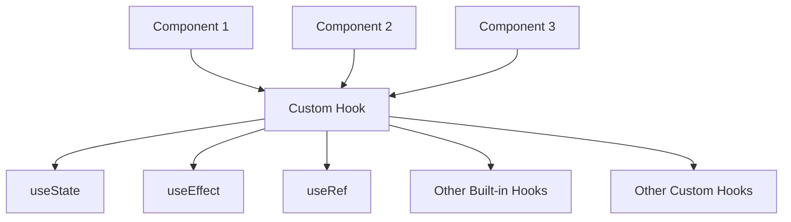

##### Creating Your First Custom Hook

Let's start with a simple example - a hook that manages form input state:

```typescript
// useFormInput.ts
import { useState, ChangeEvent } from 'react';

function useFormInput(initialValue: string) {
  const [value, setValue] = useState(initialValue);

  const handleChange = (e: ChangeEvent<HTMLInputElement>) => {
    setValue(e.target.value);
  };

  return {
    value,
    onChange: handleChange,
    reset: () => setValue(initialValue)
  };
}

export default useFormInput;
```

Using the custom hook in a component:

```typescript
// LoginForm.tsx
import React from 'react';
import useFormInput from './useFormInput';

function LoginForm() {
  const email = useFormInput('');
  const password = useFormInput('');

  const handleSubmit = (e: React.FormEvent) => {
    e.preventDefault();
    console.log('Submitting:', email.value, password.value);

    // Reset form after submission
    email.reset();
    password.reset();
  };

  return (
    <form onSubmit={handleSubmit}>
      <div>
        <label>Email:</label>
        <input type="email" {...email} />
      </div>
      <div>
        <label>Password:</label>
        <input type="password" {...password} />
      </div>
      <button type="submit">Login</button>
    </form>
  );
}
```

##### Common Types of Custom Hooks

Custom hooks typically fall into several categories:

###### 1. State Logic Hooks

These hooks encapsulate complex state management:

```typescript
// useCounter.ts
import { useState } from 'react';

interface UseCounterOptions {
  initialValue?: number;
  min?: number;
  max?: number;
  step?: number;
}

function useCounter({
  initialValue = 0,
  min = -Infinity,
  max = Infinity,
  step = 1
}: UseCounterOptions = {}) {
  const [count, setCount] = useState(initialValue);

  const increment = () => {
    setCount(prevCount => Math.min(max, prevCount + step));
  };

  const decrement = () => {
    setCount(prevCount => Math.max(min, prevCount - step));
  };

  const reset = () => {
    setCount(initialValue);
  };

  return {
    count,
    increment,
    decrement,
    reset,
    setCount
  };
}

export default useCounter;
```

###### 2. Side Effect Hooks

These hooks manage side effects like API calls, subscriptions, or browser APIs:

```typescript
// useLocalStorage.ts
import { useState, useEffect } from 'react';

function useLocalStorage<T>(key: string, initialValue: T) {
  // Get from local storage then parse stored json or return initialValue
  const readValue = (): T => {
    if (typeof window === 'undefined') {
      return initialValue;
    }

    try {
      const item = window.localStorage.getItem(key);
      return item ? JSON.parse(item) : initialValue;
    } catch (error) {
      console.warn(`Error reading localStorage key "${key}":`, error);
      return initialValue;
    }
  };

  // State to store our value
  const [storedValue, setStoredValue] = useState<T>(readValue);

  // Return a wrapped version of useState's setter function that
  // persists the new value to localStorage
  const setValue = (value: T | ((val: T) => T)) => {
    try {
      // Allow value to be a function so we have the same API as useState
      const valueToStore =
        value instanceof Function ? value(storedValue) : value;

      // Save state
      setStoredValue(valueToStore);

      // Save to local storage
      if (typeof window !== 'undefined') {
        window.localStorage.setItem(key, JSON.stringify(valueToStore));
      }
    } catch (error) {
      console.warn(`Error setting localStorage key "${key}":`, error);
    }
  };

  // Listen for changes to this localStorage key in other tabs/windows
  useEffect(() => {
    const handleStorageChange = (e: StorageEvent) => {
      if (e.key === key && e.newValue) {
        setStoredValue(JSON.parse(e.newValue));
      }
    };

    window.addEventListener('storage', handleStorageChange);
    return () => window.removeEventListener('storage', handleStorageChange);
  }, [key]);

  return [storedValue, setValue] as const;
}

export default useLocalStorage;
```

###### 3. Browser API Hooks

These hooks provide access to browser APIs in a React-friendly way:

```typescript
// useMediaQuery.ts
import { useState, useEffect } from 'react';

function useMediaQuery(query: string): boolean {
  // Initialize with the current match state
  const getMatches = (): boolean => {
    // SSR check
    if (typeof window !== 'undefined') {
      return window.matchMedia(query).matches;
    }
    return false;
  };

  const [matches, setMatches] = useState(getMatches);

  useEffect(() => {
    const mediaQuery = window.matchMedia(query);

    // Update the state initially and when matches change
    const updateMatches = () => {
      setMatches(mediaQuery.matches);
    };

    // Listen for changes
    mediaQuery.addEventListener('change', updateMatches);

    // Update matches immediately in case it changed since initial render
    updateMatches();

    // Clean up
    return () => {
      mediaQuery.removeEventListener('change', updateMatches);
    };
  }, [query]);

  return matches;
}

export default useMediaQuery;
```

###### 4. Async/Data Fetching Hooks

These hooks manage asynchronous operations like API calls:

```typescript
// useAsync.ts
import { useState, useCallback, useEffect } from 'react';

interface AsyncState<T> {
  status: 'idle' | 'pending' | 'success' | 'error';
  data: T | null;
  error: Error | null;
}

function useAsync<T>(asyncFunction: () => Promise<T>, immediate = true) {
  const [state, setState] = useState<AsyncState<T>>({
    status: 'idle',
    data: null,
    error: null
  });

  const execute = useCallback(() => {
    setState({ status: 'pending', data: null, error: null });

    return asyncFunction()
      .then(data => {
        setState({ status: 'success', data, error: null });
        return data;
      })
      .catch(error => {
        setState({ status: 'error', data: null, error });
        throw error;
      });
  }, [asyncFunction]);

  useEffect(() => {
    if (immediate) {
      execute();
    }
  }, [execute, immediate]);

  return { ...state, execute };
}

export default useAsync;
```

##### Best Practices for Custom Hooks

###### 1. Naming Conventions

- **Always start with "use"**: This is not just a convention but a requirement for React's linting tools to apply the Rules of Hooks.
- **Be descriptive**: Names should clearly indicate what the hook does (e.g., `useFormValidation`, not just `useValidation`).
- **Be specific**: Prefer `useUserAuthentication` over `useAuth` if it specifically handles user authentication.

```typescript
// ❌ Bad naming
function getData() { /* ... */ }

// ✅ Good naming
function useUserData() { /* ... */ }
```

###### 2. Keep Hooks Focused

- **Single Responsibility Principle**: Each hook should do one thing well.
- **Compose hooks**: Build complex hooks by combining simpler ones.

```typescript
// ❌ Too many responsibilities
function useUserDashboard() {
  // Authentication
  // User data fetching
  // Notifications
  // Analytics
  // Preferences
}

// ✅ Focused hooks that can be composed
function useAuth() { /* ... */ }
function useUserData(userId) { /* ... */ }
function useNotifications(userId) { /* ... */ }
function useAnalytics(page) { /* ... */ }
function useUserPreferences(userId) { /* ... */ }

// Component that composes hooks
function UserDashboard() {
  const { user, isAuthenticated } = useAuth();
  const { data: userData } = useUserData(user?.id);
  const { notifications } = useNotifications(user?.id);
  useAnalytics('dashboard');
  const { preferences } = useUserPreferences(user?.id);

  // Render using all this data
}
```

###### 3. Return Consistent Values

- **Use consistent return patterns**: Return objects for named values, arrays for destructuring.
- **Follow built-in hook patterns**: For example, if your hook is similar to `useState`, return a value-setter pair.

```typescript
// ✅ Object return for named values
function useFormField(initialValue) {
  const [value, setValue] = useState(initialValue);

  return {
    value,
    setValue,
    onChange: (e) => setValue(e.target.value),
    reset: () => setValue(initialValue)
  };
}

// ✅ Array return for destructuring (like useState)
function useCounter(initialValue = 0) {
  const [count, setCount] = useState(initialValue);

  const increment = () => setCount(c => c + 1);
  const decrement = () => setCount(c => c - 1);

  return [count, { increment, decrement }];
}

// Usage
const [count, { increment, decrement }] = useCounter(10);
```

###### 4. Handle Errors and Edge Cases

- **Graceful error handling**: Catch and handle errors within the hook when appropriate.
- **Default values**: Provide sensible defaults for parameters.
- **TypeScript**: Use TypeScript to enforce correct usage.

```typescript
// ✅ Robust error handling and defaults
function useFetch<T>(url: string, options: RequestInit = {}) {
  const [data, setData] = useState<T | null>(null);
  const [error, setError] = useState<Error | null>(null);
  const [loading, setLoading] = useState(false);

  useEffect(() => {
    if (!url) return;

    let isMounted = true;
    setLoading(true);

    fetch(url, options)
      .then(response => {
        if (!response.ok) {
          throw new Error(`HTTP error! Status: ${response.status}`);
        }
        return response.json();
      })
      .then((json: T) => {
        if (isMounted) {
          setData(json);
          setError(null);
        }
      })
      .catch(err => {
        if (isMounted) {
          setError(err);
          setData(null);
        }
      })
      .finally(() => {
        if (isMounted) {
          setLoading(false);
        }
      });

    return () => {
      isMounted = false;
    };
  }, [url, JSON.stringify(options)]);

  return { data, error, loading };
}
```

###### 5. Optimize for Performance

- **Memoize callbacks and values**: Use `useCallback` and `useMemo` for functions and values that shouldn't change on every render.
- **Minimize dependencies**: Keep the dependency arrays as small as possible.

```typescript
// ✅ Optimized with useCallback and useMemo
function useSearch<T>(items: T[], searchProp: keyof T) {
  const [searchTerm, setSearchTerm] = useState('');

  // Memoize the filtering function
  const filteredItems = useMemo(() => {
    if (!searchTerm) return items;

    return items.filter(item => {
      const value = item[searchProp];
      return String(value).toLowerCase().includes(searchTerm.toLowerCase());
    });
  }, [items, searchProp, searchTerm]);

  // Memoize the search handler
  const handleSearch = useCallback((e: React.ChangeEvent<HTMLInputElement>) => {
    setSearchTerm(e.target.value);
  }, []);

  return {
    searchTerm,
    handleSearch,
    filteredItems
  };
}
```

###### 6. Document Your Hooks

- **Add JSDoc comments**: Document parameters, return values, and behavior.
- **Include examples**: Show how to use the hook correctly.

```typescript
/**
 * Hook for managing pagination state.
 *
 * @param {Object} options - Pagination options
 * @param {number} options.totalItems - Total number of items to paginate
 * @param {number} options.initialPage - Initial page number (default: 1)
 * @param {number} options.itemsPerPage - Number of items per page (default: 10)
 * @returns {Object} Pagination state and controls
 * @example
 * const {
 *   currentPage,
 *   totalPages,
 *   nextPage,
 *   prevPage,
 *   goToPage,
 *   pageItems
 * } = usePagination({
 *   totalItems: 100,
 *   itemsPerPage: 10
 * });
 */
function usePagination({
  totalItems,
  initialPage = 1,
  itemsPerPage = 10
}: PaginationOptions) {
  // Implementation...
}
```

###### 7. Test Your Hooks

- **Use React Testing Library**: Test hooks with `@testing-library/react-hooks`.
- **Test edge cases**: Test error states, loading states, and boundary conditions.

```typescript
// useCounter.test.ts
import { renderHook, act } from '@testing-library/react-hooks';
import useCounter from './useCounter';

describe('useCounter', () => {
  test('should initialize with default value', () => {
    const { result } = renderHook(() => useCounter());
    expect(result.current.count).toBe(0);
  });

  test('should initialize with provided value', () => {
    const { result } = renderHook(() => useCounter({ initialValue: 10 }));
    expect(result.current.count).toBe(10);
  });

  test('should increment counter', () => {
    const { result } = renderHook(() => useCounter());

    act(() => {
      result.current.increment();
    });

    expect(result.current.count).toBe(1);
  });

  test('should not exceed max value', () => {
    const { result } = renderHook(() => useCounter({ initialValue: 9, max: 10 }));

    act(() => {
      result.current.increment();
      result.current.increment();
    });

    expect(result.current.count).toBe(10);
  });
});
```

###### 8. Organize Hooks in Your Project

- **Create a hooks directory**: Keep hooks organized in a dedicated directory.
- **Group related hooks**: Consider subdirectories for related hooks.
- **Create an index file**: Export all hooks from a single entry point.

```
src/
  hooks/
    index.ts                 # Export all hooks
    form/
      useFormField.ts
      useFormValidation.ts
      useFormSubmission.ts
      index.ts               # Export form hooks
    data/
      useFetch.ts
      useLocalStorage.ts
      useSessionStorage.ts
      index.ts               # Export data hooks
    ui/
      useMediaQuery.ts
      useWindowSize.ts
      useClickOutside.ts
      index.ts               # Export UI hooks
```

##### Advanced Custom Hook Patterns

###### 1. Reducer Pattern

For complex state logic, use `useReducer` within your custom hooks:

```typescript
// useShoppingCart.ts
import { useReducer, useCallback } from 'react';

type CartItem = {
  id: string;
  name: string;
  price: number;
  quantity: number;
};

type CartState = {
  items: CartItem[];
  total: number;
};

type CartAction =
  | { type: 'ADD_ITEM'; payload: Omit<CartItem, 'quantity'> }
  | { type: 'REMOVE_ITEM'; payload: { id: string } }
  | { type: 'UPDATE_QUANTITY'; payload: { id: string; quantity: number } }
  | { type: 'CLEAR_CART' };

const calculateTotal = (items: CartItem[]): number => {
  return items.reduce((sum, item) => sum + item.price * item.quantity, 0);
};

const cartReducer = (state: CartState, action: CartAction): CartState => {
  switch (action.type) {
    case 'ADD_ITEM': {
      const existingItemIndex = state.items.findIndex(
        item => item.id === action.payload.id
      );

      let newItems;

      if (existingItemIndex >= 0) {
        newItems = [...state.items];
        newItems[existingItemIndex] = {
          ...newItems[existingItemIndex],
          quantity: newItems[existingItemIndex].quantity + 1
        };
      } else {
        newItems = [...state.items, { ...action.payload, quantity: 1 }];
      }

      return {
        items: newItems,
        total: calculateTotal(newItems)
      };
    }

    case 'REMOVE_ITEM': {
      const newItems = state.items.filter(item => item.id !== action.payload.id);

      return {
        items: newItems,
        total: calculateTotal(newItems)
      };
    }

    case 'UPDATE_QUANTITY': {
      const newItems = state.items.map(item =>
        item.id === action.payload.id
          ? { ...item, quantity: action.payload.quantity }
          : item
      );

      return {
        items: newItems,
        total: calculateTotal(newItems)
      };
    }

    case 'CLEAR_CART':
      return {
        items: [],
        total: 0
      };

    default:
      return state;
  }
};

function useShoppingCart() {
  const [cart, dispatch] = useReducer(cartReducer, {
    items: [],
    total: 0
  });

  const addItem = useCallback((item: Omit<CartItem, 'quantity'>) => {
    dispatch({ type: 'ADD_ITEM', payload: item });
  }, []);

  const removeItem = useCallback((id: string) => {
    dispatch({ type: 'REMOVE_ITEM', payload: { id } });
  }, []);

  const updateQuantity = useCallback((id: string, quantity: number) => {
    dispatch({ type: 'UPDATE_QUANTITY', payload: { id, quantity } });
  }, []);

  const clearCart = useCallback(() => {
    dispatch({ type: 'CLEAR_CART' });
  }, []);

  return {
    cart,
    addItem,
    removeItem,
    updateQuantity,
    clearCart
  };
}

export default useShoppingCart;
```

###### 2. Context + Hooks Pattern

Combine context with custom hooks for global state management:

```typescript
// ThemeContext.tsx
import React, { createContext, useContext, useState, ReactNode } from 'react';

type Theme = 'light' | 'dark';

interface ThemeContextType {
  theme: Theme;
  toggleTheme: () => void;
}

const ThemeContext = createContext<ThemeContextType | undefined>(undefined);

export function ThemeProvider({ children }: { children: ReactNode }) {
  const [theme, setTheme] = useState<Theme>('light');

  const toggleTheme = () => {
    setTheme(prevTheme => (prevTheme === 'light' ? 'dark' : 'light'));
  };

  return (
    <ThemeContext.Provider value={{ theme, toggleTheme }}>
      {children}
    </ThemeContext.Provider>
  );
}

// Custom hook to use the theme context
export function useTheme() {
  const context = useContext(ThemeContext);

  if (context === undefined) {
    throw new Error('useTheme must be used within a ThemeProvider');
  }

  return context;
}
```

###### 3. Composition Pattern

Build complex hooks by composing simpler ones:

```typescript
// Base hooks
function useField(initialValue = '') {
  const [value, setValue] = useState(initialValue);

  const handleChange = (e: React.ChangeEvent<HTMLInputElement>) => {
    setValue(e.target.value);
  };

  return {
    value,
    onChange: handleChange,
    reset: () => setValue(initialValue)
  };
}

function useValidation(value: string, validationFn: (value: string) => string | null) {
  const [error, setError] = useState<string | null>(null);

  useEffect(() => {
    setError(validationFn(value));
  }, [value, validationFn]);

  return { error, isValid: error === null };
}

// Composed hook
function useFormField(
  initialValue = '',
  validate?: (value: string) => string | null
) {
  const field = useField(initialValue);
  const validation = useValidation(
    field.value,
    validate || (() => null)
  );

  return {
    ...field,
    ...validation,
    inputProps: {
      value: field.value,
      onChange: field.onChange
    }
  };
}

// Usage
function SignupForm() {
  const email = useFormField('', value => {
    if (!value) return 'Email is required';
    if (!/\S+@\S+\.\S+/.test(value)) return 'Email is invalid';
    return null;
  });

  const password = useFormField('', value => {
    if (!value) return 'Password is required';
    if (value.length < 8) return 'Password must be at least 8 characters';
    return null;
  });

  const handleSubmit = (e: React.FormEvent) => {
    e.preventDefault();
    if (email.isValid && password.isValid) {
      // Submit form
    }
  };

  return (
    <form onSubmit={handleSubmit}>
      <div>
        <label>Email:</label>
        <input type="email" {...email.inputProps} />
        {email.error && <p className="error">{email.error}</p>}
      </div>
      <div>
        <label>Password:</label>
        <input type="password" {...password.inputProps} />
        {password.error && <p className="error">{password.error}</p>}
      </div>
      <button type="submit" disabled={!email.isValid || !password.isValid}>
        Sign Up
      </button>
    </form>
  );
}
```

###### 4. Factory Pattern

Create hooks that generate other hooks:

```typescript
// createResourceHook.ts
function createResourceHook<T, P extends any[]>(
  fetchFn: (...params: P) => Promise<T>
) {
  return (...params: P) => {
    const [data, setData] = useState<T | null>(null);
    const [loading, setLoading] = useState(false);
    const [error, setError] = useState<Error | null>(null);

    useEffect(() => {
      let isMounted = true;
      setLoading(true);

      fetchFn(...params)
        .then(result => {
          if (isMounted) {
            setData(result);
            setError(null);
          }
        })
        .catch(err => {
          if (isMounted) {
            setError(err);
            setData(null);
          }
        })
        .finally(() => {
          if (isMounted) {
            setLoading(false);
          }
        });

      return () => {
        isMounted = false;
      };
    }, params);

    return { data, loading, error };
  };
}

// Usage
const api = {
  getUser: (id: string) => fetch(`/api/users/${id}`).then(r => r.json()),
  getPost: (id: string) => fetch(`/api/posts/${id}`).then(r => r.json()),
  getComments: (postId: string) => fetch(`/api/posts/${postId}/comments`).then(r => r.json())
};

const useUser = createResourceHook(api.getUser);
const usePost = createResourceHook(api.getPost);
const useComments = createResourceHook(api.getComments);

function UserProfile({ userId }: { userId: string }) {
  const { data: user, loading, error } = useUser(userId);

  if (loading) return <div>Loading...</div>;
  if (error) return <div>Error: {error.message}</div>;
  if (!user) return <div>User not found</div>;

  return (
    <div>
      <h1>{user.name}</h1>
      <p>{user.email}</p>
    </div>
  );
}
```

##### Real-World Examples of Custom Hooks

###### 1. Form Management

```typescript
// useForm.ts
function useForm<T extends Record<string, any>>(initialValues: T) {
  const [values, setValues] = useState<T>(initialValues);
  const [errors, setErrors] = useState<Partial<Record<keyof T, string>>>({});
  const [touched, setTouched] = useState<Partial<Record<keyof T, boolean>>>({});
  const [isSubmitting, setIsSubmitting] = useState(false);

  const handleChange = (e: React.ChangeEvent<HTMLInputElement>) => {
    const { name, value, type, checked } = e.target;
    setValues(prev => ({
      ...prev,
      [name]: type === 'checkbox' ? checked : value
    }));
  };

  const handleBlur = (e: React.FocusEvent<HTMLInputElement>) => {
    const { name } = e.target;
    setTouched(prev => ({
      ...prev,
      [name]: true
    }));
  };

  const reset = () => {
    setValues(initialValues);
    setErrors({});
    setTouched({});
    setIsSubmitting(false);
  };

  const setFieldValue = (name: keyof T, value: any) => {
    setValues(prev => ({
      ...prev,
      [name]: value
    }));
  };

  const setFieldError = (name: keyof T, error: string) => {
    setErrors(prev => ({
      ...prev,
      [name]: error
    }));
  };

  const validateForm = (validationSchema?: Record<keyof T, (value: any) => string | null>) => {
    if (!validationSchema) return true;

    const newErrors: Partial<Record<keyof T, string>> = {};
    let isValid = true;

    Object.keys(validationSchema).forEach(key => {
      const validateField = validationSchema[key as keyof T];
      const error = validateField(values[key as keyof T]);

      if (error) {
        newErrors[key as keyof T] = error;
        isValid = false;
      }
    });

    setErrors(newErrors);
    return isValid;
  };

  const handleSubmit = (
    onSubmit: (values: T) => void | Promise<void>,
    validationSchema?: Record<keyof T, (value: any) => string | null>
  ) => {
    return async (e: React.FormEvent) => {
      e.preventDefault();

      // Mark all fields as touched
      const allTouched = Object.keys(values).reduce(
        (acc, key) => ({ ...acc, [key]: true }),
        {} as Record<keyof T, boolean>
      );
      setTouched(allTouched);

      // Validate
      const isValid = validateForm(validationSchema);

      if (isValid) {
        setIsSubmitting(true);
        try {
          await onSubmit(values);
        } finally {
          setIsSubmitting(false);
        }
      }
    };
  };

  return {
    values,
    errors,
    touched,
    isSubmitting,
    handleChange,
    handleBlur,
    handleSubmit,
    reset,
    setFieldValue,
    setFieldError
  };
}
```

###### 2. Infinite Scroll

```typescript
// useInfiniteScroll.ts
function useInfiniteScroll<T>(
  fetchItems: (page: number) => Promise<T[]>,
  options: {
    initialPage?: number;
    threshold?: number;
    limit?: number;
  } = {}
) {
  const {
    initialPage = 1,
    threshold = 200,
    limit = 10
  } = options;

  const [items, setItems] = useState<T[]>([]);
  const [page, setPage] = useState(initialPage);
  const [loading, setLoading] = useState(false);
  const [error, setError] = useState<Error | null>(null);
  const [hasMore, setHasMore] = useState(true);

  const loadMoreRef = useRef<HTMLDivElement>(null);

  const loadItems = useCallback(async () => {
    if (loading || !hasMore) return;

    setLoading(true);
    setError(null);

    try {
      const newItems = await fetchItems(page);

      setItems(prevItems => [...prevItems, ...newItems]);
      setPage(prevPage => prevPage + 1);
      setHasMore(newItems.length === limit);
    } catch (err) {
      setError(err as Error);
    } finally {
      setLoading(false);
    }
  }, [fetchItems, page, loading, hasMore, limit]);

  useEffect(() => {
    const observer = new IntersectionObserver(
      entries => {
        const [entry] = entries;
        if (entry.isIntersecting && hasMore) {
          loadItems();
        }
      },
      {
        root: null,
        rootMargin: `0px 0px ${threshold}px 0px`,
        threshold: 0.1
      }
    );

    const currentRef = loadMoreRef.current;
    if (currentRef) {
      observer.observe(currentRef);
    }

    return () => {
      if (currentRef) {
        observer.unobserve(currentRef);
      }
    };
  }, [loadItems, hasMore, threshold]);

  const reset = useCallback(() => {
    setItems([]);
    setPage(initialPage);
    setLo
```
##### 2. Infinite Scroll Hook

This hook handles infinite scrolling functionality, loading more data when the user scrolls to the bottom of the page:

```typescript
import { useState, useEffect, useCallback, useRef } from 'react';

interface UseInfiniteScrollOptions {
  threshold?: number;  // Distance from bottom to trigger loading (in pixels)
  initialPage?: number;
}

interface UseInfiniteScrollReturn<T> {
  data: T[];
  loading: boolean;
  error: Error | null;
  hasMore: boolean;
  loadMore: () => void;
  reset: () => void;
}

function useInfiniteScroll<T>(
  fetchFn: (page: number) => Promise<{ items: T[]; hasMore: boolean }>,
  options: UseInfiniteScrollOptions = {}
): UseInfiniteScrollReturn<T> {
  const { threshold = 200, initialPage = 1 } = options;

  const [data, setData] = useState<T[]>([]);
  const [page, setPage] = useState(initialPage);
  const [loading, setLoading] = useState(false);
  const [error, setError] = useState<Error | null>(null);
  const [hasMore, setHasMore] = useState(true);

  // Use a ref to track if the component is mounted
  const mounted = useRef(true);

  // Function to load more data
  const loadMore = useCallback(async () => {
    if (loading || !hasMore) return;

    setLoading(true);
    setError(null);

    try {
      const result = await fetchFn(page);

      if (mounted.current) {
        setData(prev => [...prev, ...result.items]);
        setHasMore(result.hasMore);
        setPage(prev => prev + 1);
      }
    } catch (err) {
      if (mounted.current) {
        setError(err instanceof Error ? err : new Error('An error occurred'));
      }
    } finally {
      if (mounted.current) {
        setLoading(false);
      }
    }
  }, [fetchFn, page, loading, hasMore]);

  // Reset function
  const reset = useCallback(() => {
    setData([]);
    setPage(initialPage);
    setLoading(false);
    setError(null);
    setHasMore(true);
  }, [initialPage]);

  // Set up scroll listener
  useEffect(() => {
    const handleScroll = () => {
      if (
        window.innerHeight + document.documentElement.scrollTop >=
        document.documentElement.offsetHeight - threshold
      ) {
        loadMore();
      }
    };

    window.addEventListener('scroll', handleScroll);
    return () => window.removeEventListener('scroll', handleScroll);
  }, [loadMore, threshold]);

  // Initial load
  useEffect(() => {
    loadMore();

    return () => {
      mounted.current = false;
    };
  }, []);  // eslint-disable-line react-hooks/exhaustive-deps

  return { data, loading, error, hasMore, loadMore, reset };
}

export default useInfiniteScroll;
```

**Usage Example:**

```tsx
import React from 'react';
import useInfiniteScroll from './useInfiniteScroll';

interface Post {
  id: number;
  title: string;
  body: string;
}

const fetchPosts = async (page: number) => {
  const response = await fetch(
    `https://jsonplaceholder.typicode.com/posts?_page=${page}&_limit=10`
  );

  if (!response.ok) {
    throw new Error('Failed to fetch posts');
  }

  const data = await response.json();
  return {
    items: data,
    hasMore: page < 10  // Assuming there are 10 pages total
  };
};

function PostList() {
  const { data: posts, loading, error, hasMore } = useInfiniteScroll<Post>(fetchPosts);

  if (error) {
    return <div>Error: {error.message}</div>;
  }

  return (
    <div>
      <h1>Posts</h1>
      <ul>
        {posts.map(post => (
          <li key={post.id}>
            <h2>{post.title}</h2>
            <p>{post.body}</p>
          </li>
        ))}
      </ul>
      {loading && <div>Loading more posts...</div>}
      {!hasMore && <div>No more posts to load</div>}
    </div>
  );
}

export default PostList;
```

##### 3. Local Storage Hook

This hook provides a way to persist state in localStorage, with automatic synchronization:

```typescript
import { useState, useEffect } from 'react';

function useLocalStorage<T>(
  key: string,
  initialValue: T
): [T, (value: T | ((val: T) => T)) => void] {
  // Get from local storage then parse stored json or return initialValue
  const readValue = (): T => {
    if (typeof window === 'undefined') {
      return initialValue;
    }

    try {
      const item = window.localStorage.getItem(key);
      return item ? (JSON.parse(item) as T) : initialValue;
    } catch (error) {
      console.warn(`Error reading localStorage key "${key}":`, error);
      return initialValue;
    }
  };

  // State to store our value
  const [storedValue, setStoredValue] = useState<T>(readValue);

  // Return a wrapped version of useState's setter function that persists the new value to localStorage
  const setValue = (value: T | ((val: T) => T)) => {
    try {
      // Allow value to be a function so we have the same API as useState
      const valueToStore =
        value instanceof Function ? value(storedValue) : value;

      // Save state
      setStoredValue(valueToStore);

      // Save to local storage
      if (typeof window !== 'undefined') {
        window.localStorage.setItem(key, JSON.stringify(valueToStore));
      }
    } catch (error) {
      console.warn(`Error setting localStorage key "${key}":`, error);
    }
  };

  // Listen for changes to this localStorage key in other tabs/windows
  useEffect(() => {
    const handleStorageChange = (e: StorageEvent) => {
      if (e.key === key && e.newValue) {
        setStoredValue(JSON.parse(e.newValue));
      }
    };

    window.addEventListener('storage', handleStorageChange);
    return () => window.removeEventListener('storage', handleStorageChange);
  }, [key]);

  return [storedValue, setValue];
}

export default useLocalStorage;
```

**Usage Example:**

```tsx
import React from 'react';
import useLocalStorage from './useLocalStorage';

function UserPreferences() {
  const [theme, setTheme] = useLocalStorage<'light' | 'dark'>('theme', 'light');
  const [fontSize, setFontSize] = useLocalStorage<number>('fontSize', 16);

  return (
    <div className={`app ${theme}`}>
      <h1>User Preferences</h1>

      <div>
        <h2>Theme</h2>
        <button onClick={() => setTheme(theme === 'light' ? 'dark' : 'light')}>
          Toggle Theme (Current: {theme})
        </button>
      </div>

      <div>
        <h2>Font Size</h2>
        <button onClick={() => setFontSize(size => size - 1)}>Smaller</button>
        <span style={{ margin: '0 10px', fontSize: `${fontSize}px` }}>
          Current Size: {fontSize}px
        </span>
        <button onClick={() => setFontSize(size => size + 1)}>Larger</button>
      </div>
    </div>
  );
}

export default UserPreferences;
```

##### 4. Media Query Hook

This hook makes it easy to respond to media queries for responsive designs:

```typescript
import { useState, useEffect } from 'react';

function useMediaQuery(query: string): boolean {
  const [matches, setMatches] = useState(false);

  useEffect(() => {
    const mediaQuery = window.matchMedia(query);

    // Set the initial value
    setMatches(mediaQuery.matches);

    // Create an event listener
    const handler = (event: MediaQueryListEvent) => {
      setMatches(event.matches);
    };

    // Add the event listener
    mediaQuery.addEventListener('change', handler);

    // Clean up
    return () => {
      mediaQuery.removeEventListener('change', handler);
    };
  }, [query]);

  return matches;
}

export default useMediaQuery;
```

**Usage Example:**

```tsx
import React from 'react';
import useMediaQuery from './useMediaQuery';

function ResponsiveComponent() {
  const isMobile = useMediaQuery('(max-width: 768px)');
  const isTablet = useMediaQuery('(min-width: 769px) and (max-width: 1024px)');
  const isDesktop = useMediaQuery('(min-width: 1025px)');

  return (
    <div>
      <h1>Responsive Component</h1>

      {isMobile && (
        <div className="mobile-layout">
          <h2>Mobile Layout</h2>
          <p>This content is optimized for mobile devices.</p>
        </div>
      )}

      {isTablet && (
        <div className="tablet-layout">
          <h2>Tablet Layout</h2>
          <p>This content is optimized for tablets.</p>
        </div>
      )}

      {isDesktop && (
        <div className="desktop-layout">
          <h2>Desktop Layout</h2>
          <p>This content is optimized for desktop computers.</p>
        </div>
      )}
    </div>
  );
}

export default ResponsiveComponent;
```

##### 5. Debounce Hook

This hook debounces a function call, useful for search inputs or other scenarios where you want to limit the frequency of function calls:

```typescript
import { useState, useEffect, useCallback } from 'react';

function useDebounce<T extends (...args: any[]) => any>(
  fn: T,
  delay: number
): [(...args: Parameters<T>) => void, boolean] {
  const [debouncedFn, setDebouncedFn] = useState<ReturnType<typeof setTimeout> | null>(null);
  const [isDebouncing, setIsDebouncing] = useState(false);

  // Clean up the timeout when the component unmounts or when fn/delay changes
  useEffect(() => {
    return () => {
      if (debouncedFn) {
        clearTimeout(debouncedFn);
      }
    };
  }, [fn, delay, debouncedFn]);

  // The debounced function
  const debounced = useCallback(
    (...args: Parameters<T>) => {
      setIsDebouncing(true);

      // Clear any existing timeout
      if (debouncedFn) {
        clearTimeout(debouncedFn);
      }

      // Set a new timeout
      const timeout = setTimeout(() => {
        fn(...args);
        setIsDebouncing(false);
        setDebouncedFn(null);
      }, delay);

      setDebouncedFn(timeout);
    },
    [fn, delay, debouncedFn]
  );

  return [debounced, isDebouncing];
}

export default useDebounce;
```

**Usage Example:**

```tsx
import React, { useState } from 'react';
import useDebounce from './useDebounce';

function SearchComponent() {
  const [searchTerm, setSearchTerm] = useState('');
  const [results, setResults] = useState<string[]>([]);

  // Mock search function
  const searchAPI = async (term: string) => {
    console.log(`Searching for: ${term}`);
    // Simulate API call
    return new Promise<string[]>(resolve => {
      setTimeout(() => {
        resolve(
          ['apple', 'banana', 'cherry', 'date', 'elderberry']
            .filter(fruit => fruit.includes(term.toLowerCase()))
        );
      }, 500);
    });
  };

  // Debounce the search function
  const [debouncedSearch, isSearching] = useDebounce(async (term: string) => {
    if (term.trim() === '') {
      setResults([]);
      return;
    }

    const searchResults = await searchAPI(term);
    setResults(searchResults);
  }, 500);

  // Handle input change
  const handleChange = (e: React.ChangeEvent<HTMLInputElement>) => {
    const value = e.target.value;
    setSearchTerm(value);
    debouncedSearch(value);
  };

  return (
    <div>
      <h1>Search Fruits</h1>
      <input
        type="text"
        value={searchTerm}
        onChange={handleChange}
        placeholder="Type to search..."
      />

      {isSearching && <p>Searching...</p>}

      <ul>
        {results.map((result, index) => (
          <li key={index}>{result}</li>
        ))}
      </ul>

      {!isSearching && results.length === 0 && searchTerm && (
        <p>No results found</p>
      )}
    </div>
  );
}

export default SearchComponent;
```

##### 6. Form Validation Hook

This hook simplifies form validation with customizable rules:

```typescript
import { useState, useCallback } from 'react';

type ValidationRule<T> = {
  validate: (value: T) => boolean;
  message: string;
};

interface UseFormValidationOptions<T> {
  initialValue: T;
  rules?: ValidationRule<T>[];
  validateOnChange?: boolean;
}

interface UseFormValidationReturn<T> {
  value: T;
  setValue: (value: T) => void;
  error: string | null;
  isValid: boolean;
  validate: () => boolean;
  reset: () => void;
  inputProps: {
    value: T;
    onChange: (e: React.ChangeEvent<HTMLInputElement>) => void;
  };
}

function useFormValidation<T>({
  initialValue,
  rules = [],
  validateOnChange = false
}: UseFormValidationOptions<T>): UseFormValidationReturn<T> {
  const [value, setValue] = useState<T>(initialValue);
  const [error, setError] = useState<string | null>(null);
  const [isDirty, setIsDirty] = useState(false);

  // Validate the current value against all rules
  const validate = useCallback((): boolean => {
    for (const rule of rules) {
      if (!rule.validate(value)) {
        setError(rule.message);
        return false;
      }
    }

    setError(null);
    return true;
  }, [value, rules]);

  // Update value and optionally validate
  const handleChange = useCallback(
    (newValue: T) => {
      setValue(newValue);
      setIsDirty(true);

      if (validateOnChange) {
        validate();
      }
    },
    [validateOnChange, validate]
  );

  // Handle input change events
  const handleInputChange = useCallback(
    (e: React.ChangeEvent<HTMLInputElement>) => {
      const target = e.target;
      let newValue: any;

      // Handle different input types
      if (target.type === 'checkbox') {
        newValue = target.checked;
      } else if (target.type === 'number') {
        newValue = target.value === '' ? '' : Number(target.value);
      } else {
        newValue = target.value;
      }

      handleChange(newValue as T);
    },
    [handleChange]
  );

  // Reset to initial state
  const reset = useCallback(() => {
    setValue(initialValue);
    setError(null);
    setIsDirty(false);
  }, [initialValue]);

  return {
    value,
    setValue: handleChange,
    error,
    isValid: isDirty && error === null,
    validate,
    reset,
    inputProps: {
      value,
      onChange: handleInputChange
    }
  };
}

export default useFormValidation;
```

**Usage Example:**

```tsx
import React from 'react';
import useFormValidation from './useFormValidation';

function SignupForm() {
  const email = useFormValidation({
    initialValue: '',
    rules: [
      {
        validate: (value) => value.trim() !== '',
        message: 'Email is required'
      },
      {
        validate: (value) => /^[^\s@]+@[^\s@]+\.[^\s@]+$/.test(value),
        message: 'Please enter a valid email address'
      }
    ],
    validateOnChange: true
  });

  const password = useFormValidation({
    initialValue: '',
    rules: [
      {
        validate: (value) => value.trim() !== '',
        message: 'Password is required'
      },
      {
        validate: (value) => value.length >= 8,
        message: 'Password must be at least 8 characters long'
      },
      {
        validate: (value) => /[A-Z]/.test(value),
        message: 'Password must contain at least one uppercase letter'
      },
      {
        validate: (value) => /[0-9]/.test(value),
        message: 'Password must contain at least one number'
      }
    ],
    validateOnChange: true
  });

  const handleSubmit = (e: React.FormEvent) => {
    e.preventDefault();

    // Validate all fields
    const isEmailValid = email.validate();
    const isPasswordValid = password.validate();

    // Submit if all fields are valid
    if (isEmailValid && isPasswordValid) {
      console.log('Form submitted:', { email: email.value, password: password.value });
      email.reset();
      password.reset();
    }
  };

  return (
    <form onSubmit={handleSubmit}>
      <div>
        <label>Email:</label>
        <input type="email" {...email.inputProps} />
        {email.error && <span>{email.error}</span>}
      </div>
      <div>
        <label>Password:</label>
        <input type="password" {...password.inputProps} />
        {password.error && <span>{password.error}</span>}
      </div>
      <button type="submit">Sign Up</button>
    </form>
  );
}

export default SignupForm;
```

#### Summary of Custom Hooks

Custom hooks are a powerful way to encapsulate and reuse stateful logic in React applications. They allow developers to create reusable functions that can manage state, handle side effects, and interact with browser APIs, all while maintaining the isolation of state between different component instances.

The examples above demonstrate how custom hooks can simplify complex functionality like form validation, infinite scrolling, local storage persistence, media queries, and debouncing. By extracting these patterns into custom hooks, you can create more maintainable, readable, and reusable code.

When creating your own custom hooks, remember to follow the naming convention (starting with "use"), keep them focused on a specific concern, and ensure they work with React's component lifecycle. With these principles in mind, custom hooks can significantly improve your React development experience.

## Prompt: *Explain in more depth what is and how to use useReducer*

### LLM:

#### Understanding useReducer: A Deep Dive

The `useReducer` hook is one of React's most powerful state management tools, offering a more structured approach to handling complex state logic compared to `useState`. It's inspired by Redux's core principles but integrated directly into React's component model.

##### What is useReducer?

At its core, `useReducer` is a React hook that implements the reducer pattern from functional programming. It provides a way to manage state transitions through explicit actions, making state changes more predictable and easier to debug.

```typescript
const [state, dispatch] = useReducer(reducer, initialState, init?);
```

Where:
- `state` is the current state value
- `dispatch` is a function to send actions to the reducer
- `reducer` is a pure function that determines how state changes in response to actions
- `initialState` is the starting state value
- `init` (optional) is a function to lazily initialize the state

##### The Reducer Pattern Explained

```mermaid
graph LR
    A[Current State] --> B[Reducer Function]
    C[Action] --> B
    B --> D[New State]
    D --> A
```

The reducer pattern follows a simple formula:

```typescript
(state, action) => newState
```

A reducer is a pure function that:
1. Takes the current state and an action as arguments
2. Returns a new state based on the action type
3. Never modifies the existing state (immutability)
4. Has no side effects

##### Basic useReducer Example

Let's start with a simple counter example to understand the basic mechanics:

```typescript
import React, { useReducer } from 'react';

// Define action types for better type safety
type CounterAction =
  | { type: 'INCREMENT' }
  | { type: 'DECREMENT' }
  | { type: 'RESET' }
  | { type: 'SET'; payload: number };

// Define the reducer function
function counterReducer(state: number, action: CounterAction): number {
  switch (action.type) {
    case 'INCREMENT':
      return state + 1;
    case 'DECREMENT':
      return state - 1;
    case 'RESET':
      return 0;
    case 'SET':
      return action.payload;
    default:
      return state;
  }
}

function Counter() {
  // Initialize useReducer with the reducer function and initial state
  const [count, dispatch] = useReducer(counterReducer, 0);

  return (
    <div>
      <p>Count: {count}</p>
      <button onClick={() => dispatch({ type: 'INCREMENT' })}>Increment</button>
      <button onClick={() => dispatch({ type: 'DECREMENT' })}>Decrement</button>
      <button onClick={() => dispatch({ type: 'RESET' })}>Reset</button>
      <button onClick={() => dispatch({ type: 'SET', payload: 10 })}>Set to 10</button>
    </div>
  );
}
```

##### When to Use useReducer vs. useState

```mermaid
graph TD
    A[Need to manage state?] -->|Yes| B[Is the state logic complex?]
    B -->|No| C[useState]
    B -->|Yes| D[Does state consist of multiple sub-values?]
    D -->|No| C
    D -->|Yes| E[useReducer]
    A -->|No| F[Use props or derived values]
```

Use `useReducer` when:

1. **State logic is complex** - When state transitions involve multiple sub-values or complex logic
2. **Next state depends on previous state** - When you need reliable access to the previous state
3. **State updates are frequent** - When you have many state updates happening in quick succession
4. **State logic needs to be shared** - When the same state logic is used in multiple components
5. **You want more predictable state transitions** - When you need a clear history of state changes

Use `useState` when:

1. **State is simple** - When you're managing independent primitive values
2. **State updates are straightforward** - When updates don't depend on previous state in complex ways
3. **You're working with a small component** - When the component has minimal state logic

##### Anatomy of a Reducer

Let's break down the key components of a well-structured reducer:

###### 1. State Definition

Define your state shape clearly, preferably with TypeScript:

```typescript
// Define the shape of your state
interface TodoState {
  todos: Todo[];
  filter: 'all' | 'active' | 'completed';
  loading: boolean;
  error: string | null;
}

// Initial state
const initialState: TodoState = {
  todos: [],
  filter: 'all',
  loading: false,
  error: null
};
```

###### 2. Action Types

Define your actions with clear, descriptive types:

```typescript
// Define action types
type TodoAction =
  | { type: 'ADD_TODO'; payload: { text: string } }
  | { type: 'TOGGLE_TODO'; payload: { id: string } }
  | { type: 'REMOVE_TODO'; payload: { id: string } }
  | { type: 'SET_FILTER'; payload: { filter: 'all' | 'active' | 'completed' } }
  | { type: 'FETCH_TODOS_START' }
  | { type: 'FETCH_TODOS_SUCCESS'; payload: { todos: Todo[] } }
  | { type: 'FETCH_TODOS_FAILURE'; payload: { error: string } };
```

###### 3. Reducer Function

Implement the reducer as a pure function:

```typescript
function todoReducer(state: TodoState, action: TodoAction): TodoState {
  switch (action.type) {
    case 'ADD_TODO':
      return {
        ...state,
        todos: [
          ...state.todos,
          {
            id: Date.now().toString(),
            text: action.payload.text,
            completed: false
          }
        ]
      };

    case 'TOGGLE_TODO':
      return {
        ...state,
        todos: state.todos.map(todo =>
          todo.id === action.payload.id
            ? { ...todo, completed: !todo.completed }
            : todo
        )
      };

    case 'REMOVE_TODO':
      return {
        ...state,
        todos: state.todos.filter(todo => todo.id !== action.payload.id)
      };

    case 'SET_FILTER':
      return {
        ...state,
        filter: action.payload.filter
      };

    case 'FETCH_TODOS_START':
      return {
        ...state,
        loading: true,
        error: null
      };

    case 'FETCH_TODOS_SUCCESS':
      return {
        ...state,
        todos: action.payload.todos,
        loading: false
      };

    case 'FETCH_TODOS_FAILURE':
      return {
        ...state,
        loading: false,
        error: action.payload.error
      };

    default:
      return state;
  }
}
```

##### Advanced useReducer Patterns

###### 1. Using Lazy Initialization

The third parameter of `useReducer` allows for lazy initialization, which is useful for expensive initial state calculations:

```typescript
function init(initialCount: number): CounterState {
  // Perform expensive calculation or retrieve from localStorage
  return {
    count: parseInt(localStorage.getItem('count') || String(initialCount)),
    lastUpdated: new Date().toISOString()
  };
}

function Counter({ initialCount = 0 }) {
  const [state, dispatch] = useReducer(counterReducer, initialCount, init);

  // Rest of component...
}
```

###### 2. Action Creators

Action creators help encapsulate the action creation logic and provide better type safety:

```typescript
// Action creators
const todoActions = {
  addTodo: (text: string): TodoAction => ({
    type: 'ADD_TODO',
    payload: { text }
  }),

  toggleTodo: (id: string): TodoAction => ({
    type: 'TOGGLE_TODO',
    payload: { id }
  }),

  removeTodo: (id: string): TodoAction => ({
    type: 'REMOVE_TODO',
    payload: { id }
  }),

  setFilter: (filter: 'all' | 'active' | 'completed'): TodoAction => ({
    type: 'SET_FILTER',
    payload: { filter }
  }),

  fetchTodosStart: (): TodoAction => ({
    type: 'FETCH_TODOS_START'
  }),

  fetchTodosSuccess: (todos: Todo[]): TodoAction => ({
    type: 'FETCH_TODOS_SUCCESS',
    payload: { todos }
  }),

  fetchTodosFailure: (error: string): TodoAction => ({
    type: 'FETCH_TODOS_FAILURE',
    payload: { error }
  })
};

// Usage in component
function TodoApp() {
  const [state, dispatch] = useReducer(todoReducer, initialState);

  const handleAddTodo = (text: string) => {
    dispatch(todoActions.addTodo(text));
  };

  // Rest of component...
}
```

###### 3. Combining Reducers

For complex state, you can split reducers and combine them:

```typescript
// Split reducers by concern
function todosReducer(state: Todo[], action: TodoAction): Todo[] {
  switch (action.type) {
    case 'ADD_TODO':
      return [
        ...state,
        {
          id: Date.now().toString(),
          text: action.payload.text,
          completed: false
        }
      ];
    case 'TOGGLE_TODO':
      return state.map(todo =>
        todo.id === action.payload.id
          ? { ...todo, completed: !todo.completed }
          : todo
      );
    case 'REMOVE_TODO':
      return state.filter(todo => todo.id !== action.payload.id);
    case 'FETCH_TODOS_SUCCESS':
      return action.payload.todos;
    default:
      return state;
  }
}

function filterReducer(state: 'all' | 'active' | 'completed', action: TodoAction): 'all' | 'active' | 'completed' {
  switch (action.type) {
    case 'SET_FILTER':
      return action.payload.filter;
    default:
      return state;
  }
}

function uiReducer(state: { loading: boolean; error: string | null }, action: TodoAction): { loading: boolean; error: string | null } {
  switch (action.type) {
    case 'FETCH_TODOS_START':
      return { loading: true, error: null };
    case 'FETCH_TODOS_SUCCESS':
      return { loading: false, error: null };
    case 'FETCH_TODOS_FAILURE':
      return { loading: false, error: action.payload.error };
    default:
      return state;
  }
}

// Combine reducers
function rootReducer(state: TodoState, action: TodoAction): TodoState {
  return {
    todos: todosReducer(state.todos, action),
    filter: filterReducer(state.filter, action),
    loading: uiReducer(state, action).loading,
    error: uiReducer(state, action).error
  };
}
```

###### 4. Middleware Pattern

You can implement a middleware-like pattern for side effects:

```typescript
function TodoApp() {
  const [state, baseDispatch] = useReducer(todoReducer, initialState);

  // Create an enhanced dispatch function with "middleware"
  const dispatch = useCallback(
    (action: TodoAction) => {
      // Log every action
      console.log('Dispatching:', action);

      // Handle async actions
      if (action.type === 'FETCH_TODOS') {
        baseDispatch({ type: 'FETCH_TODOS_START' });

        fetchTodosFromAPI()
          .then(todos => {
            baseDispatch(todoActions.fetchTodosSuccess(todos));
          })
          .catch(error => {
            baseDispatch(todoActions.fetchTodosFailure(error.message));
          });

        return;
      }

      // Pass other actions through to the base dispatch
      baseDispatch(action);

      // Persist state after each action
      if (action.type !== 'FETCH_TODOS_START' &&
          action.type !== 'FETCH_TODOS_SUCCESS' &&
          action.type !== 'FETCH_TODOS_FAILURE') {
        localStorage.setItem('todos', JSON.stringify(state.todos));
      }
    },
    [baseDispatch, state.todos]
  );

  // Rest of component...
}
```

##### Complete Todo Application Example

Let's put everything together in a complete todo application example:

```typescript
import React, { useReducer, useCallback, useEffect, useState } from 'react';

// Types
interface Todo {
  id: string;
  text: string;
  completed: boolean;
}

type TodoFilter = 'all' | 'active' | 'completed';

interface TodoState {
  todos: Todo[];
  filter: TodoFilter;
  loading: boolean;
  error: string | null;
}

type TodoAction =
  | { type: 'ADD_TODO'; payload: { text: string } }
  | { type: 'TOGGLE_TODO'; payload: { id: string } }
  | { type: 'REMOVE_TODO'; payload: { id: string } }
  | { type: 'SET_FILTER'; payload: { filter: TodoFilter } }
  | { type: 'FETCH_TODOS_START' }
  | { type: 'FETCH_TODOS_SUCCESS'; payload: { todos: Todo[] } }
  | { type: 'FETCH_TODOS_FAILURE'; payload: { error: string } };

// Initial state
const initialState: TodoState = {
  todos: [],
  filter: 'all',
  loading: false,
  error: null
};

// Action creators
const todoActions = {
  addTodo: (text: string): TodoAction => ({
    type: 'ADD_TODO',
    payload: { text }
  }),

  toggleTodo: (id: string): TodoAction => ({
    type: 'TOGGLE_TODO',
    payload: { id }
  }),

  removeTodo: (id: string): TodoAction => ({
    type: 'REMOVE_TODO',
    payload: { id }
  }),

  setFilter: (filter: TodoFilter): TodoAction => ({
    type: 'SET_FILTER',
    payload: { filter }
  }),

  fetchTodosStart: (): TodoAction => ({
    type: 'FETCH_TODOS_START'
  }),

  fetchTodosSuccess: (todos: Todo[]): TodoAction => ({
    type: 'FETCH_TODOS_SUCCESS',
    payload: { todos }
  }),

  fetchTodosFailure: (error: string): TodoAction => ({
    type: 'FETCH_TODOS_FAILURE',
    payload: { error }
  })
};

// Reducer
function todoReducer(state: TodoState, action: TodoAction): TodoState {
  switch (action.type) {
    case 'ADD_TODO':
      return {
        ...state,
        todos: [
          ...state.todos,
          {
            id: Date.now().toString(),
            text: action.payload.text,
            completed: false
          }
        ]
      };

    case 'TOGGLE_TODO':
      return {
        ...state,
        todos: state.todos.map(todo =>
          todo.id === action.payload.id
            ? { ...todo, completed: !todo.completed }
            : todo
        )
      };

    case 'REMOVE_TODO':
      return {
        ...state,
        todos: state.todos.filter(todo => todo.id !== action.payload.id)
      };

    case 'SET_FILTER':
      return {
        ...state,
        filter: action.payload.filter
      };

    case 'FETCH_TODOS_START':
      return {
        ...state,
        loading: true,
        error: null
      };

    case 'FETCH_TODOS_SUCCESS':
      return {
        ...state,
        todos: action.payload.todos,
        loading: false
      };

    case 'FETCH_TODOS_FAILURE':
      return {
        ...state,
        loading: false,
        error: action.payload.error
      };

    default:
      return state;
  }
}

// Mock API
const fetchTodos = (): Promise<Todo[]> => {
  return new Promise((resolve) => {
    setTimeout(() => {
      const savedTodos = localStorage.getItem('todos');
      resolve(savedTodos ? JSON.parse(savedTodos) : []);
    }, 1000);
  });
};

// Custom hook for todo logic
function useTodoManager() {
  const [state, dispatch] = useReducer(todoReducer, initialState);

  // Load todos on mount
  useEffect(() => {
    const loadTodos = async () => {
      dispatch(todoActions.fetchTodosStart());
      try {
        const todos = await fetchTodos();
        dispatch(todoActions.fetchTodosSuccess(todos));
      } catch (error) {
        dispatch(todoActions.fetchTodosFailure((error as Error).message));
      }
    };

    loadTodos();
  }, []);

  // Save todos when they change
  useEffect(() => {
    if (!state.loading && !state.error) {
      localStorage.setItem('todos', JSON.stringify(state.todos));
    }
  }, [state.todos, state.loading, state.error]);

  // Get filtered todos
  const filteredTodos = state.todos.filter(todo => {
    if (state.filter === 'active') return !todo.completed;
    if (state.filter === 'completed') return todo.completed;
    return true;
  });

  // Actions
  const addTodo = useCallback((text: string) => {
    dispatch(todoActions.addTodo(text));
  }, []);

  const toggleTodo = useCallback((id: string) => {
    dispatch(todoActions.toggleTodo(id));
  }, []);

  const removeTodo = useCallback((id: string) => {
    dispatch(todoActions.removeTodo(id));
  }, []);

  const setFilter = useCallback((filter: TodoFilter) => {
    dispatch(todoActions.setFilter(filter));
  }, []);

  return {
    todos: filteredTodos,
    filter: state.filter,
    loading: state.loading,
    error: state.error,
    addTodo,
    toggleTodo,
    removeTodo,
    setFilter
  };
}

// Components
function TodoItem({ todo, onToggle, onRemove }: {
  todo: Todo;
  onToggle: (id: string) => void;
  onRemove: (id: string) => void;
}) {
  return (
    <li style={{
      textDecoration: todo.completed ? 'line-through' : 'none',
      display: 'flex',
      justifyContent: 'space-between',
      padding: '8px 0'
    }}>
      <div>
        <input
          type="checkbox"
          checked={todo.completed}
          onChange={() => onToggle(todo.id)}
        />
        <span style={{ marginLeft: '8px' }}>{todo.text}</span>
      </div>
      <button onClick={() => onRemove(todo.id)}>Delete</button>
    </li>
  );
}

function TodoList() {
  const {
    todos,
    filter,
    loading,
    error,
    addTodo,
    toggleTodo,
    removeTodo,
    setFilter
  } = useTodoManager();

  const [newTodo, setNewTodo] = useState('');

  const handleSubmit = (e: React.FormEvent) => {
    e.preventDefault();
    if (newTodo.trim()) {
      addTodo(newTodo.trim());
      setNewTodo('');
    }
  };

  if (loading) {
    return <div>Loading todos...</div>;
  }

  if (error) {
    return <div>Error: {error}</div>;
  }

  return (
    <div>
      <h1>Todo List</h1>

      <form onSubmit={handleSubmit}>
        <input
          type="text"
          value={newTodo}
          onChange={(e) => setNewTodo(e.target.value)}
          placeholder="Add a new todo"
        />
        <button type="submit">Add</button>
      </form>

      <div style={{ margin: '16px 0' }}>
        <button
          onClick={() => setFilter('all')}
          style={{ fontWeight: filter === 'all' ? 'bold' : 'normal' }}
        >
          All
        </button>
        <button
          onClick={() => setFilter('active')}
          style={{ fontWeight: filter === 'active' ? 'bold' : 'normal', margin: '0 8px' }}
        >
          Active
        </button>
        <button
          onClick={() => setFilter('completed')}
          style={{ fontWeight: filter === 'completed' ? 'bold' : 'normal' }}
        >
          Completed
        </button>
      </div>

      {todos.length === 0 ? (
        <p>No todos to display.</p>
      ) : (
        <ul style={{ listStyle: 'none', padding: 0 }}>
          {todos.map(todo => (
            <TodoItem
              key={todo.id}
              todo={todo}
              onToggle={toggleTodo}
              onRemove={removeTodo}
            />
          ))}
        </ul>
      )}

      <div style={{ marginTop: '16px' }}>
        <p>{todos.filter(todo => !todo.completed).length} items left</p>
      </div>
    </div>
  );
}

export default TodoList;
```

##### useReducer with Context for Global State

One of the most powerful patterns is combining `useReducer` with React Context to create a global state management solution:

```typescript
import React, { createContext, useReducer, useContext, ReactNode } from 'react';

// Define types, actions, and reducer as before...

// Create context
interface TodoContextType {
  state: TodoState;
  dispatch: React.Dispatch<TodoAction>;
}

const TodoContext = createContext<TodoContextType | undefined>(undefined);

// Provider component
function TodoProvider({ children }: { children: ReactNode }) {
  const [state, dispatch] = useReducer(todoReducer, initialState);

  // Load todos on mount
  React.useEffect(() => {
    const loadTodos = async () => {
      dispatch(todoActions.fetchTodosStart());
      try {
        const todos = await fetchTodos();
        dispatch(todoActions.fetchTodosSuccess(todos));
      } catch (error) {
        dispatch(todoActions.fetchTodosFailure((error as Error).message));
      }
    };

    loadTodos();
  }, []);

  // Save todos when they change
  React.useEffect(() => {
    if (!state.loading && !state.error) {
      localStorage.setItem('todos', JSON.stringify(state.todos));
    }
  }, [state.todos, state.loading, state.error]);

  return (
    <TodoContext.Provider value={{ state, dispatch }}>
      {children}
    </TodoContext.Provider>
  );
}

// Custom hook to use the todo context
function useTodo() {
  const context = useContext(TodoContext);

  if (context === undefined) {
    throw new Error('useTodo must be used within a TodoProvider');
  }

  return context;
}

// Action creators hook
function useTodoActions() {
  const { dispatch } = useTodo();

  return {
    addTodo: useCallback((text: string) => {
      dispatch(todoActions.addTodo(text));
    }, [dispatch]),

    toggleTodo: useCallback((id: string) => {
      dispatch(todoActions.toggleTodo(id));
    }, [dispatch]),

    removeTodo: useCallback((id: string) => {
      dispatch(todoActions.removeTodo(id));
    }, [dispatch]),

    setFilter: useCallback((filter: TodoFilter) => {
      dispatch(todoActions.setFilter(filter));
    }, [dispatch])
  };
}

// Components can now use these hooks
function TodoApp() {
  return (
    <TodoProvider>
      <TodoHeader />
      <AddTodoForm />
      <TodoFilters />
      <TodoList />
      <TodoFooter />
    </TodoProvider>
  );
}

function TodoList() {
  const { state } = useTodo();
  const { toggleTodo, removeTodo } = useTodoActions();

  const filteredTodos = state.todos.filter(todo => {
    if (state.filter === 'active') return !todo.completed;
    if (state.filter === 'completed') return todo.completed;
    return true;
  });

  if (state.loading) {
    return <div>Loading todos...</div>;
  }

  if (state.error) {
    return <div>Error: {state.error}</div>;
  }

  return (
    <ul>
      {filteredTodos.map(todo => (
        <TodoItem
          key={todo.id}
          todo={todo}
          onToggle={toggleTodo}
          onRemove={removeTodo}
        />
      ))}
    </ul>
  );
}

// Other components follow the same pattern...
```

##### Best Practices for useReducer

###### 1. Keep Reducers Pure

Reducers should be pure functions without side effects:

```typescript
// ❌ Bad: Impure reducer with side effects
function badReducer(state, action) {
  switch (action.type) {
    case 'FETCH_DATA':
      // Side effect in reducer!
      fetch('/api/data').then(/* ... */);
      return { ...state, loading: true };
    // ...
  }
}

// ✅ Good: Pure reducer
function goodReducer(state, action) {
  switch (action.type) {
    case 'FETCH_DATA_START':
      return { ...state, loading: true };
    case 'FETCH_DATA_SUCCESS':
      return { ...state, loading: false, data: action.payload };
    // ...
  }
}

// Handle side effects outside the reducer
function Component() {
  const [state, dispatch] = useReducer(goodReducer, initialState);

  const fetchData = useCallback(async () => {
    dispatch({ type: 'FETCH_DATA_START' });
    try {
      const response = await fetch('/api/data');
      const data = await response.json();
      dispatch({ type: 'FETCH_DATA_SUCCESS', payload: data });
    } catch (error) {
      dispatch({ type: 'FETCH_DATA_FAILURE', payload: error.message });
    }
  }, []);

  // ...
}
```

###### 2. Use Immutable Updates

Always create new state objects instead of mutating existing ones:

```typescript
// ❌ Bad: Mutating state
function badReducer(state, action) {
  switch (action.type) {
    case 'UPDATE_USER':
      // Mutating the state object!
      state.user.name = action.payload.name;
      return state;
    // ...
  }
}

// ✅ Good: Immutable updates
function goodReducer(state, action) {
  switch (action.type) {
    case 'UPDATE_USER':
      return {
        ...state,
        user: {
          ...state.user,
          name: action.payload.name
        }
      };
    // ...
  }
}
```

###### 3. Use TypeScript for Type Safety

TypeScript provides excellent type safety for reducers and actions:

```typescript
// Define state type
interface AppState {
  user: User | null;
  posts: Post[];
  loading: boolean;
  error: string | null;
}

// Define discriminated union for actions
type AppAction =
  | { type: 'LOGIN_START' }
  | { type: 'LOGIN_SUCCESS'; payload: User }
  | { type: 'LOGIN_FAILURE'; payload: string }
  | { type: 'LOGOUT' }
  | { type: 'FETCH_POSTS_START' }
  | { type: 'FETCH_POSTS_SUCCESS'; payload: Post[] }
  | { type: 'FETCH_POSTS_FAILURE'; payload: string };

// Type-safe reducer
function appReducer(state: AppState, action: AppAction): AppState {
  switch (action.type) {
    case 'LOGIN_START':
      return { ...state, loading: true, error: null };
    case 'LOGIN_SUCCESS':
      return { ...state, loading: false, user: action.payload };
    // ...other cases
    default:
      // TypeScript will ensure all action types are handled
      return state;
  }
}
```

###### 4. Split Reducers by Domain

For complex applications, split reducers by domain and combine them:

```typescript
// User reducer
function userReducer(state: UserState, action: AppAction): UserState {
  switch (action.type) {
    case 'LOGIN_START':
    case 'LOGIN_SUCCESS':
    case 'LOGIN_FAILURE':
    case 'LOGOUT':
      // Handle user-related actions
      // ...
    default:
      return state;
  }
}

// Posts reducer
function postsReducer(state: PostsState, action: AppAction): PostsState {
  switch (action.type) {
    case 'FETCH_POSTS_START':
    case 'FETCH_POSTS_SUCCESS':
    case 'FETCH_POSTS_FAILURE':
      // Handle posts-related actions
      // ...
    default:
      return state;
  }
}

// UI reducer
function uiReducer(state: UIState, action: AppAction): UIState {
  switch (action.type) {
    case 'LOGIN_START':
    case 'FETCH_POSTS_START':
      return { ...state, loading: true };
    case 'LOGIN_SUCCESS':
    case 'LOGIN_FAILURE':
    case 'FETCH_POSTS_SUCCESS':
    case 'FETCH_POSTS_FAILURE':
      return { ...state, loading: false };
    // ...
    default:
      return state;
  }
}

// Root reducer
function rootReducer(state: AppState, action: AppAction): AppState {
  return {
    user: userReducer(state.user, action),
    posts: postsReducer(state.posts, action),
    ui: uiReducer(state.ui, action)
  };
}
```

###### 5. Use Action Creators

Action creators make dispatching actions more type-safe and maintainable:

```typescript
// Action creators
const userActions = {
  loginStart: (): AppAction => ({
    type: 'LOGIN_START'
  }),

  loginSuccess: (user: User): AppAction => ({
    type: 'LOGIN_SUCCESS',
    payload: user
  }),

  loginFailure: (error: string): AppAction => ({
    type: 'LOGIN_FAILURE',
    payload: error
  }),

  logout: (): AppAction => ({
    type: 'LOGOUT'
  })
};

// Usage
function LoginButton() {
  const [state, dispatch] = useReducer(appReducer, initialState);

  const handleLogin = async () => {
    dispatch(userActions.loginStart());

    try {
      const user = await loginApi();
      dispatch(userActions.loginSuccess(user));
    } catch (error) {
      dispatch(userActions.loginFailure(error.message));
    }
  };

## Prompt: *Is your pattern to build action common or there is other useful pattern to define action (other then the Use of Action Creators)?*

### LLM:

#### Alternative Patterns for Defining Actions in useReducer

While action creators are a common and effective pattern for defining actions in `useReducer`, there are several other patterns that developers use depending on their specific needs and preferences. Let's explore these alternative approaches and their trade-offs.

##### 1. Enum-Based Action Types

Using TypeScript enums or constants for action types provides a centralized place to define all possible actions:

```typescript
// Define action types as an enum
enum ActionType {
  INCREMENT = 'INCREMENT',
  DECREMENT = 'DECREMENT',
  RESET = 'RESET',
  SET_VALUE = 'SET_VALUE'
}

// Define action interfaces
interface IncrementAction {
  type: ActionType.INCREMENT;
}

interface DecrementAction {
  type: ActionType.DECREMENT;
}

interface ResetAction {
  type: ActionType.RESET;
}

interface SetValueAction {
  type: ActionType.SET_VALUE;
  payload: number;
}

// Union type for all possible actions
type CounterAction =
  | IncrementAction
  | DecrementAction
  | ResetAction
  | SetValueAction;

// Usage in component
function Counter() {
  const [state, dispatch] = useReducer(counterReducer, initialState);

  return (
    <div>
      <p>Count: {state.count}</p>
      <button onClick={() => dispatch({ type: ActionType.INCREMENT })}>+</button>
      <button onClick={() => dispatch({ type: ActionType.DECREMENT })}>-</button>
      <button onClick={() => dispatch({ type: ActionType.RESET })}>Reset</button>
      <button onClick={() => dispatch({
        type: ActionType.SET_VALUE,
        payload: 10
      })}>
        Set to 10
      </button>
    </div>
  );
}
```

**Benefits:**
- Prevents typos in action type strings
- Provides autocompletion for action types
- Makes refactoring action types easier
- Centralizes all action types in one place

**Drawbacks:**
- More verbose than simple string literals
- Still requires manual creation of action objects

##### 2. Action Map Pattern

This pattern uses a map of functions that create actions, similar to action creators but organized differently:

```typescript
// Define action map
const counterActions = {
  increment: () => ({ type: 'INCREMENT' as const }),
  decrement: () => ({ type: 'DECREMENT' as const }),
  reset: () => ({ type: 'RESET' as const }),
  setValue: (value: number) => ({
    type: 'SET_VALUE' as const,
    payload: value
  })
};

// Infer action types from the action map
type CounterAction = ReturnType<typeof counterActions[keyof typeof counterActions]>;

// Create a custom dispatch hook that includes the actions
function useCounterDispatch() {
  const [state, dispatch] = useReducer(counterReducer, initialState);

  // Create bound action dispatchers
  const actions = {
    increment: () => dispatch(counterActions.increment()),
    decrement: () => dispatch(counterActions.decrement()),
    reset: () => dispatch(counterActions.reset()),
    setValue: (value: number) => dispatch(counterActions.setValue(value))
  };

  return { state, ...actions };
}

// Usage in component
function Counter() {
  const { state, increment, decrement, reset, setValue } = useCounterDispatch();

  return (
    <div>
      <p>Count: {state.count}</p>
      <button onClick={increment}>+</button>
      <button onClick={decrement}>-</button>
      <button onClick={reset}>Reset</button>
      <button onClick={() => setValue(10)}>Set to 10</button>
    </div>
  );
}
```

**Benefits:**
- Combines action creation and dispatch in one step
- Provides a more function-oriented API
- Reduces boilerplate in components
- Type inference works well with this pattern

**Drawbacks:**
- Mixes concerns of state management and action creation
- May lead to more re-renders if not memoized properly

##### 3. Command Pattern

The command pattern treats actions as commands that describe what should happen, without specifying how:

```typescript
// Define commands as simple objects
type CounterCommand =
  | { command: 'increment' }
  | { command: 'decrement' }
  | { command: 'reset' }
  | { command: 'setValue'; value: number };

// Reducer that processes commands
function counterReducer(state: CounterState, command: CounterCommand): CounterState {
  switch (command.command) {
    case 'increment':
      return { ...state, count: state.count + 1 };
    case 'decrement':
      return { ...state, count: state.count - 1 };
    case 'reset':
      return { ...state, count: 0 };
    case 'setValue':
      return { ...state, count: command.value };
    default:
      return state;
  }
}

// Usage in component
function Counter() {
  const [state, dispatch] = useReducer(counterReducer, initialState);

  return (
    <div>
      <p>Count: {state.count}</p>
      <button onClick={() => dispatch({ command: 'increment' })}>+</button>
      <button onClick={() => dispatch({ command: 'decrement' })}>-</button>
      <button onClick={() => dispatch({ command: 'reset' })}>Reset</button>
      <button onClick={() => dispatch({
        command: 'setValue',
        value: 10
      })}>
        Set to 10
      </button>
    </div>
  );
}
```

**Benefits:**
- More intuitive naming (commands vs actions)
- Often maps more directly to user intentions
- Can be easier to understand for those new to Redux patterns

**Drawbacks:**
- Less conventional in the React ecosystem
- May not integrate as well with existing Redux-inspired libraries

##### 4. Event-Based Pattern

This pattern models actions as events that have occurred, rather than commands to be executed:

```typescript
// Define events
type CounterEvent =
  | { event: 'incremented' }
  | { event: 'decremented' }
  | { event: 'reset' }
  | { event: 'valueSet'; value: number };

// Reducer that processes events
function counterReducer(state: CounterState, event: CounterEvent): CounterState {
  switch (event.event) {
    case 'incremented':
      return { ...state, count: state.count + 1 };
    case 'decremented':
      return { ...state, count: state.count - 1 };
    case 'reset':
      return { ...state, count: 0 };
    case 'valueSet':
      return { ...state, count: event.value };
    default:
      return state;
  }
}

// Usage in component
function Counter() {
  const [state, dispatch] = useReducer(counterReducer, initialState);

  const increment = () => dispatch({ event: 'incremented' });
  const decrement = () => dispatch({ event: 'decremented' });
  const reset = () => dispatch({ event: 'reset' });
  const setValue = (value: number) => dispatch({ event: 'valueSet', value });

  return (
    <div>
      <p>Count: {state.count}</p>
      <button onClick={increment}>+</button>
      <button onClick={decrement}>-</button>
      <button onClick={reset}>Reset</button>
      <button onClick={() => setValue(10)}>Set to 10</button>
    </div>
  );
}
```

**Benefits:**
- Focuses on "what happened" rather than "what to do"
- Can make debugging and logging more intuitive
- Works well with event sourcing patterns

**Drawbacks:**
- May require a mental shift for those used to command-based actions
- Naming can sometimes be awkward (past tense vs imperative)

##### 5. Reducer Factory Pattern

This pattern creates specialized reducers with built-in actions:

```typescript
// Create a counter reducer factory
function createCounterReducer(initialCount = 0) {
  // Initial state
  const initialState = { count: initialCount };

  // Reducer
  const reducer = (state: typeof initialState, action: any) => {
    switch (action.type) {
      case 'INCREMENT':
        return { ...state, count: state.count + 1 };
      case 'DECREMENT':
        return { ...state, count: state.count - 1 };
      case 'RESET':
        return { ...state, count: initialCount };
      case 'SET':
        return { ...state, count: action.payload };
      default:
        return state;
    }
  };

  // Actions
  const actions = {
    increment: () => ({ type: 'INCREMENT' }),
    decrement: () => ({ type: 'DECREMENT' }),
    reset: () => ({ type: 'RESET' }),
    set: (value: number) => ({ type: 'SET', payload: value })
  };

  return { initialState, reducer, actions };
}

// Usage in component
function Counter() {
  const { initialState, reducer, actions } = createCounterReducer(0);
  const [state, dispatch] = useReducer(reducer, initialState);

  return (
    <div>
      <p>Count: {state.count}</p>
      <button onClick={() => dispatch(actions.increment())}>+</button>
      <button onClick={() => dispatch(actions.decrement())}>-</button>
      <button onClick={() => dispatch(actions.reset())}>Reset</button>
      <button onClick={() => dispatch(actions.set(10))}>Set to 10</button>
    </div>
  );
}
```

**Benefits:**
- Encapsulates related state, reducer, and actions together
- Makes it easy to create multiple instances with different initial states
- Provides a clean API for components

**Drawbacks:**
- More complex setup
- May be overkill for simple state management needs

##### 6. FSM (Finite State Machine) Pattern

This pattern models state as a finite state machine with explicit states and transitions:

```typescript
// Define state types
type CounterState =
  | { status: 'idle'; count: number }
  | { status: 'incrementing'; count: number }
  | { status: 'decrementing'; count: number };

// Define events
type CounterEvent =
  | { type: 'INCREMENT' }
  | { type: 'DECREMENT' }
  | { type: 'RESET' }
  | { type: 'SET'; value: number };

// State machine reducer
function counterReducer(state: CounterState, event: CounterEvent): CounterState {
  switch (state.status) {
    case 'idle':
      switch (event.type) {
        case 'INCREMENT':
          return { status: 'incrementing', count: state.count + 1 };
        case 'DECREMENT':
          return { status: 'decrementing', count: state.count - 1 };
        case 'RESET':
          return { status: 'idle', count: 0 };
        case 'SET':
          return { status: 'idle', count: event.value };
        default:
          return state;
      }

    case 'incrementing':
      // Transition back to idle after incrementing
      return { status: 'idle', count: state.count };

    case 'decrementing':
      // Transition back to idle after decrementing
      return { status: 'idle', count: state.count };

    default:
      return state;
  }
}

// Usage in component
function Counter() {
  const [state, dispatch] = useReducer(
    counterReducer,
    { status: 'idle', count: 0 }
  );

  return (
    <div>
      <p>Count: {state.count}</p>
      <p>Status: {state.status}</p>
      <button onClick={() => dispatch({ type: 'INCREMENT' })}>+</button>
      <button onClick={() => dispatch({ type: 'DECREMENT' })}>-</button>
      <button onClick={() => dispatch({ type: 'RESET' })}>Reset</button>
      <button onClick={() => dispatch({ type: 'SET', value: 10 })}>
        Set to 10
      </button>
    </div>
  );
}
```

**Benefits:**
- Makes state transitions explicit
- Prevents impossible states
- Works well for complex UI with many states
- Integrates well with visualization tools

**Drawbacks:**
- More verbose for simple state management
- Steeper learning curve
- May be overkill for basic use cases

##### 7. Immer Integration Pattern

This pattern uses Immer to allow "mutating" updates while maintaining immutability:

```typescript
import produce from 'immer';

// Define action types
type CounterAction =
  | { type: 'INCREMENT' }
  | { type: 'DECREMENT' }
  | { type: 'RESET' }
  | { type: 'SET'; payload: number };

// Initial state
const initialState = { count: 0 };

// Immer-based reducer
const counterReducer = produce((draft, action: CounterAction) => {
  switch (action.type) {
    case 'INCREMENT':
      draft.count += 1;
      break;
    case 'DECREMENT':
      draft.count -= 1;
      break;
    case 'RESET':
      draft.count = 0;
      break;
    case 'SET':
      draft.count = action.payload;
      break;
  }
});

// Usage in component
function Counter() {
  const [state, dispatch] = useReducer(counterReducer, initialState);

  return (
    <div>
      <p>Count: {state.count}</p>
      <button onClick={() => dispatch({ type: 'INCREMENT' })}>+</button>
      <button onClick={() => dispatch({ type: 'DECREMENT' })}>-</button>
      <button onClick={() => dispatch({ type: 'RESET' })}>Reset</button>
      <button onClick={() => dispatch({ type: 'SET', payload: 10 })}>
        Set to 10
      </button>
    </div>
  );
}
```

**Benefits:**
- Simplifies immutable updates with "mutable" syntax
- Reduces boilerplate for complex nested state
- Makes the reducer code more readable
- Prevents accidental state mutations

**Drawbacks:**
- Adds a dependency
- May hide the immutable nature of React state
- Small performance overhead

##### 8. Reducer Composition Pattern

This pattern composes multiple small reducers to handle different parts of the state:

```typescript
// Define state shape
interface CounterState {
  count: number;
  history: number[];
  lastUpdated: string;
}

// Initial state
const initialState: CounterState = {
  count: 0,
  history: [],
  lastUpdated: new Date().toISOString()
};

// Action types
type CounterAction =
  | { type: 'INCREMENT' }
  | { type: 'DECREMENT' }
  | { type: 'RESET' }
  | { type: 'SET'; payload: number };

// Individual reducers for each part of the state
function countReducer(state: number, action: CounterAction): number {
  switch (action.type) {
    case 'INCREMENT':
      return state + 1;
    case 'DECREMENT':
      return state - 1;
    case 'RESET':
      return 0;
    case 'SET':
      return action.payload;
    default:
      return state;
  }
}

function historyReducer(state: number[], action: CounterAction, count: number): number[] {
  switch (action.type) {
    case 'INCREMENT':
    case 'DECREMENT':
    case 'SET':
      return [...state, count].slice(-5); // Keep last 5 values
    case 'RESET':
      return [];
    default:
      return state;
  }
}

function lastUpdatedReducer(state: string, action: CounterAction): string {
  switch (action.type) {
    case 'INCREMENT':
    case 'DECREMENT':
    case 'RESET':
    case 'SET':
      return new Date().toISOString();
    default:
      return state;
  }
}

// Combined reducer
function counterReducer(state: CounterState, action: CounterAction): CounterState {
  // First update the count
  const newCount = countReducer(state.count, action);

  // Then update the rest of the state based on the new count
  return {
    count: newCount,
    history: historyReducer(state.history, action, state.count),
    lastUpdated: lastUpdatedReducer(state.lastUpdated, action)
  };
}

// Usage in component
function Counter() {
  const [state, dispatch] = useReducer(counterReducer, initialState);

  return (
    <div>
      <p>Count: {state.count}</p>
      <p>History: {state.history.join(', ')}</p>
      <p>Last Updated: {new Date(state.lastUpdated).toLocaleString()}</p>
      <button onClick={() => dispatch({ type: 'INCREMENT' })}>+</button>
      <button onClick={() => dispatch({ type: 'DECREMENT' })}>-</button>
      <button onClick={() => dispatch({ type: 'RESET' })}>Reset</button>
      <button onClick={() => dispatch({ type: 'SET', payload: 10 })}>
        Set to 10
      </button>
    </div>
  );
}
```

**Benefits:**
- Breaks down complex state logic into manageable pieces
- Makes each reducer focused on a single responsibility
- Easier to test individual reducers
- Scales well for complex state

**Drawbacks:**
- More boilerplate for simple cases
- Requires careful orchestration of reducer execution order

##### 9. Async Action Pattern with Custom Middleware

This pattern handles async actions with a middleware-like approach:

```typescript
// Define state and synchronous actions as before
type CounterState = {
  count: number;
  loading: boolean;
  error: string | null;
};

type SyncCounterAction =
  | { type: 'INCREMENT' }
  | { type: 'DECREMENT' }
  | { type: 'RESET' }
  | { type: 'SET'; payload: number }
  | { type: 'FETCH_START' }
  | { type: 'FETCH_SUCCESS'; payload: number }
  | { type: 'FETCH_ERROR'; payload: string };

// Define async actions
type AsyncCounterAction = {
  type: 'FETCH_COUNT';
  payload?: number;
};

type CounterAction = SyncCounterAction | AsyncCounterAction;

// Sync reducer
function counterReducer(state: CounterState, action: SyncCounterAction): CounterState {
  switch (action.type) {
    case 'INCREMENT':
      return { ...state, count: state.count + 1 };
    case 'DECREMENT':
      return { ...state, count: state.count - 1 };
    case 'RESET':
      return { ...state, count: 0 };
    case 'SET':
      return { ...state, count: action.payload };
    case 'FETCH_START':
      return { ...state, loading: true, error: null };
    case 'FETCH_SUCCESS':
      return { ...state, count: action.payload, loading: false };
    case 'FETCH_ERROR':
      return { ...state, error: action.payload, loading: false };
    default:
      return state;
  }
}

// Custom hook with middleware-like functionality
function useCounterWithMiddleware() {
  const [state, dispatch] = useReducer(counterReducer, {
    count: 0,
    loading: false,
    error: null
  });

  // Enhanced dispatch function that handles async actions
  const enhancedDispatch = useCallback((action: CounterAction) => {
    if (action.type === 'FETCH_COUNT') {
      // Handle async action
      dispatch({ type: 'FETCH_START' });

      // Simulate API call
      setTimeout(() => {
        try {
          // Simulate success or failure
          if (Math.random() > 0.3) {
            const result = action.payload || Math.floor(Math.random() * 100);
            dispatch({ type: 'FETCH_SUCCESS', payload: result });
          } else {
            dispatch({
              type: 'FETCH_ERROR',
              payload: 'Failed to fetch count'
            });
          }
        } catch (error) {
          dispatch({
            type: 'FETCH_ERROR',
            payload: (error as Error).message
          });
        }
      }, 1000);
    } else {
      // Pass through sync actions
      dispatch(action as SyncCounterAction);
    }
  }, []);

  return [state, enhancedDispatch] as const;
}

// Usage in component
function Counter() {
  const [state, dispatch] = useCounterWithMiddleware();

  return (
    <div>
      <p>Count: {state.count}</p>
      {state.loading && <p>Loading...</p>}
      {state.error && <p>Error: {state.error}</p>}

      <button onClick={() => dispatch({ type: 'INCREMENT' })}>+</button>
      <button onClick={() => dispatch({ type: 'DECREMENT' })}>-</button>
      <button onClick={() => dispatch({ type: 'RESET' })}>Reset</button>
      <button onClick={() => dispatch({ type: 'FETCH_COUNT' })}>
        Fetch Random
      </button>
      <button onClick={() => dispatch({ type: 'FETCH_COUNT', payload: 42 })}>
        Fetch 42
      </button>
    </div>
  );
}
```

**Benefits:**
- Handles async operations without external libraries
- Keeps reducer pure
- Provides a familiar middleware-like pattern
- Centralizes async logic

**Drawbacks:**
- More complex implementation
- Requires careful handling of async state
- May lead to callback hell for complex async flows

##### 10. Flux Standard Action (FSA) Pattern

This pattern follows the Flux Standard Action format, which standardizes the shape of action objects:

```typescript
// FSA-compliant action types
interface FSAction<T = any, P = any, M = any> {
  type: T;
  payload?: P;
  error?: boolean;
  meta?: M;
}

// Define specific action types
type IncrementAction = FSAction<'INCREMENT'>;
type DecrementAction = FSAction<'DECREMENT'>;
type ResetAction = FSAction<'RESET'>;
type SetAction = FSAction<'SET', number>;
type ErrorAction = FSAction<'ERROR', Error, { source: string }>;

type CounterAction =
  | IncrementAction
  | DecrementAction
  | ResetAction
  | SetAction
  | ErrorAction;

// Action creators following FSA pattern
const counterActions = {
  increment: (): IncrementAction => ({
    type: 'INCREMENT'
  }),

  decrement: (): DecrementAction => ({
    type: 'DECREMENT'
  }),

  reset: (): ResetAction => ({
    type: 'RESET'
  }),

  set: (value: number): SetAction => ({
    type: 'SET',
    payload: value
  }),

  error: (err: Error): ErrorAction => ({
    type: 'ERROR',
    payload: err,
    error: true,
    meta: { source: 'counter' }
  })
};

// Reducer
function counterReducer(state: CounterState, action: CounterAction): CounterState {
  switch (action.type) {
    case 'INCREMENT':
      return { ...state, count: state.count + 1 };
    case 'DECREMENT':
      return { ...state, count: state.count - 1 };
    case 'RESET':
      return { ...state, count: 0 };
    case 'SET':
      return { ...state, count: action.payload || 0 };
    case 'ERROR':
      return {
        ...state,
        error: action.payload?.message || 'Unknown error'
      };
    default:
      return state;
  }
}
```

**Benefits:**
- Standardized action format
- Clear distinction between success and error actions
- Compatible with many existing tools and libraries
- Supports metadata for logging, analytics, etc.

**Drawbacks:**
- More verbose than simpler action formats
- May be overkill for small applications

##### Choosing the Right Pattern

The best pattern depends on your specific needs:

1. **For simple state management:**
   - Basic action creators or direct dispatch are usually sufficient

2. **For complex applications:**
   - FSM pattern or Reducer Composition can help manage complexity
   - Middleware pattern helps with async operations

3. **For team environments:**
   - Standardized patterns like FSA or Enum-based actions improve consistency
   - Action creators with TypeScript provide better type safety

4. **For performance-critical applications:**
   - Consider the Immer pattern to simplify updates while maintaining performance
   - Reducer factory pattern can help optimize specific use cases

5. **For maintainability:**
   - Command or Event patterns can make code more self-documenting
   - Reducer composition helps break down complex logic

##### Hybrid Approaches

In practice, many applications use hybrid approaches, combining elements from different patterns:

```typescript
// Combining FSA, action creators, and async middleware
import { produce } from 'immer';

// FSA-compliant action types with TypeScript
interface Action<T extends string, P = void> {
  type: T;
  payload?: P;
  error?: boolean;
  meta?: Record<string, any>;
}

// Action creators with async support
const todoActions = {
  // Synchronous actions
  addTodo: (text: string): Action<'ADD_TODO', { text: string }> => ({
    type: 'ADD_TODO',
    payload: { text }
  }),

  toggleTodo: (id: string): Action<'TOGGLE_TODO', { id: string }> => ({
    type: 'TOGGLE_TODO',
    payload: { id }
  }),

  // Async action
  fetchTodos: () => async (dispatch: React.Dispatch<any>) => {
    dispatch({ type: 'FETCH_TODOS_START' });

    try {
      const response = await fetch('/api/todos');
      const todos = await response.json();
      dispatch({
        type: 'FETCH_TODOS_SUCCESS',
        payload: { todos }
      });
    } catch (error) {
      dispatch({
        type: 'FETCH_TODOS_FAILURE',
        payload: { error: (error as Error).message },
        error: true
      });
    }
  }
};

// Immer-based reducer
const todoReducer = produce((draft, action: any) => {
  switch (action.type) {
    case 'ADD_TODO':
      draft.todos.push({
        id: Date.now().toString(),
        text: action.payload.text,
        completed: false
      });
      break;

    case 'TOGGLE_TODO':
      const todo = draft.todos.find(t => t.id === action.payload.id);
      if (todo) {
        todo.completed = !todo.completed;
      }
      break;

    case 'FETCH_TODOS_START':
      draft.loading = true;
      draft.error = null;
      break;

    case 'FETCH_TODOS_SUCCESS':
      draft.todos = action.payload.todos;
      draft.loading = false;
      break;

    case 'FETCH_TODOS_FAILURE':
      draft.error = action.payload.error;
      draft.loading = false;
      break;
  }
});

// Custom hook with middleware support
function useTodos() {
  const [state, baseDispatch] = useReducer(todoReducer, {
    todos: [],
    loading: false,
    error: null
  });

  // Enhanced dispatch that supports thunks
  const dispatch = useCallback((action: any) => {
    if (typeof action === 'function') {
      // Handle thunk
      return action(dispatch);
    } else {
      // Handle regular action
      return baseDispatch(action);
    }
  }, [baseDispatch]);

  return { state, dispatch, actions: todoActions };
}
```

This hybrid approach combines:
- FSA-compliant actions for standardization
- Action creators for type safety
- Immer for simpler state updates
- Thunk-like middleware for async actions
- Custom hook for encapsulation

##### Conclusion

While action creators are a common and effective pattern, there are many alternative approaches to defining actions in `useReducer`. The best choice depends on your specific requirements, team preferences, and application complexity.

For most applications, I recommend starting with a simpler approach (basic action creators or direct dispatch) and evolving to more sophisticated patterns as your needs grow. The key is to maintain consistency within your application and choose patterns that make your code more readable, maintainable, and robust.

Remember that these patterns are tools, not rules. Feel free to adapt and combine them to best suit your specific use case.

## Prompt: *If I've understood correctly most of the pattern use the type and payload structure for actions and then the reducer will do it's work based on these two information*

### LLM:

#### Understanding the Type-Payload Action Pattern

You've understood correctly. The type-payload structure is indeed the most common and fundamental pattern for defining actions in reducers. Let's explore why this pattern is so prevalent and how it works in practice.

##### The Core Type-Payload Pattern

At its essence, the pattern consists of:

1. **Type**: A string (or enum) that identifies what kind of action is being performed
2. **Payload**: Optional data needed to perform the state update

```typescript
interface Action<T = string, P = any> {
  type: T;       // What to do
  payload?: P;   // Data needed to do it
}
```

This simple structure is powerful because it:

1. **Separates intent from data**: The type declares what should happen, while the payload provides the necessary data
2. **Provides a consistent interface**: All actions follow the same structure
3. **Makes debugging easier**: You can log actions and clearly see what's happening

##### Why This Pattern Dominates

The type-payload pattern has become the standard for several reasons:

###### 1. Simplicity and Clarity

```typescript
// Clear intent with necessary data
dispatch({ type: 'ADD_TODO', payload: { text: 'Buy milk' } });

// The reducer knows exactly what to do
function todoReducer(state, action) {
  switch (action.type) {
    case 'ADD_TODO':
      return {
        ...state,
        todos: [...state.todos, { id: Date.now(), text: action.payload.text, completed: false }]
      };
    // Other cases...
  }
}
```

###### 2. Redux Influence

Redux popularized this pattern, and since React's `useReducer` was inspired by Redux, the pattern carried over naturally.

###### 3. Serializable Actions

The type-payload structure makes actions serializable (can be converted to JSON), which enables:
- Time-travel debugging
- Action logging
- State persistence
- Server-side rendering

###### 4. TypeScript Integration

This pattern works exceptionally well with TypeScript's discriminated unions:

```typescript
type TodoAction =
  | { type: 'ADD_TODO'; payload: { text: string } }
  | { type: 'TOGGLE_TODO'; payload: { id: string } }
  | { type: 'DELETE_TODO'; payload: { id: string } };

// TypeScript knows exactly what's in the payload based on the type
function todoReducer(state: TodoState, action: TodoAction): TodoState {
  switch (action.type) {
    case 'ADD_TODO':
      // TypeScript knows payload has a text property
      return { /*...*/ };

    case 'TOGGLE_TODO':
      // TypeScript knows payload has an id property
      return { /*...*/ };

    // Other cases...
  }
}
```

##### Variations on the Core Pattern

While most patterns use the type-payload structure, there are variations in how it's implemented:

###### 1. Basic Type-Payload

```typescript
// Most basic form
dispatch({ type: 'INCREMENT' });
dispatch({ type: 'SET_VALUE', payload: 42 });
```

###### 2. Flux Standard Action (FSA)

Adds standardized fields like `error` and `meta`:

```typescript
dispatch({
  type: 'FETCH_USER_FAILURE',
  payload: new Error('Network error'),
  error: true,
  meta: { userId: '123', timestamp: Date.now() }
});
```

###### 3. Named Parameters Instead of Payload

Some prefer to avoid the `payload` nesting:

```typescript
// Instead of payload object
dispatch({ type: 'ADD_TODO', text: 'Buy milk' });

// Reducer
function todoReducer(state, action) {
  switch (action.type) {
    case 'ADD_TODO':
      return {
        ...state,
        todos: [...state.todos, { id: Date.now(), text: action.text, completed: false }]
      };
    // Other cases...
  }
}
```

###### 4. Command/Event Naming

Changes the field name but keeps the structure:

```typescript
// Command pattern
dispatch({ command: 'addTodo', data: { text: 'Buy milk' } });

// Event pattern
dispatch({ event: 'todoAdded', data: { text: 'Buy milk' } });
```

##### The Reducer's Role

Regardless of the specific action pattern, the reducer's job remains consistent:

1. Examine the action type to determine what operation to perform
2. Extract necessary data from the action (usually from payload)
3. Create and return a new state based on the current state and the action data

```typescript
function reducer(state, action) {
  // Step 1: Determine operation by type
  switch (action.type) {
    case 'ADD_ITEM':
      // Step 2: Extract data from payload
      const { item } = action.payload;

      // Step 3: Create new state
      return {
        ...state,
        items: [...state.items, item]
      };

    // Other cases follow the same pattern
    case 'REMOVE_ITEM':
      const { id } = action.payload;
      return {
        ...state,
        items: state.items.filter(item => item.id !== id)
      };

    default:
      return state;
  }
}
```

##### Practical Example: Shopping Cart

Here's a complete example showing how the type-payload pattern works in practice:

```typescript
import React, { useReducer } from 'react';

// Define types
interface Product {
  id: string;
  name: string;
  price: number;
}

interface CartItem {
  product: Product;
  quantity: number;
}

interface CartState {
  items: CartItem[];
  total: number;
}

type CartAction =
  | { type: 'ADD_ITEM'; payload: { product: Product; quantity?: number } }
  | { type: 'REMOVE_ITEM'; payload: { productId: string } }
  | { type: 'UPDATE_QUANTITY'; payload: { productId: string; quantity: number } }
  | { type: 'CLEAR_CART' };

// Calculate cart total
const calculateTotal = (items: CartItem[]): number => {
  return items.reduce((sum, item) => sum + (item.product.price * item.quantity), 0);
};

// Reducer function
const cartReducer = (state: CartState, action: CartAction): CartState => {
  switch (action.type) {
    case 'ADD_ITEM': {
      const { product, quantity = 1 } = action.payload;

      // Check if product already exists in cart
      const existingItemIndex = state.items.findIndex(
        item => item.product.id === product.id
      );

      let newItems;

      if (existingItemIndex >= 0) {
        // Update quantity of existing item
        newItems = [...state.items];
        newItems[existingItemIndex] = {
          ...newItems[existingItemIndex],
          quantity: newItems[existingItemIndex].quantity + quantity
        };
      } else {
        // Add new item
        newItems = [...state.items, { product, quantity }];
      }

      return {
        items: newItems,
        total: calculateTotal(newItems)
      };
    }

    case 'REMOVE_ITEM': {
      const { productId } = action.payload;
      const newItems = state.items.filter(item => item.product.id !== productId);

      return {
        items: newItems,
        total: calculateTotal(newItems)
      };
    }

    case 'UPDATE_QUANTITY': {
      const { productId, quantity } = action.payload;

      // Don't allow negative quantities
      if (quantity <= 0) {
        return state;
      }

      const newItems = state.items.map(item =>
        item.product.id === productId
          ? { ...item, quantity }
          : item
      );

      return {
        items: newItems,
        total: calculateTotal(newItems)
      };
    }

    case 'CLEAR_CART':
      return {
        items: [],
        total: 0
      };

    default:
      return state;
  }
};

// Component using the reducer
function ShoppingCart() {
  const [cart, dispatch] = useReducer(cartReducer, { items: [], total: 0 });

  // Sample products
  const products = [
    { id: 'p1', name: 'Laptop', price: 999.99 },
    { id: 'p2', name: 'Headphones', price: 99.99 },
    { id: 'p3', name: 'Keyboard', price: 59.99 }
  ];

  return (
    <div>
      <h2>Products</h2>
      <div className="products">
        {products.map(product => (
          <div key={product.id} className="product-card">
            <h3>{product.name}</h3>
            <p>${product.price.toFixed(2)}</p>
            <button onClick={() => dispatch({
              type: 'ADD_ITEM',
              payload: { product }
            })}>
              Add to Cart
            </button>
          </div>
        ))}
      </div>

      <h2>Shopping Cart</h2>
      {cart.items.length === 0 ? (
        <p>Your cart is empty</p>
      ) : (
        <>
          <ul>
            {cart.items.map(item => (
              <li key={item.product.id}>
                <div>
                  <strong>{item.product.name}</strong> - ${item.product.price.toFixed(2)} x
                  <input
                    type="number"
                    min="1"
                    value={item.quantity}
                    onChange={(e) => dispatch({
                      type: 'UPDATE_QUANTITY',
                      payload: {
                        productId: item.product.id,
                        quantity: parseInt(e.target.value) || 1
                      }
                    })}
                    style={{ width: '50px', margin: '0 10px' }}
                  />
                  = ${(item.product.price * item.quantity).toFixed(2)}
                  <button
                    onClick={() => dispatch({
                      type: 'REMOVE_ITEM',
                      payload: { productId: item.product.id }
                    })}
                    style={{ marginLeft: '10px' }}
                  >
                    Remove
                  </button>
                </div>
              </li>
            ))}
          </ul>
          <p><strong>Total: ${cart.total.toFixed(2)}</strong></p>
          <button onClick={() => dispatch({ type: 'CLEAR_CART' })}>
            Clear Cart
          </button>
        </>
      )}
    </div>
  );
}
```

##### Beyond Type-Payload: When the Pattern Varies

While the type-payload pattern is dominant, there are cases where it's extended or modified:

###### 1. For Complex Async Operations

When handling async operations, you might use a more specialized pattern:

```typescript
// Async action creator with thunk-like pattern
const fetchUser = (userId) => async (dispatch) => {
  dispatch({ type: 'FETCH_USER_START' });

  try {
    const response = await fetch(`/api/users/${userId}`);
    const user = await response.json();
    dispatch({ type: 'FETCH_USER_SUCCESS', payload: { user } });
  } catch (error) {
    dispatch({
      type: 'FETCH_USER_FAILURE',
      payload: { error: error.message },
      error: true
    });
  }
};

// Usage
const enhancedDispatch = (action) => {
  if (typeof action === 'function') {
    return action(enhancedDispatch);
  }
  return dispatch(action);
};

enhancedDispatch(fetchUser('123'));
```

###### 2. For State Machines

When using a state machine approach, the action might include state transition information:

```typescript
dispatch({
  type: 'TRANSITION',
  payload: {
    from: 'idle',
    to: 'loading',
    data: { requestId: '123' }
  }
});
```

###### 3. For Event Sourcing

In event sourcing patterns, actions might include additional metadata:

```typescript
dispatch({
  type: 'USER_REGISTERED',
  payload: { username: 'john_doe', email: 'john@example.com' },
  meta: {
    timestamp: Date.now(),
    userId: '123',
    source: 'registration_form'
  }
});
```

##### Conclusion

You've correctly identified that most reducer patterns revolve around the type-payload structure. This pattern has become the standard because it's:

1. **Simple yet powerful**: Easy to understand but flexible enough for complex state management
2. **Predictable**: Clear separation between what to do (type) and the data needed (payload)
3. **Well-supported**: Works seamlessly with TypeScript, debugging tools, and the React ecosystem

While there are variations and extensions to this pattern, the core idea remains consistent: actions describe what happened or what should happen, and reducers determine how the state should change in response.

The beauty of this pattern is that it scales from simple counter examples to complex enterprise applications while maintaining the same fundamental principles. Whether you're building a small component or a large application, understanding the type-payload pattern gives you a solid foundation for state management in React.

## Prompt: *Could you create some diagrams on how the useReducer works?*

### LLM:

#### Understanding useReducer Through Diagrams

Let me create some diagrams to help visualize how `useReducer` works in React applications.

##### 1. Basic useReducer Flow

```mermaid
graph TD
    A[Component] -->|1\. Initial State| B[useReducer]
    A -->|2\. Reducer Function| B
    B -->|3\. Returns State & Dispatch| A
    A -->|4\. Call dispatch with action| C[Dispatch Function]
    C -->|5\. Action| D[Reducer Function]
    D -->|6\. Current State| D
    D -->|7\. New State| B
    B -->|8\. Re-render with new state| A
```

This diagram shows the basic flow of `useReducer`:
1. You provide an initial state and reducer function to `useReducer`
2. It returns the current state and a dispatch function
3. When you call dispatch with an action, the reducer processes the current state and action
4. The reducer returns a new state, which triggers a re-render with the updated state

##### 2. Detailed Action Processing Flow

```mermaid
sequenceDiagram
    participant Component
    participant Dispatch
    participant Reducer
    participant React

    Component->>React: useReducer(reducer, initialState)
    React->>Component: [state, dispatch]
    Component->>Dispatch: dispatch({type: 'INCREMENT'})
    Dispatch->>Reducer: reducer(currentState, {type: 'INCREMENT'})
    Reducer->>Reducer: Process action
    Reducer->>React: Return new state
    React->>React: Schedule update
    React->>Component: Re-render with new state
```

This sequence diagram shows the detailed flow when an action is dispatched:
1. The component calls dispatch with an action
2. The dispatch function calls the reducer with the current state and action
3. The reducer processes the action and returns a new state
4. React schedules an update with the new state
5. The component re-renders with the updated state

##### 3. State Transition Visualization

```mermaid
stateDiagram-v2
    [*] --> Initial: Initialize
    Initial --> State1: Action A
    Initial --> State2: Action B
    State1 --> State3: Action C
    State2 --> State3: Action D
    State3 --> State4: Action E
    State4 --> State1: Action F
    State4 --> [*]: Unmount
```

This state diagram shows how different actions trigger transitions between states:
1. The component starts with an initial state
2. Different actions (A, B, C, etc.) cause transitions to new states
3. The state continues to evolve as actions are dispatched
4. The component eventually unmounts

##### 4. Reducer Function Internals

```mermaid
flowchart TD
    A[Reducer Function] -->|Receives| B[Current State]
    A -->|Receives| C[Action]
    A -->|Contains| D[Switch Statement]
    D -->|Case 1| E[Handle Action Type 1]
    D -->|Case 2| F[Handle Action Type 2]
    D -->|Case 3| G[Handle Action Type 3]
    D -->|Default| H[Return Current State]
    E & F & G & H -->|Return| I[New State]
```

This flowchart illustrates what happens inside a typical reducer function:
1. The reducer receives the current state and an action
2. It uses a switch statement to handle different action types
3. Each case processes the action and creates a new state
4. The default case returns the current state unchanged
5. The reducer returns the new state to React

##### 5. useReducer vs. useState Comparison

```mermaid
graph TB
    subgraph "useState"
        A1[Component] -->|1\. Initial Value| B1[useState]
        B1 -->|2\. Returns Value & Setter| A1
        A1 -->|3\. Call Setter| C1[Setter Function]
        C1 -->|4\. New Value| B1
        B1 -->|5\. Re-render| A1
    end

    subgraph "useReducer"
        A2[Component] -->|1\. Initial State & Reducer| B2[useReducer]
        B2 -->|2\. Returns State & Dispatch| A2
        A2 -->|3\. Call Dispatch with Action| C2[Dispatch Function]
        C2 -->|4\. Action| D2[Reducer Function]
        D2 -->|5\. Current State| D2
        D2 -->|6\. New State| B2
        B2 -->|7\. Re-render| A2
    end
```

This comparison shows the key differences between `useState` and `useReducer`:
1. `useState` directly updates values with a setter function
2. `useReducer` processes actions through a reducer function to determine the new state
3. `useReducer` has more steps but provides more structure for complex state logic

##### 6. Data Flow in a Component Using useReducer

```mermaid
flowchart TD
    A[Component] -->|1\. Initialize| B[useReducer]
    B -->|2\. Return| C[State]
    B -->|3\. Return| D[Dispatch]
    C -->|4\. Read| E[UI Rendering]
    F[User Interaction] -->|5\. Trigger| G[Event Handler]
    G -->|6\. Call| D
    D -->|7\. Send Action| H[Reducer]
    H -->|8\. Process| I[New State]
    I -->|9\. Update| C
    C -->|10\. Trigger| J[Re-render]
```

This flowchart shows the complete data flow in a component using `useReducer`:
1. The component initializes with `useReducer`
2. The state is used to render the UI
3. User interactions trigger event handlers
4. Event handlers dispatch actions
5. The reducer processes actions to create new state
6. The updated state triggers a re-render
7. The cycle continues with each user interaction

##### 7. Complex State Management with useReducer and Context

```mermaid
graph TD
    A[App Component] -->|1\. Create| B[Context Provider]
    B -->|2\. Initialize| C[useReducer]
    C -->|3\. Return| D[State]
    C -->|4\. Return| E[Dispatch]
    B -->|5\. Provide| F[Context Value]
    F -->|6\. Contains| D
    F -->|7\. Contains| E

    G[Child Component 1] -->|8\. Consume| F
    H[Child Component 2] -->|9\. Consume| F
    I[Child Component 3] -->|10\. Consume| F

    G -->|11\. Read| D
    G -->|12\. Call| E
    H -->|13\. Read| D
    H -->|14\. Call| E
    I -->|15\. Read| D
    I -->|16\. Call| E

    E -->|17\. Send Action| J[Reducer]
    J -->|18\. Update| D
    D -->|19\. Trigger Re-render| G
    D -->|20\. Trigger Re-render| H
    D -->|21\. Trigger Re-render| I
```

This diagram illustrates how `useReducer` can be combined with Context for global state management:
1. The App component creates a Context Provider
2. The Provider initializes state with `useReducer`
3. The state and dispatch function are provided through Context
4. Child components consume the Context to access state and dispatch
5. When a child component dispatches an action, the reducer updates the state
6. The updated state triggers re-renders in all consuming components

##### 8. Async Operations with useReducer

```mermaid
sequenceDiagram
    participant Component
    participant Dispatch
    participant AsyncFunction
    participant API
    participant Reducer
    participant React

    Component->>React: useReducer(reducer, initialState)
    React->>Component: [state, dispatch]
    Component->>Dispatch: dispatch({type: 'FETCH_START'})
    Dispatch->>Reducer: reducer(state, {type: 'FETCH_START'})
    Reducer->>React: {loading: true, data: null, error: null}
    React->>Component: Re-render with loading state
    Component->>AsyncFunction: fetchData()
    AsyncFunction->>API: fetch('/api/data')
    API->>AsyncFunction: Response

    alt Success
        AsyncFunction->>Dispatch: dispatch({type: 'FETCH_SUCCESS', payload: data})
        Dispatch->>Reducer: reducer(state, {type: 'FETCH_SUCCESS', payload: data})
        Reducer->>React: {loading: false, data: payload, error: null}
    else Error
        AsyncFunction->>Dispatch: dispatch({type: 'FETCH_ERROR', payload: error})
        Dispatch->>Reducer: reducer(state, {type: 'FETCH_ERROR', payload: error})
        Reducer->>React: {loading: false, data: null, error: payload}
    end

    React->>Component: Re-render with final state
```

This sequence diagram shows how to handle async operations with `useReducer`:
1. The component dispatches a 'FETCH_START' action to indicate loading
2. It then calls an async function to fetch data
3. When the async operation completes, it dispatches either a success or error action
4. The reducer updates the state accordingly
5. The component re-renders with the final state

##### 9. Middleware Pattern with useReducer

```mermaid
flowchart TD
    A[Component] -->|1\. Call| B[Enhanced Dispatch]
    B -->|2\. Process| C{Is Async?}
    C -->|Yes| D[Handle Async]
    C -->|No| E[Regular Dispatch]
    D -->|3\. Start| F[Dispatch START Action]
    F -->|4\. Call| G[Reducer]
    G -->|5\. Update| H[Loading State]
    D -->|6\. Execute| I[Async Operation]
    I -->|7\. Complete| J{Success?}
    J -->|Yes| K[Dispatch SUCCESS Action]
    J -->|No| L[Dispatch ERROR Action]
    K & L -->|8\. Call| G
    G -->|9\. Update| M[Final State]
    E -->|10\. Call| G
    G -->|11\. Update| N[New State]
```

This flowchart illustrates a middleware pattern for handling complex logic with `useReducer`:
1. The component calls an enhanced dispatch function
2. The enhanced dispatch checks if the action is async
3. For async actions, it dispatches a START action, executes the async operation, and then dispatches a SUCCESS or ERROR action
4. For regular actions, it passes them directly to the reducer
5. The reducer updates the state accordingly

##### 10. useReducer Lifecycle

```mermaid
graph TD
    A[Component Mounts] -->|1\. Initialize| B[useReducer]
    B -->|2\. Create| C[Initial State]
    B -->|3\. Return| D[State & Dispatch]
    E[User Interaction] -->|4\. Trigger| F[Dispatch Action]
    F -->|5\. Process| G[Reducer]
    G -->|6\. Create| H[New State]
    H -->|7\. Cause| I[Re-render]
    I -->|8\. Use| D
    J[Component Unmounts] -->|9\. Clean up| K[State Discarded]
```

This diagram shows the lifecycle of `useReducer` from component mount to unmount:
1. When the component mounts, `useReducer` initializes the state
2. User interactions trigger actions through the dispatch function
3. The reducer processes actions to create new states
4. Each new state causes a re-render
5. When the component unmounts, the state is discarded

These diagrams provide a comprehensive visual guide to understanding how `useReducer` works in React applications, from basic usage to advanced patterns.